# 一、Kafka安装教程

### 1. 安装运行环境

​     Kafka运行依赖ZooKeeper，而ZooKeeper服务器是用Java创建的，它在JVM上运行。需要安装JDK 6或更高版本。

​	<font color="#dd0000">安装所需要的包都已下好，在download文件夹中</font>

####  1.1 安装JDK

1. 将jdk安装包上传到服务器中

2. 解压JDK

   >   tar ­zxvf jdk-8u231-linux-x64.tar.gz

   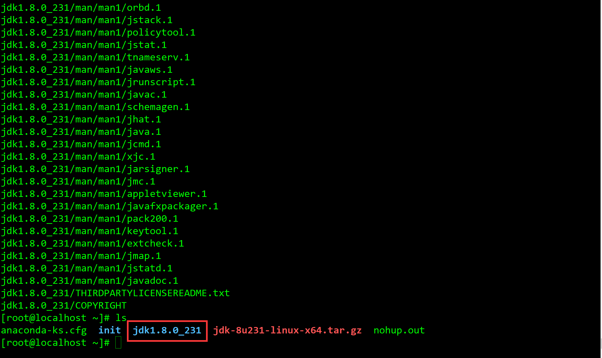

3.  修改全局变量

   > vim /etc/profile

   <font color="#dd0000">JAVA_HOME路径填写为你JDK安装的路径</font>

   ```txt
   export JAVA_HOME=/developer/jdk1.8.0_231
   export		CLASSPATH=.:${JAVA_HOME}/jre/lib/rt.jar:${JAVA_HOME}/lib/dt.jar:${JAVA_HOME}/lib/tools.jar
   export PATH=$PATH:${JAVA_HOME}/bin
   ```

   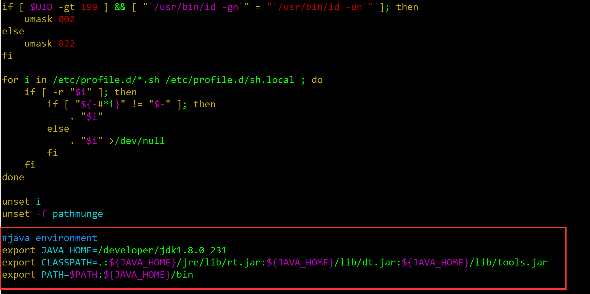

4. 保存退出

   > 键盘 ESC
   >
   > :wq!

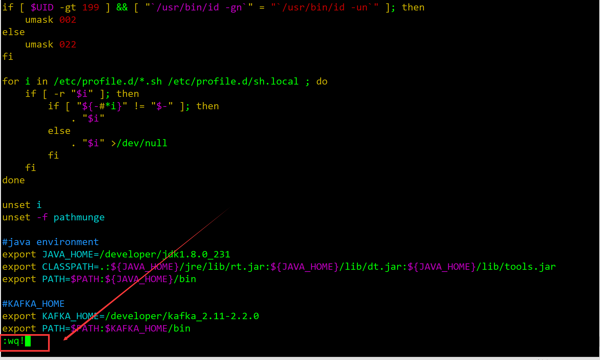

5. 刷新环境

   > source /etc/profile

6.  检查是否配置成功

   > java ­version

   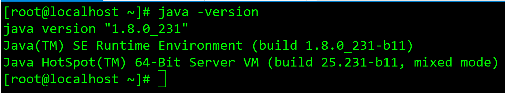


#### 1.2 安装Zookeeper

​	<font color="#dd0000">Zookeeper安装方式有三种，**单机模式**和**集群模式**以及**伪集群模式**。Kafka安装包里面已经包含了Zookeeper，可以使用Kafka自带的Zookeeper而不用重新下载。本案例中使用的是单独安装的Zookeeper</font>

-  单机模式：Zookeeper只运行在一台服务器上，适合测试环境；
-  伪集群模式：就是在一台物理机上运行多个Zookeeper 实例；
-  集群模式：Zookeeper运行于一个集群上，适合生产环境，这个计算机集群被称为一个“集合体”（ensemble） 

###### 单机模式

​	  **我使用是单机模式，用于测试环境，多台kafka注册到一个Zookeeper中。**

如图所示：

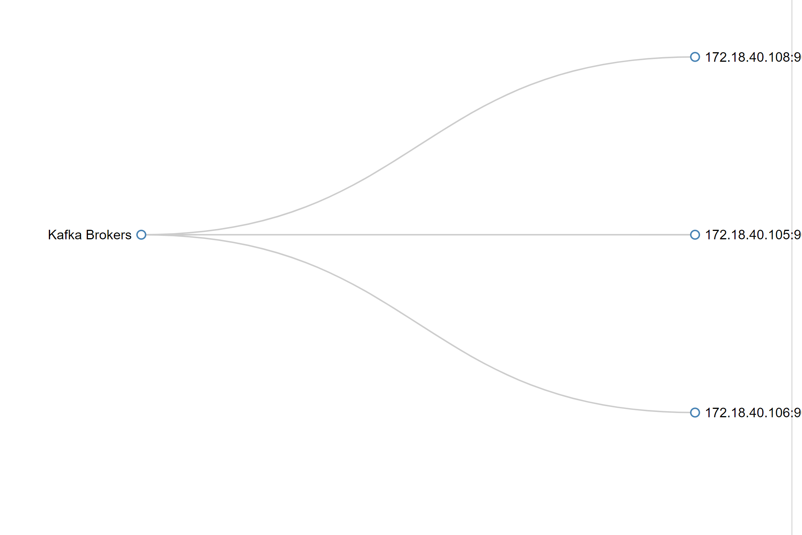

1. 将zookeeper安装包上传到服务器中

2. 解压zookeeper安装包

   > tar -zxvf  apache-zookeeper-3.6.0-bin.tar.gz

3. ZooKeeper Server启动时，默认读取$ZOOKEEPER_HOME/conf/zoo_sample.cfg文件，zoo_sample.cfg文件配置了Zookeeper所有的运行参数。查看 zoo_sample.cfg文件

   > cd apache-zookeeper-3.6.0-bin/conf/
   >
   > cp  zoo_sample.cfg zoo.cfg
>
   > vim zoo_sample.cfg

   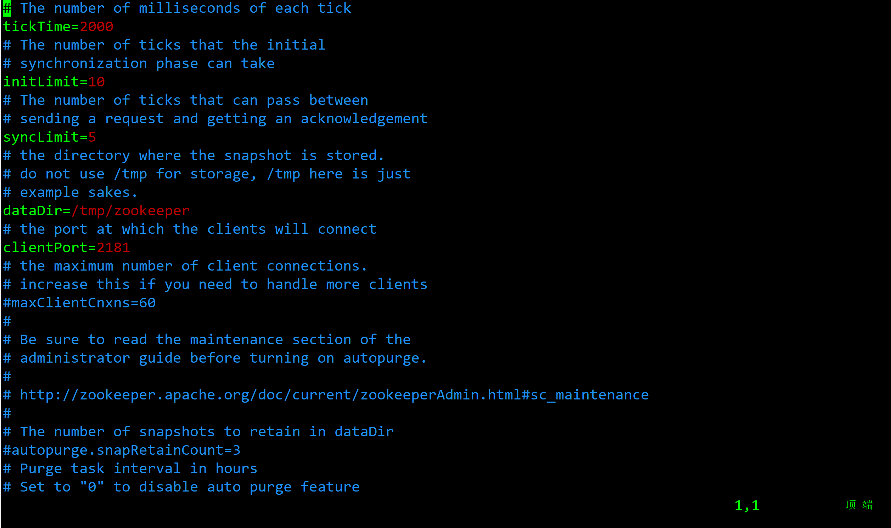

   

<font color="#dd0000">zoo.cfg下面默认有五个属性：</font>

| tickTime       | 心跳检测时间，系统默认是2000毫秒，也就是间隔两秒心跳一次。客户端与服务器或者服务器与服务器之间维持心跳，也就是每个tickTime时间就会发送一次心跳。通过心跳不仅能够用来监听机器的工作状态，还可以通过心跳来控制Flower跟Leader的通信时间，默认情况下FL的会话时常是心跳间隔的两倍。 |
| -------------- | ------------------------------------------------------------ |
| **initLimit**  | **集群中的follower服务器(F)与leader服务器(L)之间初始连接时能容忍的最多心跳数（tickTime的数量）。** |
| **syncLimit**  | **集群中flower服务器（F）跟leader（L）服务器之间的请求和答应最多能容忍的心跳数。** |
| **dataDir**    | **该属性对应的目录是用来存放myid信息跟一些版本，日志，跟服务器唯一的ID信息等。** |
| **clientPort** | **客户端连接的接口，客户端连接zookeeper服务器的端口，zookeeper会监听这个端口，接收客户端的请求访问！这个端口默认是2181。** |

<font color="#dd0000">其他属性：</font>

| maxClientCnxns                | 最大并发客户端数，用于防止DOS的，默认值是60，设置为0是不加限制 |
| ----------------------------- | ------------------------------------------------------------ |
| **autopurge.snapRetainCount** | **参数指定了需要保留的事务日志和快照文件的数目。默认是保留3个。和autopurge.purgeInterval搭配使用** |
| **autopurge.purgeInterval**   | **在3.4.0及之后版本，Zookeeper提供了自动清理事务日志和快照文件的功能，这个参数指定了清理频率，单位是小时，需要配置一个1或更大的整数，0，表示不开启自动清理功能，默认值1，表示1小时候自动清理事务日志和快照文件** |

4. 启动zookeeper，成功界面如图所示

   > bin/zkServer.sh start conf/zoo_sample.cfg

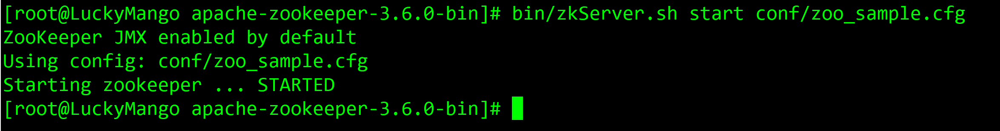


**Zookeeper启动失败解决方案**

 1. 系统内存不足报错

    > 解决方案：vim bin/zookeeper-server-start.sh
    >
    > 将  export KAFKA_HEAP_OPTS="-Xmx512M -Xms128M" 参数改小即可

    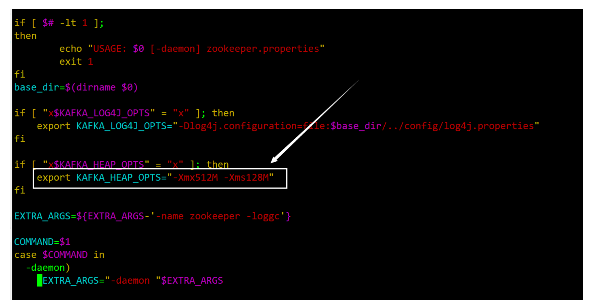


------


###### 集群模式

<font color="#dd0000">集群模式分为两种</font>

- 单独下载Zookeeper安装包，部署多台Zookeeper应用从而组成集群(<font color="#dd0000">未安装测试过</font>)

- 使用Kafka自带的Zookeeper组成集群(<font color="#dd0000">安装并测试过</font>)

> 集群模式只需修改kafka中config下的server.properties配置文件，将Zookeeper地址填写进去。多个Zookeeper实例中间需要用逗号隔开，例如 192.168.0.1:2181 , 192.168.0.2:2181

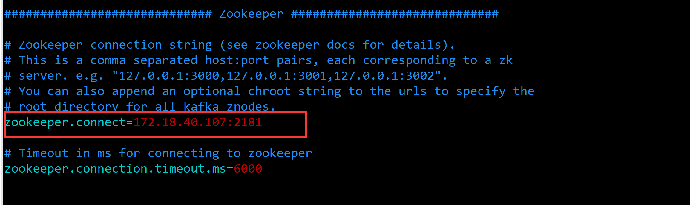


### 2. 安装Kafka

1. 上传安装包到服务器中(安装包在download文件夹下)

2. 解压安装包

   >  tar -zxvf kafka_2.12-2.2.0.tgz

3.  修改Kafka配置文件

   > vim kafka_2.12-2.2.0/config/server.properties

   配置文件说明：

   ```
   # The id of the broker. This must be set to a unique integer for each broker.
   # broker的唯一id，对于每一个broker都必须设置为唯一的"整数"，多台broker要设置不同的id
   broker.id=0
   
   # The address the socket server listens on. It will get the value returned from 
   # java.net.InetAddress.getCanonicalHostName() if not configured.
   #   FORMAT:
   #     listeners = listener_name://host_name:port
   #   EXAMPLE:
   #     listeners = PLAINTEXT://your.host.name:9092
   #listeners=PLAINTEXT://:9092
   # 监听端口9092
   
   # The number of threads that the server uses for receiving requests from the network and sending responses to the network
   # 服务用于接收来自网络的请求以及向网络发送响应的线程数
   num.network.threads=3
   
   # The number of threads that the server uses for processing requests, which may include disk I/O
   # 服务用于处理请求的线程数、可能包含磁盘IO
   num.io.threads=8
   
   # The send buffer (SO_SNDBUF) used by the socket server
   # socket服务端用于发送数据的缓存，意思是当数据到达指定的缓存之后才发送
   socket.send.buffer.bytes=102400
   
   # The receive buffer (SO_RCVBUF) used by the socket server
   # socket服务端用于接收数据的缓存，意思是当数据达到指定的缓存之后才读取
   socket.receive.buffer.bytes=102400
   
   # The maximum size of a request that the socket server will accept (protection against OOM)
   # socket服务允许接收的请求的最大字节数
   socket.request.max.bytes=104857600
   
   
   # A comma separated list of directories under which to store log files
   # 用逗号分隔的一系列文件路径，用于存储日志文件。可以填写多个。用”,”间隔
   log.dirs=/tmp/kafka-logs
   
   # The default number of log partitions per topic. More partitions allow greater
   # parallelism for consumption, but this will also result in more files across
   # the brokers.
   # 默认的分区数
   num.partitions=1
   
   # The number of threads per data directory to be used for log recovery at startup and flushing at shutdown.
   # This value is recommended to be increased for installations with data dirs located in RAID array.
   # 用来恢复和清理data下数据的线程数量
   num.recovery.threads.per.data.dir=1
   
   ############################# Internal Topic Settings  #############################
   # The replication factor for the group metadata internal topics "__consumer_offsets" and "__transaction_state"
   # For anything other than development testing, a value greater than 1 is recommended for to ensure availability such as 3.
   # 副本系数等
   offsets.topic.replication.factor=1
   transaction.state.log.replication.factor=1
   transaction.state.log.min.isr=1
   
   
   # The maximum size of a log segment file. When this size is reached a new log segment will be created.
   # 每一个日志段的最大字节，换算之后是一个G
   log.segment.bytes=1073741824
   
   # The interval at which log segments are checked to see if they can be deleted according
   # to the retention policies
   # segment保留的最长时间，超时将被删除
   log.retention.check.interval.ms=300000
   
   # Zookeeper connection string (see zookeeper docs for details).
   # This is a comma separated host:port pairs, each corresponding to a zk
   # server. e.g. "127.0.0.1:3000,127.0.0.1:3001,127.0.0.1:3002".
   # You can also append an optional chroot string to the urls to specify the
   # root directory for all kafka znodes.
   # 配置连接zookeeper的地址，如果多个zookeeper的话，那么就用逗号分割
   zookeeper.connect=localhost:2181
   
   # Timeout in ms for connecting to zookeeper
   # 连接zookeeper的最大超时时间
   zookeeper.connection.timeout.ms=6000
   ```

   只需要修改一下几个配置，其余根据业务场景进行配置。

   ```
   #broker 的全局唯一编号，不能重复
   broker.id=0
   #开启删除 topic 功能
   delete.topic.enable=true
   # 配置连接zookeeper的地址，如果多个zookeeper的话，那么就用逗号分割
   zookeeper.connect=localhost:2181
   ```

   **详细配置文件说明如下**

   | broker.id                         | 在单机时无需修改，但在集群下部署时往往需要修改。它是个每一个 broker 在集群中 的唯一表示，要求是正数。当该服务器的 IP 地址发生改变时，broker.id 没有变化，则不会 影响 consumers 的消息情况 |
   | --------------------------------- | ------------------------------------------------------------ |
   | listeners                         | 监听列表(以逗号分隔 不同的协议(如 plaintext,trace,ssl、不同的 IP 和端口)),hostname 如果设置为 0.0.0.0 则绑定所有的网卡地址；如果 hostname 为空则绑定默认的网卡。如果 没有配置则默认为 java.net.InetAddress.getCanonicalHostName()。 如：PLAINTEXT://myhost:9092,TRACE://:9091 或 PLAINTEXT://0.0.0.0:9092 |
   | zookeeper.connect                 | zookeeper 集群的地址，可以是多个，多个之间用逗号分割         |
   | log.dirs                          | Kafka 把所有的消息都保存在磁盘上，存放这些数据的目录通过 log.dirs 指定。可以填写多个。用”,”间隔 |
   | num.recovery.threads.per.data.dir | 每数据目录用于日志恢复启动和关闭时的线程数量。因为这些线程只是服务器启动和关 闭时会用到。所以完全可以设置大量的线程来达到并行操作的目的。注意，这个参数指的是 每个日志目录的线程数，比如本参数设置为 8，而 log.dirs 设置为了三个路径，则总共会启 动 24 个线程。 |
   | auto.create.topics.enable         | 是否允许自动创建主题。如果设为 true，那么 produce，consume 或者 fetch metadata 一个不存在的主题时，就会自动创建。缺省为 true。 |
   | num.partitions                    | 每个新建主题的分区个数。这个参数一般要评估，比如，每秒钟要写入和读取 1GB 数 据，如果现在每个消费者每秒钟可以处理 50MB 的数据，那么需要 20 个分区，这样就可以 让 20 个消费者同时读取这些分区，从而达到设计目标。 |
   | log.retention.hours               | 日志保存时间，默认为 7 天（168 小时）。超过这个时间会清理数据。bytes 和 minutes 无论哪个先达到都会触发。与此类似还有 log.retention.minutes 和 log.retention.ms，都设置 的话，优先使用具有最小值的那个。 |
   | log.retention.bytes               | topic 每个分区的最大文件大小，一个 topic 的大小限制 = 分区数*log.retention.bytes。 -1 没有大小限制。log.retention.bytes 和 log.retention.minutes 任意一个达到要求，都会执行 删除。 |
   | log.segment.bytes                 | 分区的日志存放在某个目录下诸多文件中，这些文件将分区的日志切分成一段一段的， 我们称为日志片段。这个属性就是每个文件的最大尺寸；当尺寸达到这个数值时，就会关闭 当前文件，并创建新文件。被关闭的文件就开始等待过期。默认为 1G。 如果一个主题每天只接受 100MB 的消息，那么根据默认设置，需要 10 天才能填满一个 文件。而且因为日志片段在关闭之前，消息是不会过期的，所以如果 log.retention.hours 保 持默认值的话，那么这个日志片段需要 17 天才过期。因为关闭日志片段需要 10 天，等待过 期又需要 7 天。 |
   | log.segment.ms                    | 作用和 log.segment.bytes 类似，只不过判断依据是时间。同样的，两个参数，以先到的 为准。这个参数默认是不开启的。 |
   | message.max.bytes                 | 表示一个服务器能够接收处理的消息的最大字节数，注意这个值 producer 和 consumer 必须设置一致，且不要大于 fetch.message.max.bytes 属性的值。该值默认是 1000000 字节， 大概 900KB~1MB。 |

   4. 配置环境变量，在配置文件最底下插入如下配置

      > sudo vi /etc/profile
      >
      > #KAFKA_HOME
      > export KAFKA_HOME=/developer/kafka_2.11-2.2.0
      > export PATH=$PATH:$KAFKA_HOME/bin

      其中KAFKA_HOME的路径为Kafka安装的路径

   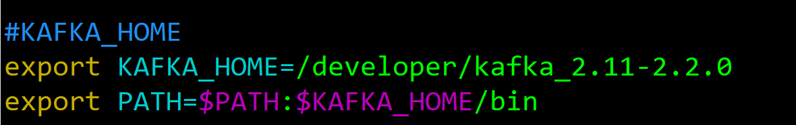

    5. 刷新配置

       > source /etc/profile

   6. 启动Kafka，进入到kafka目录执行如下命令

      > bin/kafka-server-start.sh config/server.properties

      

   **依次在各个kafka服务器上做以上配置，注意broker.id不能相同**

   

   ------

   启动失败解决方案：

   1. 如果你在启动时出现 `java.lang.OutOfMemoryError: Map failed`

      ```
      打开 bin/kafka-run-class.sh 文件，
      搜索-XX:+DisableExplicitGC，
      将这个参数替换为 -XX:+ExplicitGCInvokesConcurrent。
      ```

      

   2.  系统内存不足，出现该错误

      ```
      Java OpenJDK(TM) 64-Bit Server VM warning: INFO: os::commit_memory(0x000000c0000000, 4096, 0) failed; error='Cannot allocate memory' (errno=12)
      89477798
      ```

      > 解决办法： vim bin/kafka-server-start.sh 
      >
      > 将 export KAFKA_HEAP_OPTS="-Xmx512M -Xms128M" 参数改小即可

      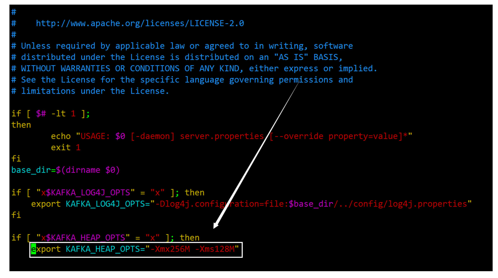

      

### 3.安装Kafka-Eagle 监控面板

1. 将Kafka-Eagle安装包上传到服务器中

2. 解压文件到本地

   > tar -zxvf  kafka-eagle-bin-1.4.4.tar.gz 

3. 进入kafka-eagle-bin-1.4.4再次解压

   > tar -zxvf  kafka-eagle-web-1.4.4-bin.tar.gz

4. 使用root权限编辑环境变量，设置JDK和Kafka-eagle地址

   > sudo vi /etc/profile
   >
   > #在配置文件最底下插入如下配置
   >
   > #其中JAVA_HOME为你安装JDK的位置
   >
   > #KE_HOME为你安装Kafka-Eagle监控面板的位置
   >
   > #Kafka_Web
   > export JAVA_HOME=/developer/jdk1.8.0_231
   > export KE_HOME=/developer/kafka-eagle-bin-1.4.4/kafka-eagle-web-1.4.4
   > export PATH=$PATH:$JAVA_HOME/bin:$KE_HOME/bin

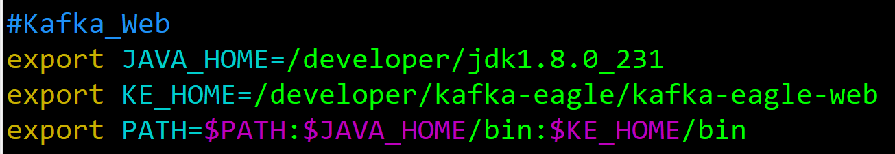

5. 刷新配置

   > source /etc/profile

6. 修改conf中的system-config.properties配置文件

   ```
   ######################################
   # 配置多个Kafka集群所对应的Zookeeper
   ######################################
   kafka.eagle.zk.cluster.alias=cluster1,cluster2
   cluster1.zk.list=dn1:2181,dn2:2181,dn3:2181
   cluster2.zk.list=tdn1:2181,tdn2:2181,tdn3:2181
   
   ######################################
   # 设置Zookeeper线程数
   ######################################
   kafka.zk.limit.size=25
   
   ######################################
   # 设置Kafka Eagle浏览器访问端口
   ######################################
   kafka.eagle.webui.port=8048
   
   ######################################
   # 如果你的offsets存储在Kafka中，这里就配置
   # 属性值为kafka，如果是在Zookeeper中，可以
   # 注释该属性。一般情况下，Offsets的也和你消
   # 费者API有关系，如果你使用的Kafka版本为0.10.x
   # 以后的版本，但是，你的消费API使用的是0.8.2.x
   # 时的API，此时消费者依然是在Zookeeper中
   ######################################
   cluster1.kafka.eagle.offset.storage=kafka
   ######################################
   # 如果你的集群一个是新版本（0.10.x以上），
   # 一个是老版本（0.8或0.9），可以这样设置，
   # 如果都是新版本，那么可以将值都设置成kafka
   ######################################
   cluster2.kafka.eagle.offset.storage=zookeeper
   
   ######################################
   # 是否启动监控图表，默认是不启动的
   ######################################
   kafka.eagle.metrics.charts=false
   
   ######################################
   # 在使用Kafka SQL查询主题时，如果遇到错误，
   # 可以尝试开启这个属性，默认情况下，不开启
   ######################################
   kafka.eagle.sql.fix.error=false
   
   ######################################
   # 邮件服务器设置，用来告警
   ######################################
   kafka.eagle.mail.enable=false
   kafka.eagle.mail.sa=
   kafka.eagle.mail.username=
   kafka.eagle.mail.password=
   kafka.eagle.mail.server.host=
   kafka.eagle.mail.server.port=
   
   ######################################
   # 设置告警用户，多个用户以英文逗号分隔
   ######################################
   kafka.eagle.alert.users=smartloli.org@gmail.com
   
   
   ######################################
   # 超级管理员删除主题的Token
   ######################################
   kafka.eagle.topic.token=keadmin
   
   ######################################
   # 如果启动Kafka SASL协议，开启该属性
   ######################################
   kafka.eagle.sasl.enable=false
   kafka.eagle.sasl.protocol=SASL_PLAINTEXT
   kafka.eagle.sasl.mechanism=PLAIN
   
   ######################################
   # Kafka Eagle默认存储在Sqlite中，如果要使用
   # MySQL可以替换驱动、用户名、密码、连接地址
   ######################################
   
   kafka.eagle.driver=org.sqlite.JDBC
   kafka.eagle.url=jdbc:sqlite:/developer/kafka-eagle/kafka-eagle-web/db/ke.db
   kafka.eagle.username=root
   kafka.eagle.password=root
   
   #kafka.eagle.driver=com.mysql.jdbc.Driver
   #kafka.eagle.url=jdbc:mysql://127.0.0.1:3306/ke?useUnicode=true&characterEncoding=UTF-#8&zeroDateTimeBehavior=convertToNull
   #kafka.eagle.username=root
   #kafka.eagle.password=123456
   ```

   注意： 使用Kafka Eagle默认存储Sqlite时

   kafka.eagle.url=jdbc:sqlite:/你Kafka-Eagle安装目录/db/ke.db

7. 给启动文件执行权限

   > cd  kafka-eagle-web-1.4.4/bin
   >
   > chmod 777 ke.sh

8. 进入bin目录启动监控界面

   > ./ke.sh start

   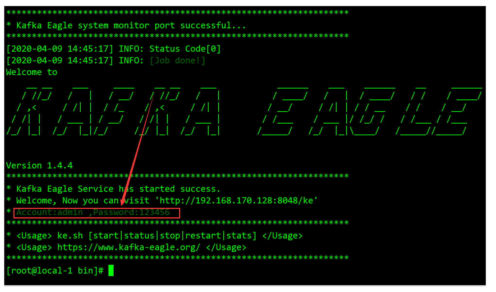

   默认的账号：admin

   默认的密码：123456

   密码和账号均可在配置文件中更改

9. 登录页面查看监控数据

   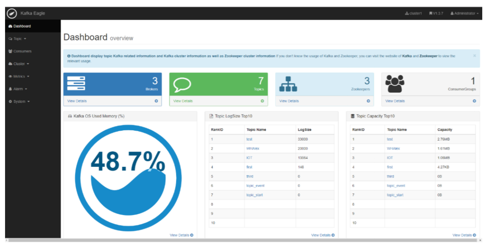

**常用命令**

```
# 查看Kafka Eagle运行状态
ke.sh status

# 停止Kafka Eagle
ke.sh stop

# 查看Kafka Eagle GC情况
ke.sh gc

# 查看Kafka Eagle服务器资源占用情况，例如TCP、句柄等
ke.sh stats

# 查看Kafka Eagle版本号
ke.sh version

# 查看Kafka Eagle服务器上JDK的编码情况（如果JDK编码不是UTF-8，可能会有异常出现，执行如下命令，根据提示来修复JDK编码问题）
ke.sh jdk

# 查看Kafka Eagle中是否存在某个类（如果需要精确，类名前面可以加上包名）
ke.sh find [ClassName]
```

​		  另外，有时候可能会在日志中发现一些连接超时或是空指针异常，对于这类问题，首先需要检测Kafka集群的各个Broker节点JMX_PORT是否开启（这个Kafka默认是不开启），然后就是空指针异常问题，这类问题通常发生在Kafka集群配置了ACL，这就需要认真检测Kafka Eagle配置文件中ACL信息是否正确（比如设置的用户名和密码是否正确，以及用户是否拥有访问Topic的权限等）

```
#修改Kafka启动配置文件
vi bin/kafka-server-start.sh
if [ "x$KAFKA_HEAP_OPTS" = "x" ]; then
    export KAFKA_HEAP_OPTS="-server -Xms2G -Xmx2G -XX:PermSize=128m -XX:+UseG1GC -XX:MaxGCPauseMillis=200 -XX:ParallelGCThreads=8 -XX:ConcGCThreads=5 -XX:InitiatingHeapOccupancyPercent=70"
    # 开启JMX_PORT端口，端口开启后，Kafka Eagle系统会自动感知获取
    export JMX_PORT="9999"
    # 注释脚本中默认的信息
    # export KAFKA_HEAP_OPTS="-Xmx1G -Xms1G"
fi
```

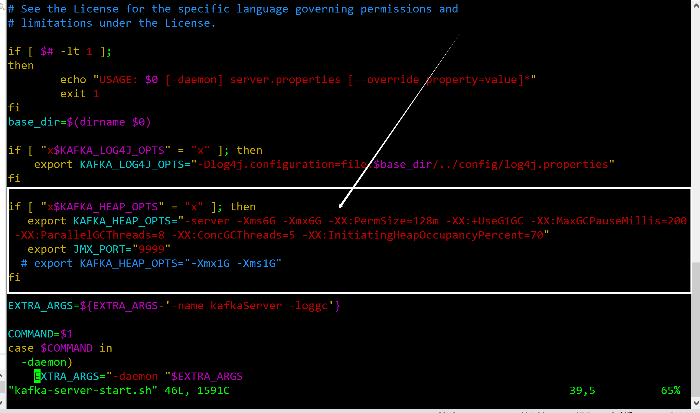


```
-Dcom.sun.management.jmxremote.host=0.0.0.0
-Dcom.sun.management.jmxremote.local.only=false 
-Djava.rmi.server.hostname=[cdh231每个节点自定义]
```