# Kafka模拟集群宕机

## 1、测试kafka的吞吐量

**测压环境**

| 序号 | IP            | CPU核数 | 内存 | 服务                   | 版本号                         |
| ---- | ------------- | ------- | ---- | ---------------------- | ------------------------------ |
| 1    | 172.18.40.105 | 4核     | 8G   | Kafka，Zookeeper       | 2.2.0                          |
| 2    | 172.18.40.106 | 4核     | 8G   | kafka，Zookeeper       | 2.2.0                          |
| 3    | 172.18.40.107 | 4核     | 8G   | Zookeeper，Kafka-eagle | Zookeeper-3.6.0，Kafka-2.2.0   |
| 4    | 172.18.40.108 | 4核     | 8G   | Kafka，Zookeeper       | Kafka-eagle-1.4.6，Kafka-2.2.0 |

**生产者测压场景**

| Brokers集群个数 | Topic个数 | Partitions个数 | 消息大小/条 | 消息总量 | 发送数据/s |
| :-------------: | :-------: | :------------: | :---------: | :------: | :--------: |
|        3        |     1     |       3        |   100Byte   |   1亿    |   100w/s   |

------

生产者执行结果图：

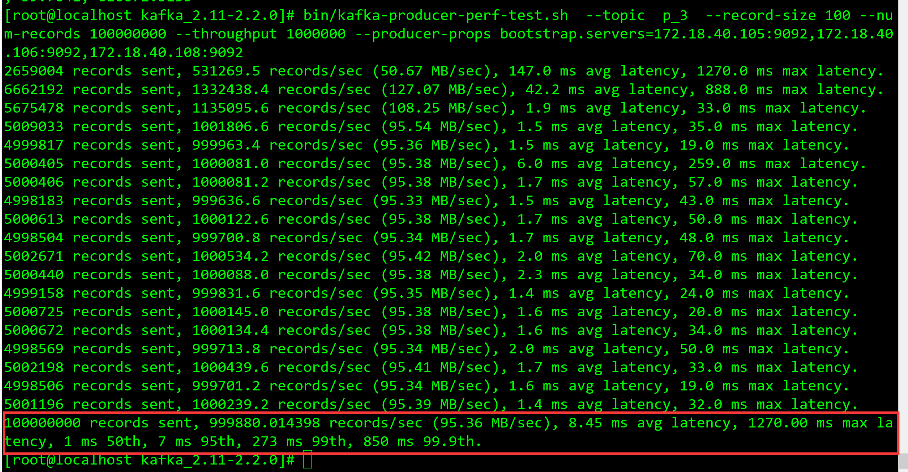

**结果：**

    1. 每秒平均向kafka写入了95.36 MB的数据，每秒写入99.9880w条数据
   2. 每次写入的平均延迟为8.45毫秒
   3. 最大延迟为1270.00毫秒
   4. 1毫秒内占50%
   5. 7毫秒内占95%
   6. 273毫秒内占99%
   7. 850毫秒内占99.9%

------

**消费者测压场景**

| Brokers集群个数 | Topic个数 | Partitions个数 | 消费者个数 | 消息大小/条 | 消息总量 |
| :-------------: | :-------: | :------------: | ---------- | :---------: | :------: |
|        3        |     1     |       3        | 3          |     1M      |   1亿    |

消费者执行结果图：

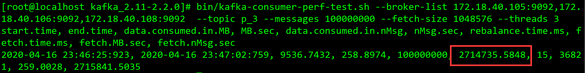


**结果**：

1. 一共消费了9536.7432MB
2. 消费速度为 258.8974M/S
3. 总共消费1亿条消息
4. 每秒消费271.735W条消息


## 2. 测试Topic数量对集群性能的影响

**测压场景**

生产者：

| Brokers集群个数 |               Topic个数               | Partitions个数 | ReplicationFactor个数 | 每秒发送条数 | 消息大小/条 | 消息总量 | 发送端RT（ms） | 发送端TPS(avg) |
| :-------------: | :-----------------------------------: | :------------: | :-------------------: | ------------ | :---------: | :------: | :------------: | -------------- |
|        3        |  <font color="#dd0000">**3** </font>  |       3        |           1           | 100w         |   100Byte   |   1亿    |    11.67/ms    | 99.980w/s      |
|        3        |  <font color="#dd0000">**6** </font>  |       3        |           1           | 100w         |   100Byte   |   1亿    |    13.25/ms    | 99.93w/s       |
|        3        | <font color="#dd0000">**12** </font>  |       3        |           1           | 100w         |   100Byte   |   1亿    |    17.22/ms    | 99.986w/s      |
|        3        | <font color="#dd0000">**24** </font>  |       3        |           1           | 100w         |   100Byte   |   1亿    |    12.40/ms    | 99.982w/s      |
|        3        | <font color="#dd0000">**48** </font>  |       3        |           1           | 100w         |   100Byte   |   1亿    |    12.36/ms    | 99.988w/s      |
|        3        | <font color="#dd0000">**96** </font>  |       3        |           1           | 100w         |   100Byte   |   1亿    |   11.92 /ms    | 99.980w/s      |
|        3        | <font color="#dd0000">**192** </font> |       3        |           1           | 100w         |   100Byte   |   1亿    |    12.62/ms    | 99.750w/s      |


消费者：

| Brokers集群个数 |               Topic个数               | Partitions个数 | ReplicationFactor个数 | 消费的客户端 | 每次消费数据大小 | 消息总量 | 消费端TPS  |
| :-------------: | :-----------------------------------: | :------------: | :-------------------: | :----------: | :--------------: | :------: | ---------- |
|        3        |  <font color="#dd0000">**3** </font>  |       3        |           1           |      3       |        1M        |   1亿    | 280.67w/s  |
|        3        |  <font color="#dd0000">**6** </font>  |       3        |           1           |      3       |        1M        |   1亿    | 304.71.w/s |
|        3        | <font color="#dd0000">**12** </font>  |       3        |           1           |      3       |        1M        |   1亿    | 203.30w/s  |
|        3        | <font color="#dd0000">**24** </font>  |       3        |           1           |      3       |        1M        |   1亿    | 205.62w/s  |
|        3        | <font color="#dd0000">**48** </font>  |       3        |           1           |      3       |        1M        |   1亿    | 200.03w/s  |
|        3        | <font color="#dd0000">**96** </font>  |       3        |           1           |      3       |        1M        |   1亿    | 192.31w/s  |
|        3        | <font color="#dd0000">**192** </font> |       3        |           1           |      3       |        1M        |   1亿    | 176.40w/s  |

------

**付：**[阿里中间件团队对比Kafka和RocketMQ测试图](http://jm.taobao.org/2016/04/20/kafka-vs-rocketmq-3/)

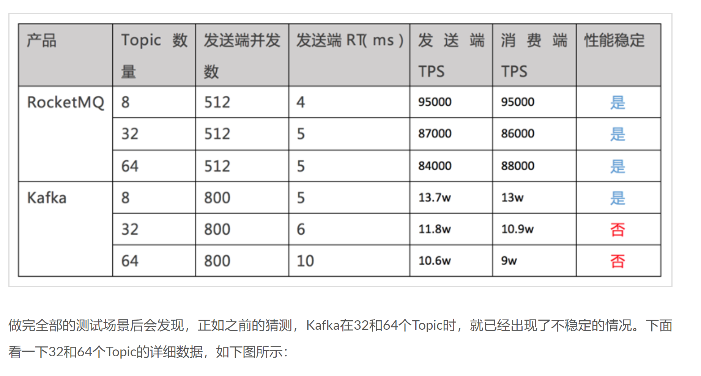


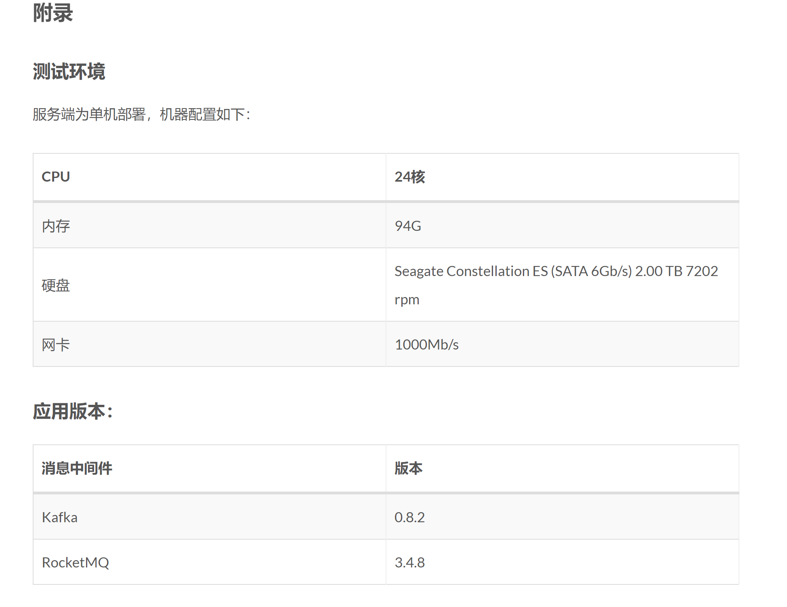

**小结：**

​			<font color="#dd0000">**随着Topic的增加，Kafka的性能会随之降低。这是因为Kafka的每个Topic、每个分区都会对应一个物理文件。当Topic数量增加时，消息分散的落盘策略会导致磁盘IO竞争激烈成为瓶颈。** </font>


------


## 3.测试Partitions数量对集群性能的影响


| Brokers集群个数 |            Partitions个数             | 消费者个数 | 消息数量 | 消息大小 | 发送端RT（ms） | 发送端TPS |         消费端TPS          |
| --------------- | :-----------------------------------: | ---------- | :------: | -------- | :------------: | :-------: | :------------------------: |
| 3               | <font color="#dd0000">**16** </font>  | 10         |   1亿    | 100Byte  |    2.90/ms     | 133.68w/s |         260.14w/s          |
| 3               | <font color="#dd0000">**32** </font>  | 10         |   1亿    | 100Byte  |    4.23/ms     | 134.21w/s |         279.75w/s          |
| 3               | <font color="#dd0000">**64** </font>  | 10         |   1亿    | 100Byte  |    4.32/ms     | 123.17w/s |         270.88w/s          |
| 3               | <font color="#dd0000">**128** </font> | 10         |   1亿    | 100Byte  |    7.61/ms     | 126.34w/s |         221.66w/s          |
| 3               | <font color="#dd0000">**256** </font> | 10         |   1亿    | 100Byte  |    12.26/ms    | 126.54w/s | java.lang.OutOfMemoryError |

## 4. 测试Kafka集群中有一台宕机造成的影响。

创建一个名为q_1的topic，该topic下有3个分区3个副本。测试在发送的过程中，将broke 为106的kafka kill掉。模拟该broke宕机

**生产者测试场景**

| Brokers集群个数 | Topic个数 | Partitions个数 | ReplicationFactor | 消息大小/条 | 消息总量 | 发送数据/s |
| :-------------: | :-------: | :------------: | ----------------- | :---------: | :------: | :--------: |
|        3        |     1     |       3        | 3                 |   100Byte   |   1亿    |   10w/s    |

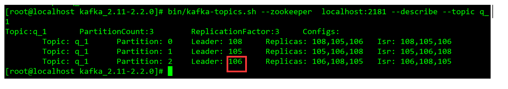

**消费者测试场景**

| Brokers集群个数 | Topic个数 | Partitions个数 | 消费者个数 | 消息大小/条 | 消息总量 |
| :-------------: | :-------: | :------------: | ---------- | :---------: | :------: |
|        3        |     1     |       3        | 3          |   100Byte   |   1亿    |

结果如下：

​	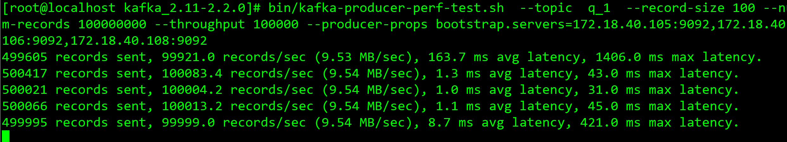

生产者正常发送消息的同时，我们将broker id为106的服务kill掉

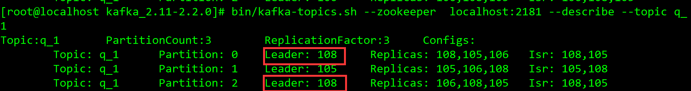

此时可以发现，被kill 掉的分区2leader已经换成了broker id为108的leader了。并且已存活的节点数为，108和105两个节点

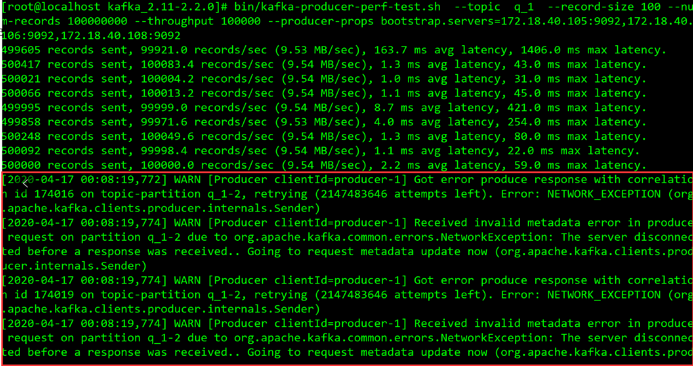

当我们继续查看生产的消息同时，可以发现在kill掉broker id为106的服务，会触发分区在均衡策略，生产者无法继续投递消息。

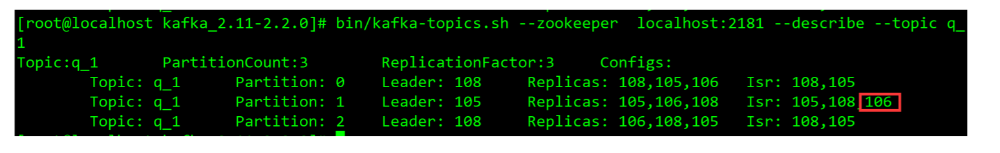

当我们将broker id为106的服务重新添加到集群中时，可以发现已存活的节点已经有了106。但也不会触发分区再均衡机制。

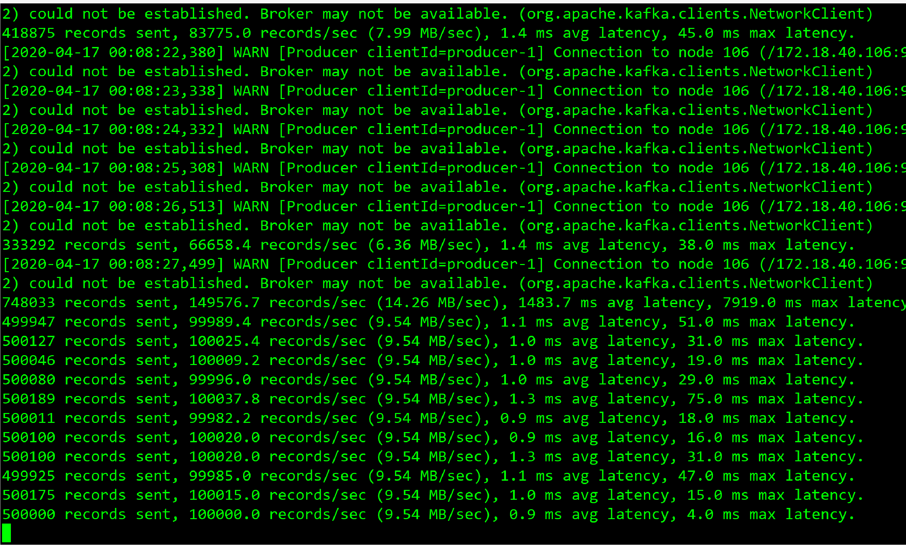

经过短暂的分区再均衡后，生产者又继续恢复投递消息。

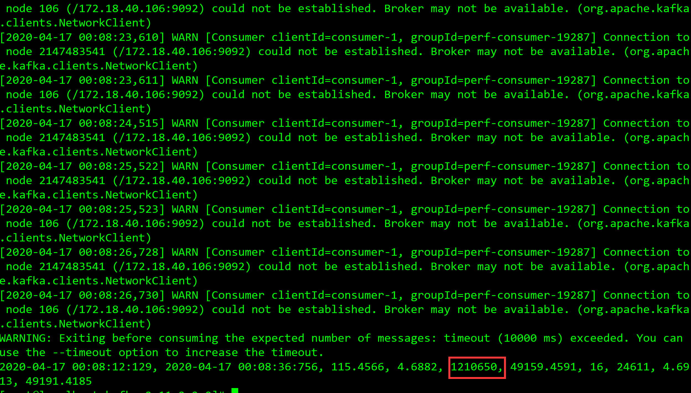

当我们查看消费者情况时，发现当kill掉broker id 为106的服务后，消费者就停止继续消费，只消费了kill前的121万条消息。哪怕生产者经过分区再均衡策略恢复生产时，消费者也依旧停止消费。


当生产者发送完消息以后可以发现，1亿条消息已经成功投递到kafka中。虽然经过短暂的宕机但是并没有造成生产者的消息丢失。

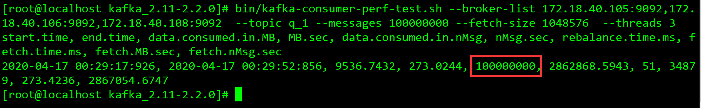

重新启动消费者时进行消息消费时，已经成功消费1亿条数据。

​			<font color="#dd0000">**以上测试均为脚本命令测试，未在Java代码中模拟生产环境测试。** </font>


# 2020年4月18日测试列表

## 1.java代码测试Kafka吞吐量

**测试环境：**

| 序号 | IP            | CPU核数 | 内存 | 服务                   | 版本号                             |
| ---- | ------------- | ------- | ---- | ---------------------- | ---------------------------------- |
| 1    | 172.18.40.105 | 4核     | 8G   | Kafka，Zookeeper       | Zookeeper-3.6.0，Kafka-2.2.0       |
| 2    | 172.18.40.106 | 4核     | 8G   | kafka，Zookeeper       | Zookeeper-3.6.0，Kafka-2.2.0       |
| 3    | 172.18.40.107 | 4核     | 8G   | Zookeeper，Kafka-eagle | Zookeeper-3.6.0，Kafka-eagle-1.4.4 |
| 4    | 172.18.40.108 | 4核     | 8G   | Kafka，Zookeeper       | Zookeeper-3.6.0，Kafka-2.2.0       |

**生产者和消费者测压场景**

| Brokers集群个数 | Topic个数 | Partitions个数 | ReplicationFactor个数 | 生产者个数 | 消费者个数 | 消息总量 | 发送端TPS | 发送端耗时/s | 接收端TPS | 接收端耗时 |
| :-------------: | :-------: | :------------: | :-------------------: | :--------: | ---------- | :------: | --------- | ------------ | --------- | ---------- |
|        3        |     1     |       2        |           3           |     2      | 2          |   300W   | 7.8529w/s | 38.20s       | 8.1691w/s | 36.756s    |
|        3        |     1     |       4        |           3           |     4      | 4          |   300W   | 8.0906w/s | 37.08s       | 8.8243w/s | 33.997s    |
|        3        |     1     |       8        |           3           |     8      | 8          |   300W   | 8.7310w/s | 34.36s       | 9.0342w/s | 33.207s    |
|        3        |     1     |       16       |           3           |     16     | 16         |   300W   | 7.7419w/s | 38.75s       | 10.225w/s | 29.337s    |


## 2.java代码Partitions数量对集群性能的影响

| Brokers集群个数 | Partitions个数 | 消费者个数 | 消息数量 | 消息大小 | 消费端TPS | 消费端耗时 |
| --------------- | :------------: | ---------- | :------: | -------- | :-------: | :--------: |
| 3               |       3        | **1**      |   300w   | 100Byte  | 8.6775w/s |  32.117s   |
| 3               |       3        | **2**      |   300w   | 100Byte  | 9.6227w/s |  31.176s   |
| 3               |       3        | **3**      |   300w   | 100Byte  | 9.9039w/s |  30.291s   |
| 3               |       3        | **4**      |   300w   | 100Byte  | 9.7952w/s |  30.627s   |
| 3               |       3        | **5**      |   300w   | 100Byte  | 9.9212w/s |  30.238s   |
| 3               |       3        | **6**      |   300w   | 100Byte  | 10.086w/s |  29.974s   |

> ​		当我们增加更多的消费者，超过了主题的分区数量，就会有一部分的消费者被闲 置，不会接收到任何消息。 往消费者群组里增加消费者是进行横向伸缩能力的主要方式。所以我们有必要为主题设 定合适规模的分区，在负载均衡的时候可以加入更多的消费者。一个群组里消 费者数量超过了主题的分区数量，多出来的消费者是没有用处的。 


------


| Brokers集群个数 | Partitions个数 | 线程个数 | 消息数量 | 消息大小 | 消费端TPS | 消费端耗时 |
| --------------- | :------------: | -------- | :------: | -------- | :-------: | :--------: |
| 3               |       3        | **3**    |   300w   | 100Byte  | 9.7952w/s |  30.291s   |
| 3               |       6        | **6**    |   300w   | 100Byte  | 9.5907w/s |   31.28s   |
| 3               |       12       | **12**   |   300w   | 100Byte  | 9.1681w/s |  32.722s   |
| 3               |       24       | **24**   |   300w   | 100Byte  | 8.7642w/s |   34.23s   |
| 3               |       48       | **48**   |   300w   | 100Byte  | 7.8812w/s |  38.065s   |
| 3               |       96       | **96**   |   300w   | 100Byte  | 6.5276w/s |  45.958s   |

> ​		随着线程数量加大，消费端的TPS性能也有所下降。是因为我们生产消息的时候并没有指定key和partition。消息会轮训写入各个分区中，消费端也并没有指定消费特定的partition。线程也就会轮训消费partition中的消费，


**测试分区个数增加，消费者不变。对集群的影响**

| Brokers集群个数 | Partitions个数 | 线程个数 | 消息数量 | 消息大小 | 消费端TPS | 消费端耗时 |
| --------------- | :------------: | -------- | :------: | -------- | :-------: | ---------- |
| 3               |       1        | **2**    |   300w   | 100Byte  | 9.261w/s  | 32.393s    |
| 3               |       2        | **2**    |   300w   | 100Byte  | 9.312w/s  | 32.216s    |
| 3               |       4        | **2**    |   300w   | 100Byte  | 9.242w/s  | 32.460s    |
| 3               |       8        | **2**    |   300w   | 100Byte  | 9.127w/s  | 32.866s    |
| 3               |       16       | **2**    |   300w   | 100Byte  | 9.024w/s  | 33.244s    |
| 3               |       32       | **2**    |   300w   | 100Byte  | 8.867w/s  | 33.832s    |

> ​		随着分区个数加大，消费端的TPS的性能也有所下降。因为并没有指定消费指定的分区，消费者默认会轮训消费各个分区中的内容。
>


## 3.java代码测试Kafka集群中宕机造成的影响和解决办法

1. ##### 首先我们创建一个名为s1的topic，该topic下有3个副本和3个分区

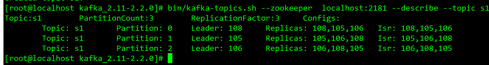

2. 此时我们来运行java程序，在运行的过程中我们模拟该实例105宕机，将分区1的leader 105 kill掉

   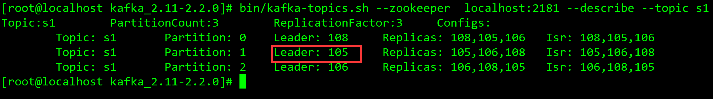

3. 开始运行java程序

   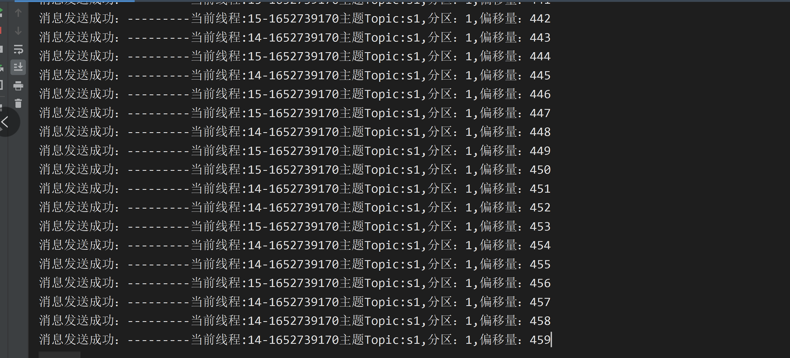

4. 将105的实例kill掉，并查看该topic

   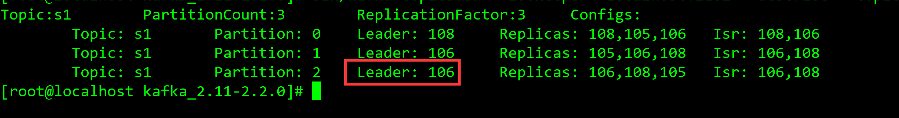

   此时可以发现分区为2的leader已经从实例105换成了106，存活的节点只有106和108

5. 查看java程序时，发现程序报错

   

   kill掉105实例触发分区再均衡策略，短时间消费者和生产者均无法生产消息和消费消息

6. 查看最终结果

   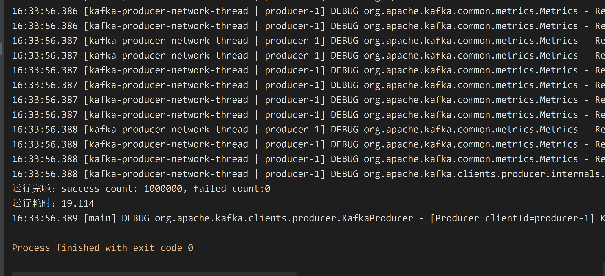

   此时可以发现，已经成功投递100W条数据，虽然经过分区再均衡后，任然没有消息丢失。

   

   ## 结论

   > ​		kafka在配置不合理的情况,会丢失消息,当业务的需求不允许消息丢失的场景,就需要配置kafka的一些参数来保证消息不丢失,但是鱼和熊掌不可兼得,所以如果保证消息不丢失,就要牺牲TPS(吞吐量)
   > kafka消息丢失分为两种,一是Producer丢失消息,二是Consumer端丢失消息

   ​	

   

   #### **一、Producer端配置**

   > 1、acks设置为-1	

   ​		设置为0表示producer不需要等待任何确认收到的信息,副本将立即加到socket buffer并认为已经发送。没有任何保障可以保证此种情况下server已经成功接收数据，同时重试配置不会发生作用（因为客户端不知道是否失败）
   设置为1意味着至少要等待leader已经成功将数据写入本地log，但是并没有等待所有follower是否成功写入。这种情况下，如果follower没有成功备份数据，而此时leader又挂掉，则消息会丢失
   设置为-1意味着leader需要等待所有备份都成功写入日志，这种策略会保证只要有一个备份存活就不会丢失数据。这是最强的保证。

   ```java
          //等待所有副本节点的应答
          props.put("acks", "-1");
   ```

   

   > 2、设置retries重试次数

   ​		设置大于0的值将使客户端重新发送任何数据，一旦这些数据发送失败。注意，这些重试与客户端接收到发送错误时的重试没有什么不同。允许重试将潜在的改变数据的顺序，如果这两个消息记录都是发送到同一个partition，则第一个消息失败第二个发送成功，则第二条消息会比第一条消息出现要早。

   ​		

   ```java
     		//消息发送最大尝试次数
           props.put("retries", 3);
   ```

   

   > 3、使用异步发送而不是同步发

            //使用异步发送
                   producer.send(record, (metadata, exception) -> {
                       //判断如果exception不为null表示发送失败
                       if(null!=exception){
                           exception.printStackTrace();
                           System.out.println("发送失败");
                       }
                       //判断metadata不为null表示发送成功
                       if(null!=metadata){
                           System.out.println("消息发送成功：---------" +"当前线程:"+id+ "主题Topic:"+metadata.topic()+","+"分区："+metadata.partition()+","+"" + "偏移量："+metadata.offset());
                       }
                       //每发送一次消息，countDownLatch就会递减一次。countDownLatch如果递减为0表示消息已经全部发送完了
                       countDownLatch.countDown();
                   });
   

   > 4、max.in.flight.requests.per.connection设置为1

   ​		kafka可以在一个connection中发送多个请求，叫作一个flight,这样可以减少开销，但是如果产生错误，可能会造成数据的发送顺序改变,默认是5 (修改）
   ​		这个参数其实为了避免消息乱序,如果你的场景不需求消息顺序,可以不设置此值,设置此值为1表示kafka broker在响应请求之前client不能再向同一个broker发送请求


完整代码如下：

生产者代码：

```java
public class KafkaConProducer {
    //发送消息的个数
    private static final int MSG_SIZE = 1000000;
    /**
     * 创建负责发送消息的定长线程池
     */
    private static ExecutorService executorService = Executors.newFixedThreadPool(2);
    //让所有线程同时进行运行，防止主线程过早退出。等待消息同时发送完毕才可以退出
    private static CountDownLatch countDownLatch = new CountDownLatch(MSG_SIZE);

    /*发送消息的任务*/
    private static class ProduceWorker implements Runnable{
        //创建生产者
        private KafkaProducer<String,String> producer;

        private ProducerRecord<String,String> record;

        //封装生产者和消息记录，每次发送消息就不用重新创建对象
        public ProduceWorker(ProducerRecord<String, String> record,KafkaProducer<String, String> producer) {
            this.record = record;
            this.producer = producer;
        }
        @Override
        public void run() {
            //获取线程的Id和producer在内存中的地址所算出来的哈希值。多个线程发送的消息，producer哈希值都一样。结论：不管有多少个线程只需要创建一个Kafka的生产者
            final String id = Thread.currentThread().getId()+"-"+System.identityHashCode(producer);
            try {
                //使用异步发送
                producer.send(record, (metadata, exception) -> {
                    //判断如果exception不为null表示发送失败
                    if(null!=exception){
                        exception.printStackTrace();
                        System.out.println("发送失败");
                    }
                    //判断metadata不为null表示发送成功
                    if(null!=metadata){
                        System.out.println("消息发送成功：---------" +"当前线程:"+id+ "主题Topic:"+metadata.topic()+","+"分区："+metadata.partition()+","+"" + "偏移量："+metadata.offset());
                    }
                    //每发送一次消息，countDownLatch就会递减一次。countDownLatch如果递减为0表示消息已经全部发送完了
                    countDownLatch.countDown();
                });
            } catch (Exception e) {
                e.printStackTrace();
            }
        }
    }

    public static void main(String[] args) {
        String value = "ReOPNIfxiDMMBzl7ifAIyuvpq5sLpf9qYZTix6RuqkNs78cTxehU1UVMhfzDs9WqhkvXE4o3nvC8p6N0qBVgIGC5Fpt9aEnJZW0B";
        String topic = "s1";
        //设置配置信息
        Properties props = new Properties();
        //配置服务器地址,Kafka可以通过一个Broker去寻找其他的服务器地址，Kafka官方推荐至少写两到三个，防止因为宕机无法连接到其他服务器
        props.put("bootstrap.servers", "172.18.40.105:9092,172.18.40.106:9092,172.18.40.108:9092");
        //等待所有副本节点的应答
        props.put("acks", "-1");
        //消息发送最大尝试次数
        props.put("retries", 3);
        //一批消息处理大小
        props.put("batch.size", 16384);
        //请求延时
        props.put("linger.ms", 1);
        //发送缓存区内存大小
        props.put("buffer.memory", 33554432);
        //key 序列化
        props.put("key.serializer", "org.apache.kafka.common.serialization.StringSerializer");
        //value 序列化
        props.put("value.serializer", "org.apache.kafka.common.serialization.StringSerializer");
        //构建拦截链,初始化集合大小为2
        ArrayList<String> interceptors = Lists.newArrayListWithCapacity(1);
        //添加计数拦截器
        interceptors.add("cc.aimango.kafka.demo.interceptor.CounterInterceptor");
        //添拦截连添加到配置文件中
        props.put(ProducerConfig.INTERCEPTOR_CLASSES_CONFIG, interceptors);
        //创建Kafka生产者，不管有多少个线程只需要创建一个Kafka的生产者
        KafkaProducer<String,String> producer = new KafkaProducer<>(props);
        try {
            //发送1000条数据到kafka
            for(int i=0;i<MSG_SIZE;i++){
                //发送消息到Kafka中
                ProducerRecord<String, String> record = new ProducerRecord<>(
                         topic
                        , null
                        , value);
                executorService.submit(new ProduceWorker(record,producer));
            }
            countDownLatch.await();

        } catch (Exception e) {
            e.printStackTrace();
        } finally {
            producer.close();
            executorService.shutdown();
        }
    }


}

```

生产者监听器：

```java
**
 * @author: 张钰博
 * @date: 2020/4/18 16:45
 * @description: 计数拦截器
 */
public class CounterInterceptor implements ProducerInterceptor<String, String> {

    /**
     * 统计发送成功数
     */
    private static AtomicLong sendSuccess = new AtomicLong(0);
    /**
     * 统计发送失败数
     */
    private static AtomicLong sendFailure = new AtomicLong(0);

    /**
     * 获取当前时间戳
     */
    private  long  localTime;

    @Override
    public ProducerRecord<String, String> onSend(ProducerRecord<String, String> record) {

        this.outputSendStat();
        System.out.println("当前线程："+Thread.currentThread().getId()+"发送消息："+record.value());
        return new ProducerRecord<>(record.topic(),
                record.partition(), record.timestamp(), null, record.value(),
                record.headers());
    }

    @Override
    public void onAcknowledgement(RecordMetadata metadata, Exception exception) {
        // 如果没有异常表示发送成功, 那么发送成功数+1, 否则发送失败数+1
        if (exception!=null){
            sendFailure.getAndIncrement();
        }else{
            sendSuccess.getAndIncrement();
        }
    }

    /**
     * 打印出发送的成功&失败次数的统计信息
     */
    private void outputSendStat(){
        sendSuccess.get();
        sendFailure.get();
    }

    //kafka运行结束以后触发该方法
    @Override
    public void close() {
        long successCount = sendSuccess.get();
        long  failedCount = sendFailure.get();
        System.out.println("运行完啦：success count: "+successCount+", failed count:"+failedCount);
        System.out.println("运行耗时："+(System.currentTimeMillis()-localTime)/1000d);
        this.outputSendStat();
    }

    //kafka在运行时，首先会执行该方法
    @Override
    public void configure(Map<String, ?> configs) {
        //获取启动时间
        localTime =   System.currentTimeMillis();
        System.out.println("------------------------开始运行-------------------");
    }
}

```


**二、Consumer端配置**

> ​	1、关闭自动提交 ，设置为手动提交
>
> enable.auto.commit = false

​		消费者端防止消息丢失相对简单,在消息处理完成前就提交了offset这样就会有可能造成消息丢失,所以要在消息处理完成后在提交offset关闭enable.auto.commit=false,此参数默认是true,所以需要改成false,然后需要在你消费消息后在提交offset

> 2、auto.offset.reset 设置为latest，

​		消费者在读取一个没有偏移量的分区或者偏移量无效的情况下，如何处理。默认值是 latest，从最新的记录开始读取，另一个值是 earliest，表示消费者从起始位置读取分区的记录。

```java
       	//是否开启自动提交
        config.put("enable.auto.commit", "false");
        //从上一个偏移量开始消费
        config.put("auto.offset.reset", "latest");
```

