# Kafka集群搭建测试

**Zookeeper安装方式有三种，单机模式和集群模式以及伪集群模式。Kafka安装包里面已经包含了 Zookeeper，可以使用Kafka自带的Zookeeper而不用重新下载。**

- 单节点集群：Zookeeper只运行在一台服务器上，适合测试环境；

- 伪集群模式：就是在一台物理机上运行多个Zookeeper 实例；

- 集群模式：Zookeeper运行于一个集群上，适合生产环境，这个计算机集群被称为一个“集合体” （ensemble）

  ------

  

### 1.单节点集群

#### 1.1 如何将Kafka组成一个集群？

		Kafka运行依赖于ZooKeeper，首先我们安装并启动Zooker。[点击查看安装教程](Kafka安装教程.pdf)

1. 启动Zookeeper

   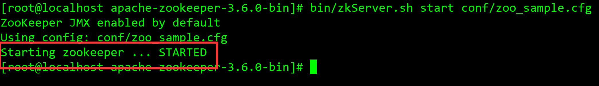

2. 再次查看是否启动成功

   > 控制台输入 jps命令

   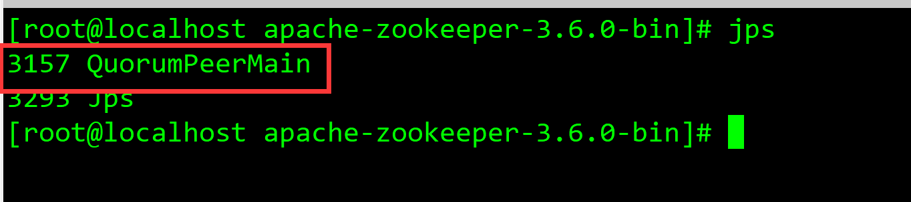

   此时可以看到Zookeeper的进程已经有了

3. 查看Zookeeper中的Broker列表

   > 1. 先进入zookeeper客户端
   >
   >    bin/zkCli.sh

   > 2. 查看Zookeeper中列表
   >
   >    ls /

   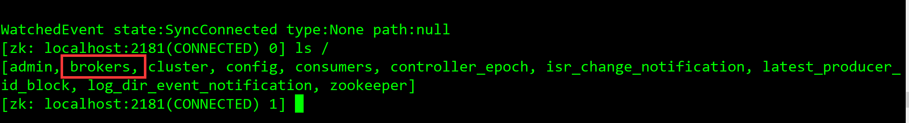

   > 3. 显示集群中的Broker列表
   >
   >    ls /brokers/ids

   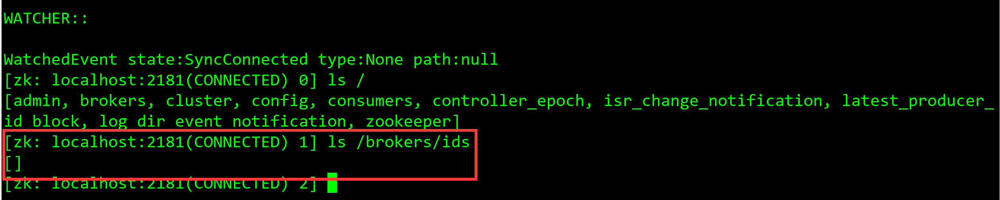

   

   	此时可以看到列表为空，没有任何一台broker

   

   4.修改Kafka的server.properties配置文件，将kafka注册到Zookeeper中

   修改broker.id为105

   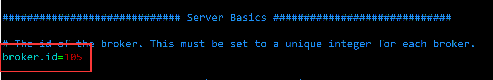

   > 修改Zookeeper连接地址

   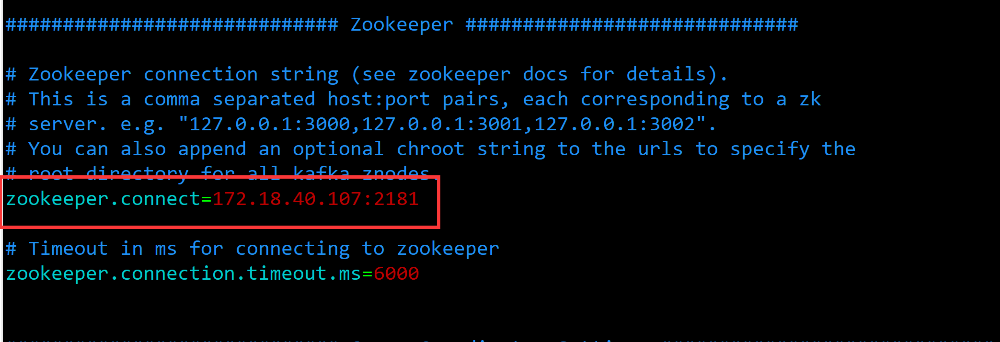

   5.保存修改后的配置文件并启动

       其余两台Broker依次配置并启动

   **成功启动如图所示：**

   																172.18.40.105

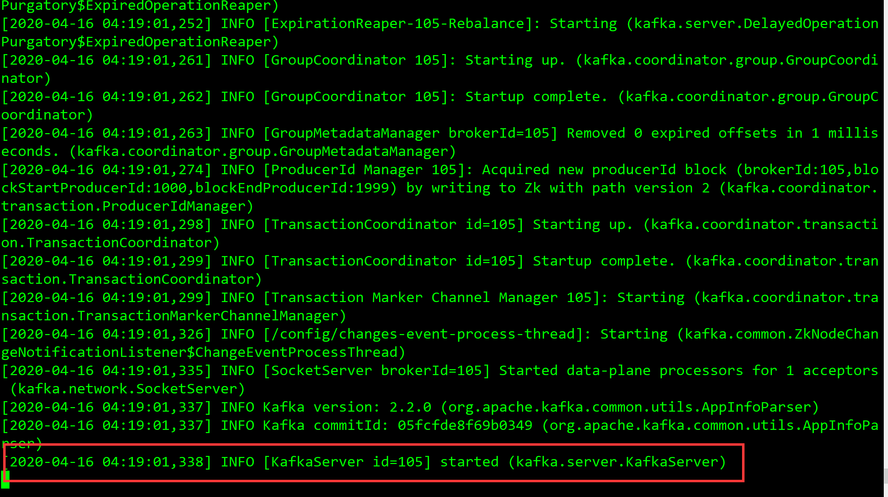

																       172.18.40.106

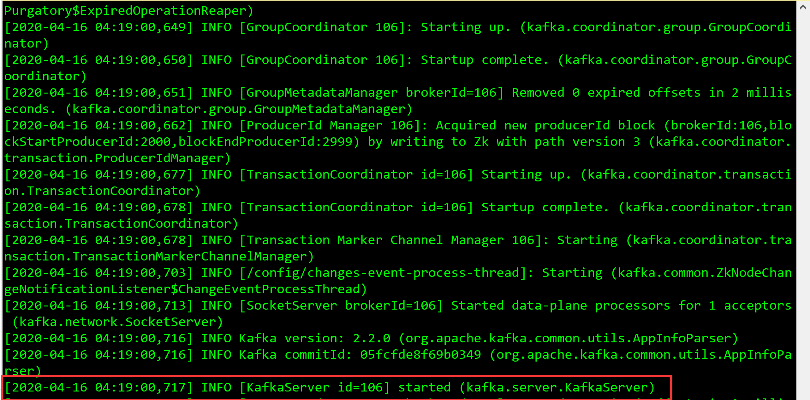

												  			    172.18.40.108	

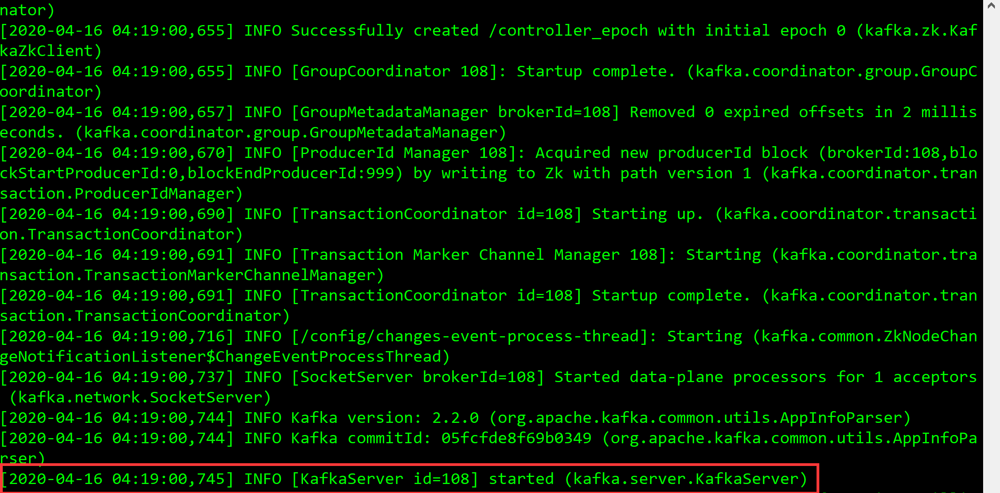


6. 查看Zookeeper中的Broker列表

   > ls /brokers/ids

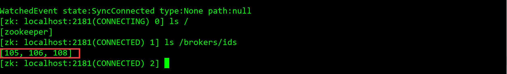

此时我们发现，zookeeper中已经有了我们3台kafka broker的id

**拓扑图如图所示**

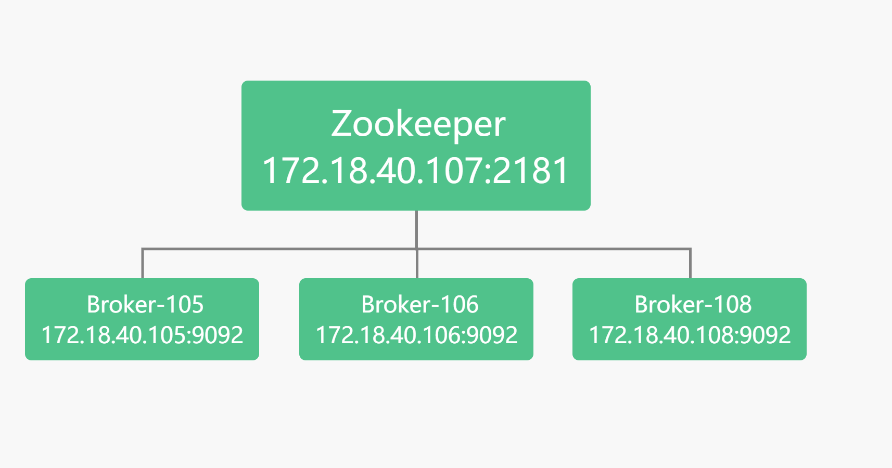

#### 1.2 kafka集群如何在线扩容？

		现在有两个Broker集群，我想在线重新添加一台Broker怎么办？

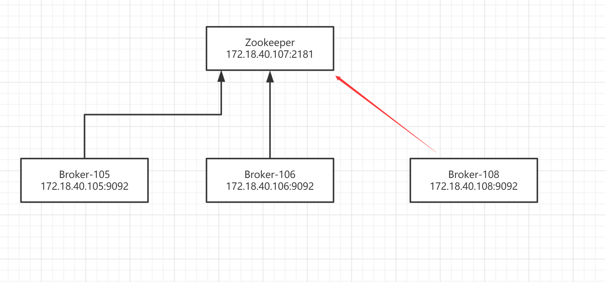

1. 查看Zookeeper中Broker列表

   > ls /brokers/ids

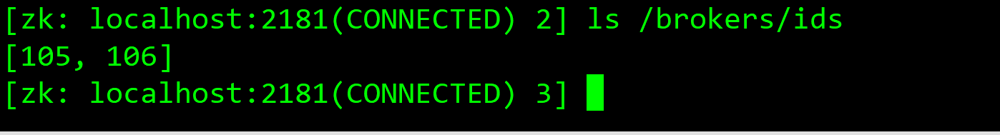

	 此时Zookeeper中只有2台Broker

2. 修改新添加Kafka的server.properties配置文件，将kafka注册到Zookeeper中

   > 修改broker.id为108


3. 修改Zookeeper连接地址

   > zookeeper.connect=172.18.40.107:2181


4. 保存修改后的配置文件并启动

   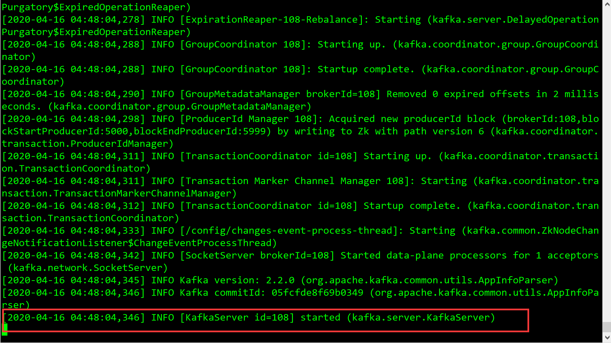

5. 查看Zookeeper中的Broker列表

   > ls /brokers/ids

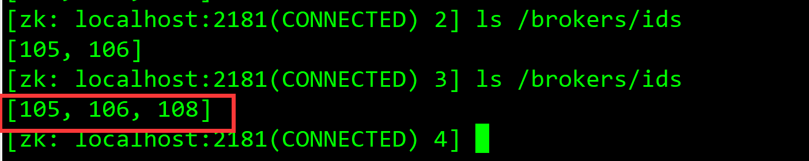

此时新添加的Broker id为108的已经成功注册到Zookeeper中


------


### 2.多节点集群

Zookeeper集群原则上需要2n+1个实例才能保证集群有效性，所以集群规模至少是3台。


多节点集群模式：Zookeeper运行于一个集群上，适合生产环境，这个计算机集群被称为一个“集合体” （ensemble）

拓扑图如下：

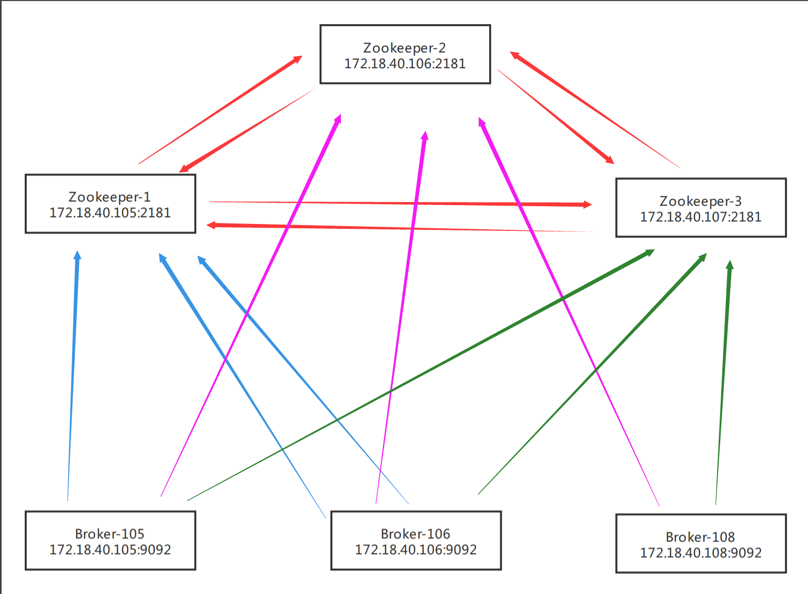

    <font color="#dd0000">   将3台Broker分别注册到3台不同的zookeeper中</font>
    
    <font color="#dd0000">   将3台Zookeeper相互注册</font>

 


#### 2.1 如何将Kafka和Zookeeper组成多节点集群？

1. 修改Kafka的server.properties配置文件，将kafka注册到Zookeeper-1和Zookeeper-2中

多节点之间用逗号隔开


2. 修改Zookeeper中配置信息，将3台Zookeeper相互注册，zoo_sample.cfg 这个文件是官方给我们的zookeeper的样板文件，给他复制一份命名为zoo.cfg，zoo.cfg是官方指定的文件命名规则。

   > 1. cd  conf
   >
   > 2. cp zoo_sample.cfg zoo.cfg
   > 3. vim zoo.cfg

   ```
   server.1=172.18.40.105:2888:3888
   server.2=172.18.40.106:2888:3888
   server.3=172.18.40.107:2888:3888
   #server.1 这个1是服务器的标识也可以是其他的数字， 表示这个是第几号服务器，用来标识服务器，这个标识要写到快照目录下面myid文件里
   #172.18.40.105为集群里的IP地址，第一个端口是master和slave之间的通信端口，默认是2888，第二个端口是leader选举的端口，集群刚启动的时候选举或者leader挂掉之后进行新的选举的端口默认是3888
   ```

   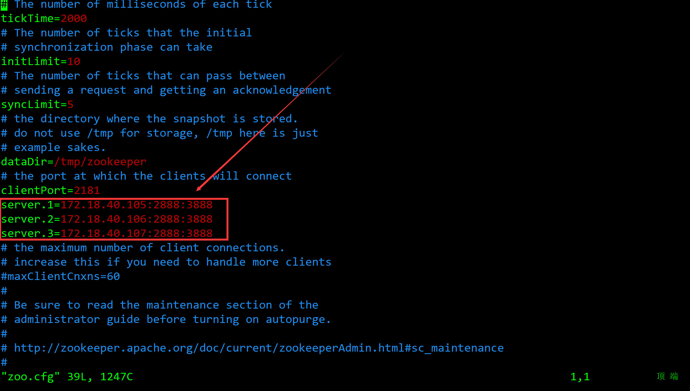

3. 三台服务器上分别创建myid文件

```
#server1（172.18.40.105）
1. cd /tmp/zookeeper
2. touch myid
3. echo "1">>myid

#server2（172.18.40.106）
1. cd /tmp/zookeeper
2. touch myid
3. echo "2">>myid

#server3（172.18.40.107）
1. cd /tmp/zookeeper
2. touch myid
3. echo "3">>myid
```

每台机器的myid里面的值对应server.后面的数字

4. 配置zookeeper的环境变量

   > vim /etc/profile
   >
   > 在配置文件中添加如下配置
   >
   > #Zookeeper_Home
   > export ZOOKEEPER_HOME=/developer/apache-zookeeper-3.6.0-bin
   > export PATH=$PATH:$ZOOKEEPER_HOME/bin:$JAVA_HOME/bin
   >
   > 刷新配置
   >
   > source /etc/profile

   

5. 依次启动3台zookeeper集群

   > bin/zkServer.sh start conf/zoo.cfg

6. 分别查看Zookeeper状态

   > bin/zkServer.sh status

   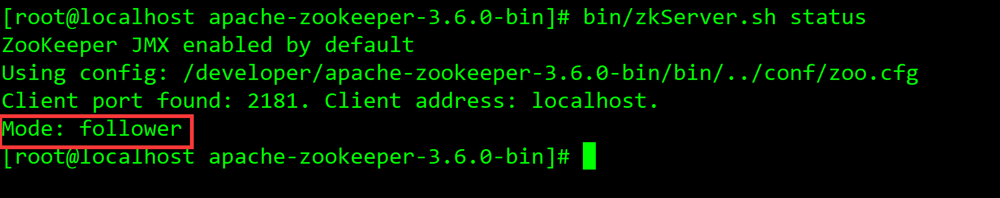

此时172.18.40.105节点成为 follower


172.18.40.106节点成为 follower

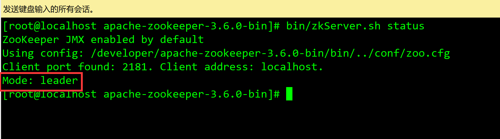

172.18.40.107节点选举成为leader

> zk集群一般只有一个leader，多个follower，主一般是响应客户端的读写请求，而从主同步数据，当主挂掉之后就会从follower里投票选举一个leader出来。

6. 修改Kafka配置信息

   > cd  config
   >
   > vim server.properties
   >
   > 修改zookeeper连接地址为之前搭建好的zookeeper集群地址
   >
   > zookeeper.connect=172.18.40.105:2181,172.18.40.106:2181,172.18.40.107:2181

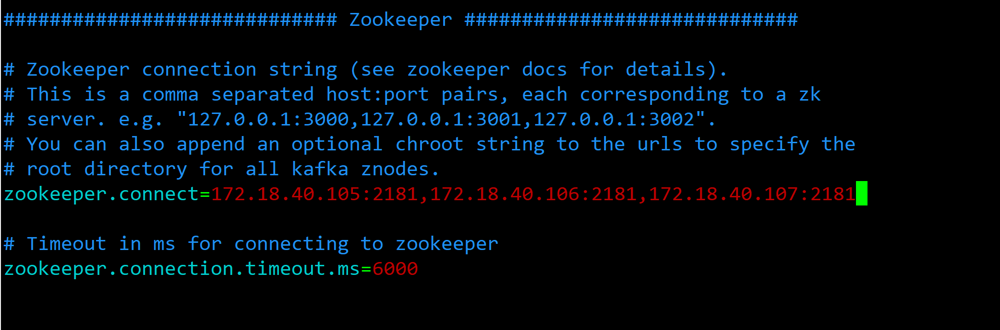

7. 依次修改其余几台配置

   >  bin/kafka-server-start.sh config/server.properties

8. 查看Zookeeper中的Broker列表

   > 先进入zookeeper客户端

   > 查看Zookeeper中的Broker列表
   >
   > ls /brokers/ids

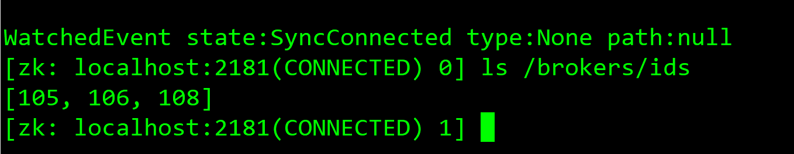

		此时可以发现Zookeeper节点中已经有了我们注册进去的三个broker集群，依次查看其余两台zookeeper集群，查看Broker列表，可以发现三个broker集群也成功注册进去。

#### 2.2 在多节点集群模式中，kafka集群如何在线扩容？

1. 修改新加入服务器的kafka配置文件

   > cd config
   >
   > vim vim server.properties
   >
   > 修改kafka的broker  id 命名为109
   >
   > broker.id=109

   

   > 修改kafka的zookeeper节点连接地址
   >
   > zookeeper.connect=172.18.40.105:2181,172.18.40.106:2181,172.18.40.107:2181

   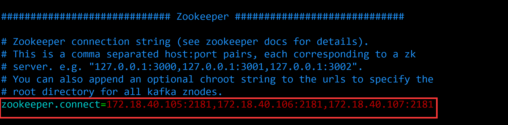

   > 启动kafka
   >
   > bin/kafka-server-start.sh config/server.properties

   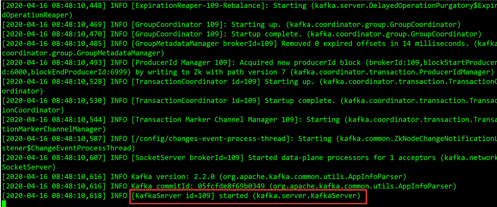

   	此时broker id为109的kafka已经成功启动

2. 查看Zookeeper中的Broker列表

   > 先进入zookeeper客户端
   >
   > bin/zkCli.sh
   >
   > 查看Zookeeper中的Broker列表
   >
   > ls /brokers/ids

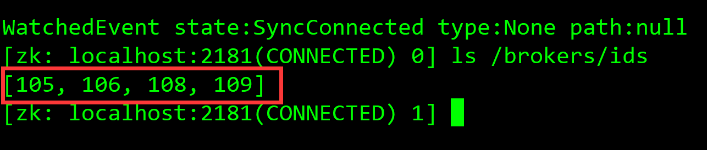

此时我们新加入的brokers id为109的kafka已经成功注册到zookeeper集群中

#### 2.3 在多节点集群模式中，如zookeeper集群如何在线扩容？

1. 首先stop我们的zookeeper集群

2. 按照[2.1 如何将Kafka和Zookeeper组成多节点集群？](# 2.1 如何将Kafka和Zookeeper组成多节点集群？)章节中，分别修改zookeeper集群中所有zookeeper中的zoo.cfg配置文件。将新添加的zookeeper连接地址添加进去

   

3. 在新的zookeeper下创建myid文件

   > cd /tmp/zookeeper
   >
   > touch myid
   >
   > echo "4">>myid

4. 配置zookeeper的环境变量

   > vim /etc/profile
   >
   > /mnt/d/Ubuntu/apache-zookeeper-3.5.5-bin
   >
   > 在配置文件中添加如下配置
   >
   > #Zookeeper_Home
   >
   > export PATH=$PATH:$JAVA_HOME/bin:$KE_HOME/bin
   > export ZOOKEEPER_HOME=/developer/apache-zookeeper-3.6.0-bin
   > export PATH=$PATH:$ZOOKEEPER_HOME/bin
   >
   > 刷新配置
   >
   > source /etc/profile

5. 保存退出，并依次启动全部zookeeper

   > bin/zkServer.sh start conf/zoo.cfg

6. 修改Kafka配置文件

   > 修改kafka的zookeeper节点连接地址
   >
   > zookeeper.connect=172.18.40.105:2181,172.18.40.106:2181,172.18.40.107:2181,新的zookeeper节点地址

7. 保存退出，并依次启动全部kafka集群

   >  bin/kafka-server-start.sh config/server.properties

8. 依次查看zookeeper中的broker列表

   > 先进入zookeeper客户端
   >
   > bin/zkCli.sh
   >
   > 查看Zookeeper中的Broker列表
   >
   > ls /brokers/ids

9. 查看新加入的zookeeper状态是否扩容成功

   > bin/zkServer.sh status
