#  一、消息队列介绍和使用场景

## 1、什么是消息队列？

消息队列中间件是分布式系统中重要的组件，主要解决应用耦合、异步消息、流量削锋等问题。实现高性能、高可用、可伸缩和最终一致性架构。是大型分布式系统不可缺少的中间件。

市面上主流的消息队列有：ActiveMQ、RabbitMQ、ZeroMQ、Kafka、MetaMQ、RocketMQ等。

## 2、消息队列应用场景

场景分为异步处理、应用解耦、流量削锋和消息通讯四个场景。

### 2.1异步处理

```txt
场景说明：用户注册后，需要发送注册邮件和发送注册信息，传统的做法有两种：串行方式、并行方式
```

**串行方式：**

将注册信息写入数据库成功后，发送注册邮件，然后发送注册短信，而所有任务执行完成后，返回信息给客户端

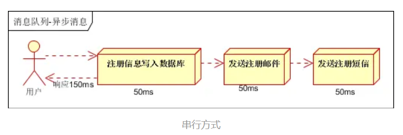

**并行方式：**

 将注册信息写入数据库成功后，同时进行发送注册邮件和发送注册短信的操作。而所有任务执行完成后，返回信息给客户端。同串行方式相比，并行方式可以提高执行效率，减少执行时间。 

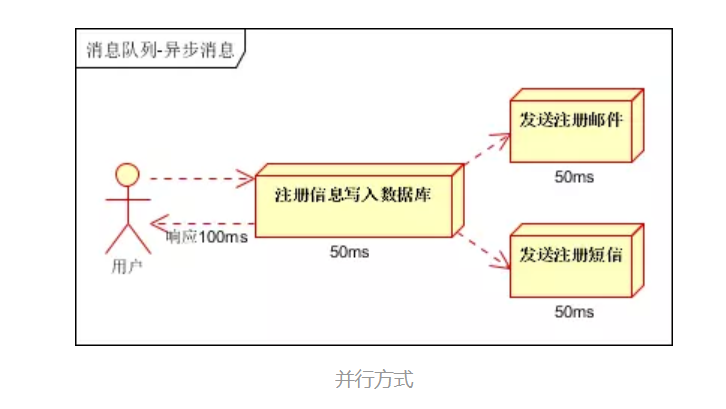

**使用消息队列：**

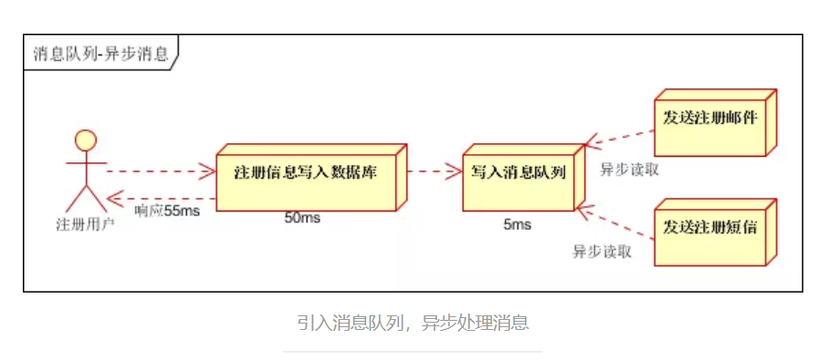

根据上述的流程，用户的响应时间基本相当于将用户数据写入数据库的时间，发送注册邮件、发送注册短信的消息在写入消息队列后，即可返回执行结果，写入消息队列的时间很快，几乎可以忽略，也有此可以将系统吞吐量提升至20QPS，比串行方式提升近3倍，比并行方式提升2倍。

### 2.2应用解耦

```txt
场景说明：用户下单后，订单系统需要通知库存系统。
```

**传统方式：**

传统的做法为：订单系统调用库存系统的接口。如下图所示：

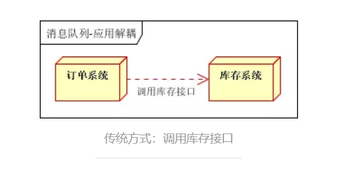


 传统方式具有如下缺点：
-1. 假设库存系统访问失败，则订单减少库存失败，导致订单创建失败
-2. 订单系统同库存系统过度耦合 

**使用消息队列：**

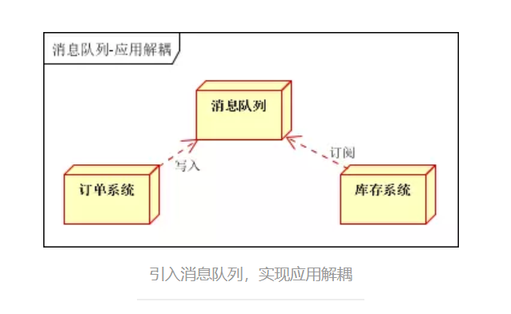

- 订单系统：用户下单后，订单系统进行数据持久化处理，然后将消息写入消息队列，返回订单创建成功
- 库存系统：使用拉/推的方式，获取下单信息，库存系统根据订单信息，进行库存操作。

假如在下单时库存系统不能正常使用。也不影响正常下单，因为下单后，订单系统写入消息队列就不再关心其后续操作了。由此实现了订单系统与库存系统的应用解耦。

### 2.3流量削峰

流量削锋也是消息队列中的常用场景，一般在秒杀或团抢活动中使用广泛。

```txt
应用场景：秒杀活动，一般会因为流量过大，导致流量暴增，应用挂掉。为解决这个问题，一般需要在应用前端加入消息队列。
```

1. 可以控制参与活动的人数；
2. 可以缓解短时间内高流量对应用的巨大压力, 服务器在接收到用户请求后，首先写入消息队列。这时如果消息队列中消息数量超过最大数量，则直接拒绝用户请求或返回跳转到错误页面；

### 2.4消息通讯

 消息通讯是指，消息队列一般都内置了高效的通信机制，因此也可以用在纯的消息通讯。比如实现点对点消息队列、聊天室等。 

**点对点通讯：**

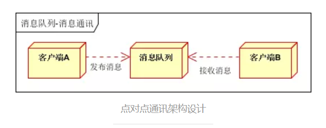

在点对点通讯架构设计中，客户端A和客户端B共用一个消息队列，即可实现消息通讯功能。

**聊天室通讯**：

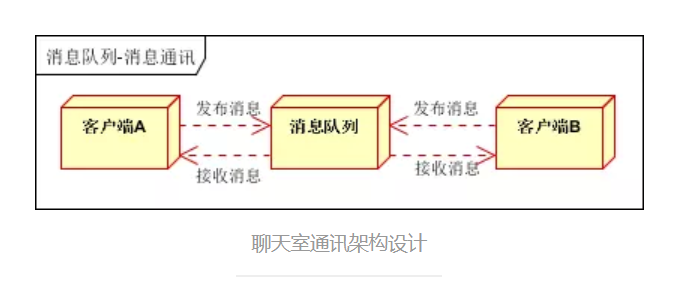

 客户端A、客户端B、直至客户端N订阅同一消息队列，进行消息的发布与接收，即可实现聊天通讯方案架构设计。 

## 3.消息队列的两种模式

### 3.1点对点模式

 一对一，消费者主动拉取数据，消息收到后消息清除 

```txt
消息生产者生产消息发送到Queue中，然后消息消费者从Queue中取出并且消费消息。消息被消费以后，queue 中不再有存储，所以消息消费者不可能消费到已经被消费的消息。Queue 支持存在多个消费者，但是对一个消息而言，只会有一个消费者可以消费
```


### 3.2 发布/订阅模式 

一对多，消费者消费数据之后不会清除消息

```txt
消息生产者（发布）将消息发布到 topic 中，同时有多个消息消费者（订阅）消费该消息。和点对点方式不同，发布到 topic 的消息会被所有订阅者消费。
```

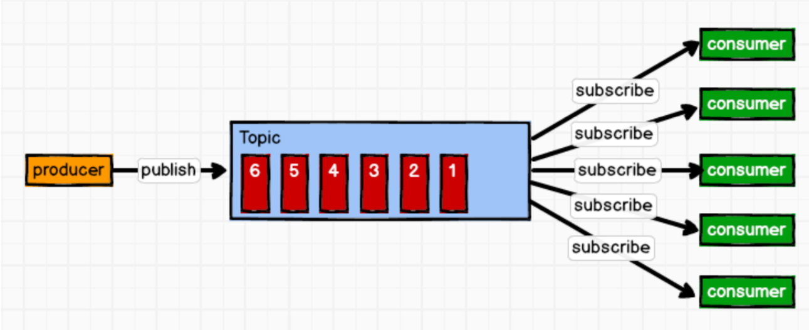


## 4.市面上主流消息队列比较

  

### 4.1性能比较

性能测试主要参考阿里中间件博客[Kafka、RabbitMQ、RocketMQ消息中间件的对比 — 消息发送性能](http://jm.taobao.org/2016/04/01/kafka-vs-rabbitmq-vs-rocketmq-message-send-performance/)

##### 测试目的

> 对比Kafka、RabbitMQ、RocketMQ发送小消息(124字节)的性能。这次压测我们只关注服务端的性能指标

##### 压测的标准

> 不断增加发送端的压力,直到系统吞吐量不再上升,而响应时间拉长。这时服务端已出现性能瓶颈,可以获得相应的系统最佳吞吐量。


在同步发送场景中，三个消息中间件的表现区分明显：

Kafka的吞吐量高达17.3w/s，不愧是高吞吐量消息中间件的行业老大。这主要取决于它的队列模式保证了写磁盘的过程是线性IO。此时broker磁盘IO已达瓶颈。

RocketMQ也表现不俗，吞吐量在11.6w/s，磁盘IO %util已接近100%。RocketMQ的消息写入内存后即返回ack，由单独的线程专门做刷盘的操作，所有的消息均是顺序写文件。

RabbitMQ的吞吐量5.95w/s，CPU资源消耗较高。它支持AMQP协议，实现非常重量级，为了保证消息的可靠性在吞吐量上做了取舍。我们还做了RabbitMQ在消息持久化场景下的性能测试，吞吐量在2.6w/s左右。

**测试结论**

**在服务端处理同步发送的性能上，Kafka>RocketMQ>RabbitMQ。**

#### 附录：

##### 测试环境

> 服务端为单机部署，机器配置如下：

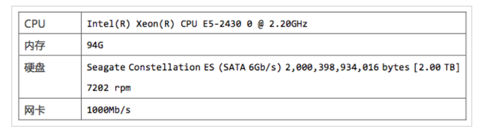

##### 应用版本

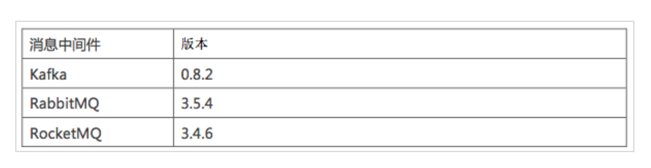

##### 测试脚本

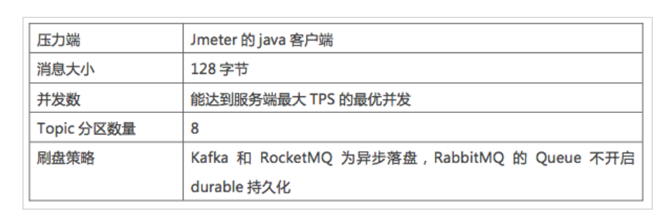


### 4.2系统可靠性比较

系统可靠性比较主要参考阿里中间件博客[Kafka vs RocketMQ——单机系统可靠性](http://jm.taobao.org/2016/04/28/kafka-vs-rocktemq-4/)

##### 测试目的

> 在消息收发的过程中，分别模拟Broker服务进程被Kill、物理机器掉电的异常场景，多次实验，查看极端情况下消息系统的可靠性。

##### 测试场景

> 以下场景使用多个发送端向一个Topic发送消息，发送方式为同步发送，分区数为8，只启动一个订阅者。

###### 场景1:`模拟进程退出`

在消息收发过程中，利用Kill -9 命令使Broker进程终止，然后重新启动，得到可靠性数据如下：

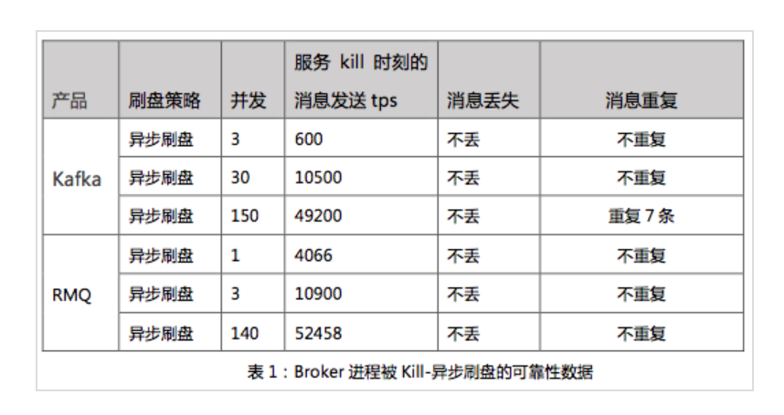

> *注：以上测试场景中Kafka的异步刷盘间隔为1秒钟，同步发送需设置request.required.acks=1，否则会出现消息丢失。*

在Broker进程被终止重启，Kafka和RMQ都能保证同步发送的消息不丢，因为进程退出后操作系统能确保将该进程遗留在内存的数据刷到磁盘上。实验中，Kafka出现了极少量的消息重复。再次可以确定此场景中，二者的可靠性都很高。

###### 场景2:`模拟机器掉电`

在消息收发过程中，直接拔掉Broker所在的宿主机电源，然后重启宿主机和Broker应用。因受到机房断电限制，我们在本场景测试中使用的是普通PC机器。得到可靠性数据如下：

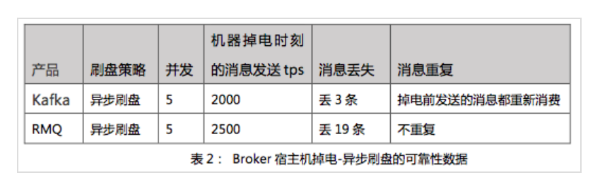

​																						*异步刷盘*


测试发现，即使在并发很低的情况下，Kafka和RMQ都无法保证掉电后不丢消息。这个时候，就需要改变刷盘策略了。我们把刷盘策略由“异步刷盘”变更为“同步刷盘”，就是说，让每一条消息都完成存储后才返回，以保证消息不丢失。

> 注：关于两种刷盘模式的详细区别可以参照文档最下方的说明

重新执行上面的测试，得到数据如下：

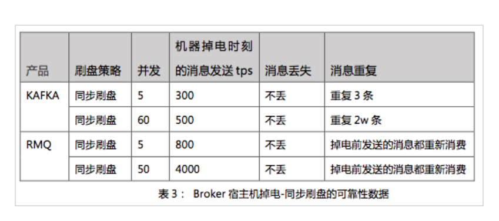

​																				*同步刷盘*

首先，设置同步刷盘时，二者都没出现消息丢失的情况。限于我们使用的是普通PC机器，两者吞吐量都不高。此时Kafka的最高TPS仅有500条/秒，RMQ可以达到4000条/秒，已经是Kafka的8倍。

为什么Kafka的吞吐量如此低呢？因为Kafka本身是没有实现任何同步刷盘机制的，就是说在这种场景下测试，Kafka注定是要丢消息的。但要想做到每一条消息都在落盘后才返回，我们可以通过修改异步刷盘的频率来实现。设置参数log.flush.interval.messages=1，即每条消息都刷一次磁盘。这样的做法，Kafka也不会丢消息了，但是频繁的磁盘读写直接导致性能的下降。

另外，二者在服务恢复后，均出现了消息重复消费的情况，这说明消费位点的提交并不是同步落盘的。不过，幸好Kafka和RMQ都提供了自定义消费位点的接口，来避免大量的重复消费。

**测试结论**	

1. 在Broker进程被Kill的场景， Kafka和RocketMQ都能在保证吞吐量的情况下，不丢消息，可靠性都比较高。
2. 在宿主机掉电的场景，Kafka与RocketMQ均能做到不丢消息，此时Kafka的吞吐量会急剧下跌，几乎不可用。RocketMQ则仍能保持较高的吞吐量。
3. 在单机可靠性方面，RocketMQ综合表现优于Kafka。

#### 附录：

##### 测试环境

> 服务端为单机部署，机器配置如下：

​	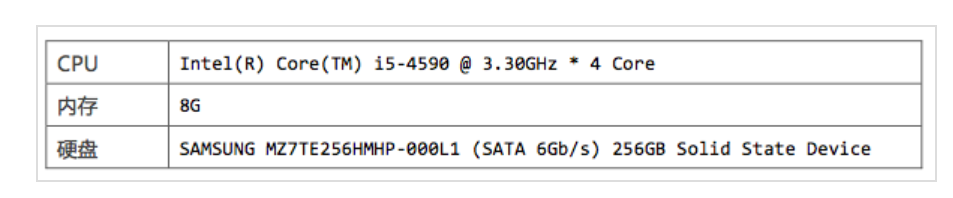


> 应用版本：

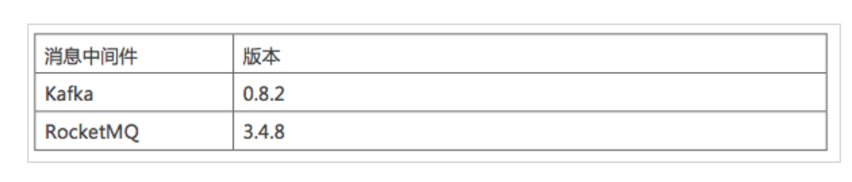

> 测试脚本:

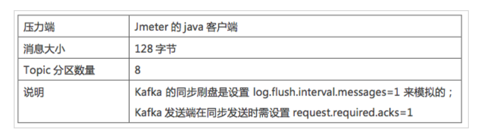


**同步刷盘和异步刷盘的区别**

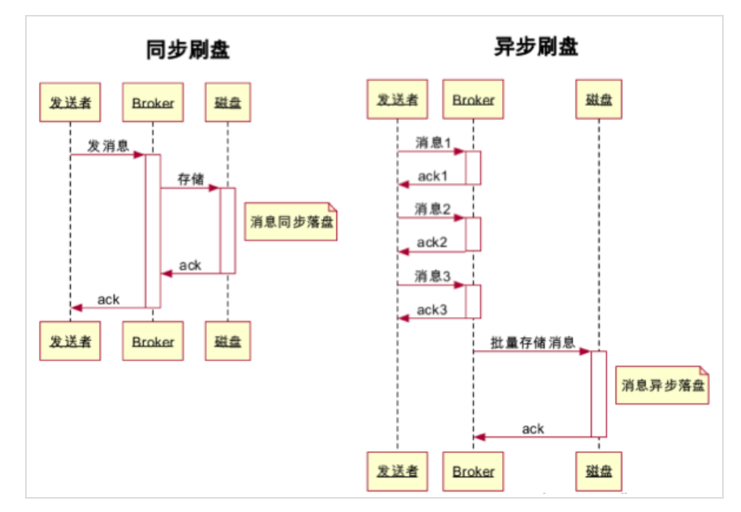

同步刷盘是在每条消息都确认落盘了之后才向发送者返回响应；而异步刷盘中，只要消息保存到Broker的内存就向发送者返回响应，Broker会有专门的线程对内存中的消息进行批量存储。所以异步刷盘的策略下，当机器突然掉电时，Broker内存中的消息因无法刷到磁盘导致丢失。

### 4.3 Kafka与其他消息中间件对比

主要参考阿里中间件博客[RocketMQ与kafka对比（18项差异)](http://jm.taobao.org/2016/03/24/rmq-vs-kafka/)

##### 数据可靠性

> 卡夫卡使用异步刷盘方式，异步复制/同步复制。Kafka的数据以分区为单位组织，意味着一个Kafka实例上会有几百个数据分区，Kafka同步Replication理论上性能会降低。

##### **性能对比**

> 卡夫卡单机写入TPS约在百万条/秒，消息大小10个字节。Kafka的TPS跑到单机百万，主要是由于Producer端将多个小消息合并，批量发向Broker。

##### **单机支持的队列数**

> Kafka单机超过64个队列/分区，Load会发生明显的飙高现象，队列越多，load越高，发送消息响应时间变长。

##### **消息投递实时性**

> Kafka使用短轮询方式，实时性取决于轮询间隔时间，0.8以后版本支持长轮询。
>
> 卡夫卡消费失败不支持重试。

##### **严格的消息顺序**

> 卡夫卡支持消息顺序，但是一台代理宕机后，就会产生消息乱序

##### 定时消息

> 卡夫卡不支持定时消息

##### 分布式事务消息

> 卡夫卡不支持分布式事务消息

##### 消息查询

> 卡夫卡不支持消息查询

##### 消息回溯

> 卡夫卡理论上可以按照偏移来回溯消息

##### 消费并行度

> Kafka的消费并行度依赖Topic配置的分区数，如分区数为10，那么最多10台机器来并行消费（每台机器只能开启一个线程），或者一台机器消费（10个线程并行消费）。即消费并行度和分区数一致。

##### 消息轨迹

> 卡夫卡不支持消息轨迹

##### 开源社区活跃度

> 卡夫卡社区更新较慢

##### 券商端消息过滤

> 卡夫卡不支持代理端的消息过滤

##### 消息堆积能力

> 消息堆积能力较强

##### 开发语言友好性

> 卡夫卡采用斯卡拉编写


# 二、Kafka基本概念

## 1、kafka概述

Kafka是LinkedIn开源的分布式发布-订阅消息系统由Scala语言编写，目前归属于Apache定级项目。Kafka它提供了类似于JMS的特性，但是在设计实现上完全不同，结合JMS中的两种模式，可以有多个消费者主动拉取数据，在JMS中只有点对点模式才有消费者主动拉取数据。主要特点是基于Pull的模式来处理消息消费，追求高吞吐量，主要应用于 大数据实时处理领域。

JMS：JMS（JAVA Message Service,Java消息服务）API是一个消息服务的标准或者说是规范，类似于JDBC(Java Database Connectivity)允许应用程序组件基于JavaEE平台创建、发送、接收和读取消息。它使分布式通信耦合度更低，消息服务更加可靠以及异步性。

## 2、Kafka基础架构

### 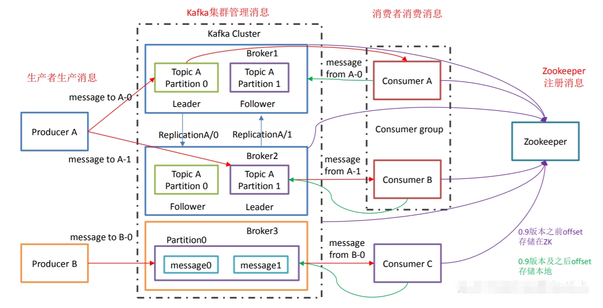

**网络拓扑图**

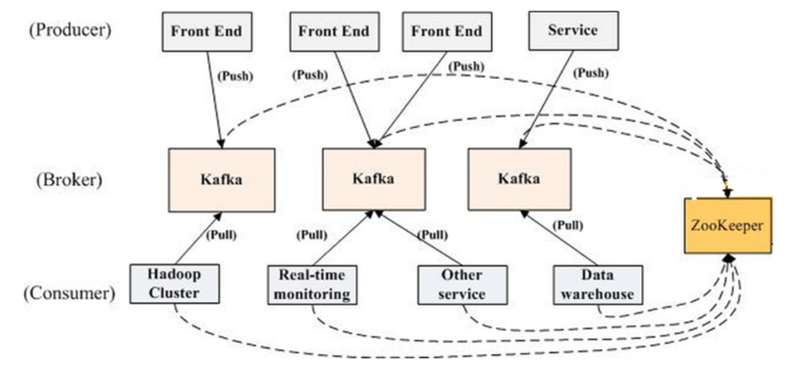

### 2.1 名词解释

> Producer ：消息生产者，就是向 kafka broker 发消息的客户端

> Consumer ：消息消费者，向 kafka broker 取消息的客户端

> Consumer Group （CG）：消费者组，由多个 consumer 组成。消费者组内每个消费者负 责消费不同分区的数据，一个分区只能由一个组内消费者消费；消费者组之间互不影响。所 有的消费者都属于某个消费者组，即消费者组是逻辑上的一个订阅者。

> Broker ：一台 kafka 服务器就是一个 broker。一个集群由多个 broker 组成。一个 broker 可以容纳多个 topic。

> Topic ：可以理解为一个队列，生产者和消费者面向的都是一个 topic；

> Partition：为了实现扩展性，一个非常大的 topic 可以分布到多个 broker（即服务器）上，
> 一个 topic 可以分为多个 partition，每个 partition 是一个有序的队列；

> Replica：副本，为保证集群中的某个节点发生故障时，该节点上的 partition 数据不丢失，且 kafka 仍然能够继续工作，kafka 提供了副本机制，一个 topic 的每个分区都有若干个副本， 一个 leader 和若干个 follower。

> leader：每个分区多个副本的“主”，生产者发送数据的对象，以及消费者消费数据的对
> 象都是 leader。

> follower：每个分区多个副本中的“从”，实时从 leader 中同步数据，保持和 leader 数据
> 的同步。leader 发生故障时，某个 follower 会成为新的 follower。

#### 概念一：生产者与消费者

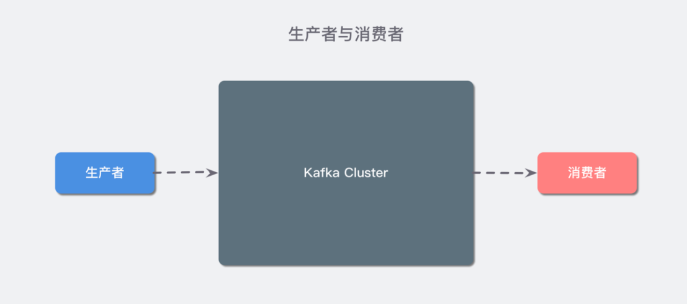


对于 Kafka 来说客户端有两种基本类型：

1. **生产者（Producer）**
2. **消费者（Consumer）**。

​      除此之外，还有用来做数据集成的 Kafka Connect API 和流式处理的 Kafka Streams 等高阶客户端，但这些高阶客户端底层仍然是生产者和消费者API，它们只不过是在上层做了封装。

这很容易理解，生产者（也称为发布者）创建消息，而消费者（也称为订阅者）负责消费or读取消息。


#### 概念二：主题（Topic）与分区（Partition）

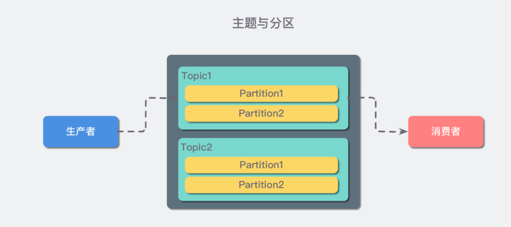

​       在 Kafka 中，消息以**主题（Topic）**来分类，每一个主题都对应一个 **「消息队列」**，这有点儿类似于数据库中的表。但是如果我们把所有同类的消息都塞入到一个“中心”队列中，势必缺少可伸缩性，无论是生产者/消费者数目的增加，还是消息数量的增加，都可能耗尽系统的性能或存储。

我们使用一个生活中的例子来说明：现在 A 城市生产的某商品需要运输到 B 城市，走的是公路，那么单通道的高速公路不论是在「A 城市商品增多」还是「现在 C 城市也要往 B 城市运输东西」这样的情况下都会出现「吞吐量不足」的问题。所以我们现在引入**分区（Partition）**的概念，类似“允许多修几条道”的方式对我们的主题完成了水平扩展。


#### 概念三：Broker 和集群（Cluster）

##### Broker的作用：

- 接收生产者的消息
- 设置偏移量
- 持久化消息到磁盘
- 为消费者提供服务


​      一个 Kafka 服务器也称为 Broker，它接受生产者发送的消息并存入磁盘；Broker 同时服务消费者拉取分区消息的请求，返回目前已经提交的消息。使用特定的机器硬件，一个 Broker 每秒可以处理成千上万的分区和百万量级的消息。（现在动不动就百万量级..我特地去查了一把，好像确实集群的情况下吞吐量挺高的..嗯..）


​      若干个 Broker 组成一个集群（Cluster），其中集群内某个 Broker 会成为集群控制器（Cluster Controller），它负责管理集群，包括分配分区到 Broker、监控 Broker 故障等。在集群内，一个分区由一个 Broker 负责，这个 Broker 也称为这个分区的 Leader；当然一个分区可以被复制到多个 Broker 上来实现冗余，这样当存在 Broker 故障时可以将其分区重新分配到其他 Broker 来负责。

​	  当我们启用Kafka的复制机制时，此时会发生分区复制。假设首领分区所在的Broker1挂了，Broker2的分区就会接管领导权，其他消费者和生产则会重新连接到新的Broker2上。

下图是一个样例：

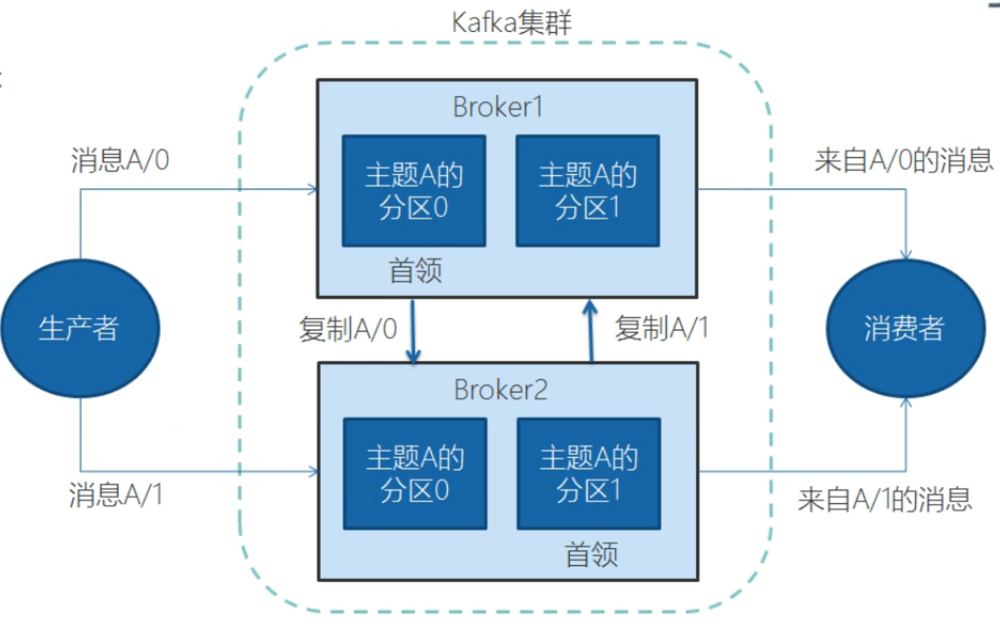

​       

**注意：**

>   Kafka拥有保留消息机制，在一定期限内Kafka会保留消息。消息被消费者消费后，消息任然会进行保留，不像其他MQ一样会进行删除。 
>
> 保留机制：每一个主题都可以设置自己的保留策略
>
> ​			1.保留一定时间
>
> ​			2.保留一定大小

​	

​      Kafka 的一个关键性质是日志保留（retention），我们可以配置主题的消息保留策略，譬如只保留一段时间的日志或者只保留特定大小的日志。当超过这些限制时，老的消息会被删除。我们也可以针对某个主题单独设置消息过期策略，这样对于不同应用可以实现个性化。 


### 2.2快速入门

#### 2.2.1安装部署

##### 1.jar包下载

[http://kafka.apache.org/downloads.html](http://kafka.apache.org/downloads.html)

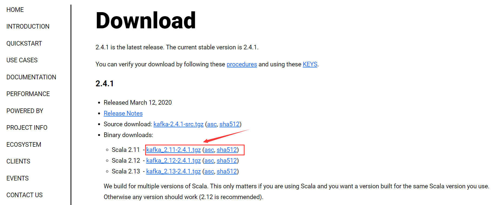

> 下载好后并上传到服务器中

##### 2. 部署集群

1、解压安装包

>  tar -zxvf  kafka_2.11-2.4.1.tgz

2、在当前目录下创建logs文件，用于存储Kafa日志

> mkdir logs

3、修改配置文件

>  vim /config/ server.properties

```
更改一下内容
#打开注释
listeners=PLAINTEXT://:9092
#当前服务器IP为192.168.0.1，你需要修改为外网或局域网可以访问到的服务器IP。
advertised.listeners=PLAINTEXT://192.168.0.1:9092
#broker 的全局唯一编号，不能重复
broker.id=0
#删除 topic 功能
delete.topic.enable=true
#处理网络请求的线程数量
num.network.threads=3
#用来处理磁盘 IO 的现成数量
num.io.threads=8
#发送套接字的缓冲区大小
socket.send.buffer.bytes=102400
#接收套接字的缓冲区大小
socket.receive.buffer.bytes=102400
#请求套接字的缓冲区大小
socket.request.max.bytes=104857600
#kafka 运行日志存放的路径
log.dirs=/opt/module/kafka/logs
#topic 在当前 broker 上的分区个数
num.partitions=1
#用来恢复和清理 data 下数据的线程数量
num.recovery.threads.per.data.dir=1
#segment 文件保留的最长时间，超时将被删除
log.retention.hours=168
#配置连接 Zookeeper 集群地址
zookeeper.connect=192.168.0.1:2181,192.168.0.2:2181,192.168.0.3:2181
```

4、配置环境变量

> sudo vi /etc/profile

在配置文件最底下插入

```
#KAFKA_HOME
export KAFKA_HOME=/opt/module/kafka
export PATH=$PATH:$KAFKA_HOME/bin
```

刷新配置

>  source /etc/profile

#### 2.2.2启动服务器

**依次在192.168.0.1、192.168.0.2、192.168.0.3节点上启动服务**

##### 2.2.2.1 启动 Zookeeper

启动Kafka时必须先启动Zookeeper，否则就会出现注册失败连接超时问题

> 启动命令：bin/zookeeper-server-start.sh config/zookeeper.properties

其中 Zookeeper主要有3个配置：

```
# the directory where the snapshot is stored.
dataDir=/tmp/zookeeper
# the port at which the clients will connect
clientPort=2181
# disable the per-ip limit on the number of connections since this is a non-production config
maxClientCnxns=0
```

###### Zookeeper启动失败

​		1：Zookeeper启动端口为2181，在防火墙内打开此端口

​        2：系统内存不足，出现该错误

> 解决办法：vim bin/zookeeper-server-start.sh
>
> 将  export KAFKA_HEAP_OPTS="-Xmx512M -Xms128M" 参数改小即可

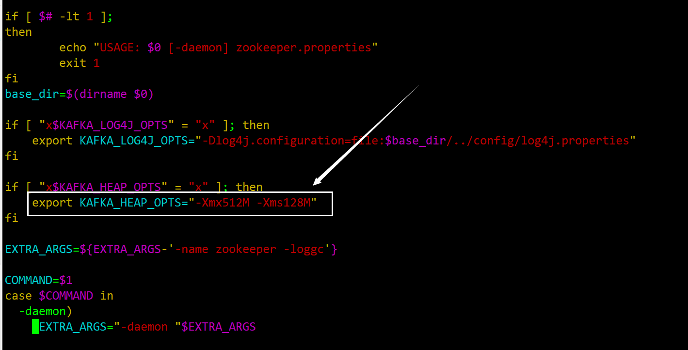

##### 2.2.2.2 启动Kafka

> 启动命令：bin/kafka-server-start.sh config/server.properties

###### Kafka启动失败

1、如果你在启动时出现 `java.lang.OutOfMemoryError: Map failed`

```
打开 bin/kafka-run-class.sh 文件，
搜索-XX:+DisableExplicitGC，
将这个参数替换为 -XX:+ExplicitGCInvokesConcurrent。
```

2、系统内存不足，出现该错误

```
Java OpenJDK(TM) 64-Bit Server VM warning: INFO: os::commit_memory(0x000000c0000000, 4096, 0) failed; error='Cannot allocate memory' (errno=12)
89477798
```

> 解决办法： vim bin/kafka-server-start.sh 
>
> 将 export KAFKA_HEAP_OPTS="-Xmx512M -Xms128M" 参数改小即可

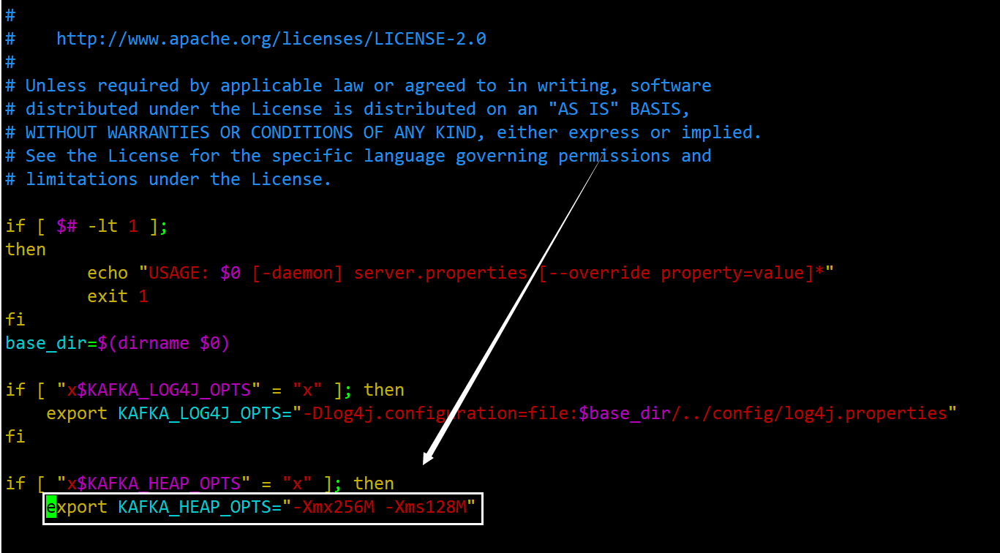

#### 2.2.3关闭集群

**依次在192.168.0.1、192.168.0.2、192.168.0.3节点上关闭服务**

>  bin/kafka-server-stop.sh stop


#### 2.2.4Kafka 命令行操作

###### 1.创建 Topic

```
bin/kafka-topics.sh --create --zookeeper localhost:2181 --replication-factor 1 --partitions 1 --topic test
选项说明：
--topic 定义 topic 名
--replication-factor 定义副本数
--partitions 定义分区数
```

######  2.删除 topic

```
bin/kafka-topics.sh --zookeeper localhost:2181 --delete --topic test
```

###### 3.查看当前服务器中的所有 topic

```
bin/kafka-topics.sh --zookeeper  localhost:2181 --list
```

###### 4.查看某个 Topic 的详情

```
bin/kafka-topics.sh --zookeeper  localhost:2181 --describe --topic test
```

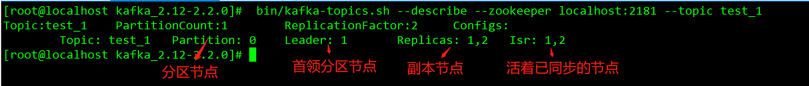


在test_2的主题下，分区0的领导是ides为1的Broers，副本节点为1和2。活着已同步的节点为1和2

在test_2的主题下，分区1的领导是ides为2的Broers，副本节点为2和1。活着已同步的节点为2和1

###### 5.修改分区数

```
bin/kafka-topics.sh --zookeeper localhost:2181 --alter --topic test --partitions 6
```

#### 2.2.4测试集群

###### 1.创建Topic

> bin/kafka-topics.sh --create --zookeeper localhost:2181 --replication-factor 1 --partitions 1 --topic test

###### 2.启动一个消费者

打开一个新的终端下执行此命令

> bin/kafka-console-consumer.sh --bootstrap-server localhost:9092 --topic test --from-beginning

这个消费者就是简单的将消息输出到控制台。

###### 3.启动生产者

执行此命令

```
bin/kafka-console-producer.sh --broker-list localhost:9092 --topic test
```

启动后，可以输入内容，然后回车。

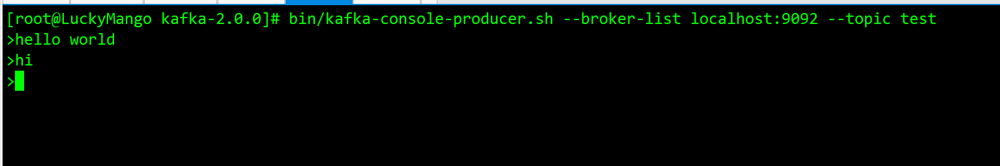

即可在刚才的新终端下看到有消息输出


### 2.3 Kafka工作流程及文件存储

##### 1. 工作流程


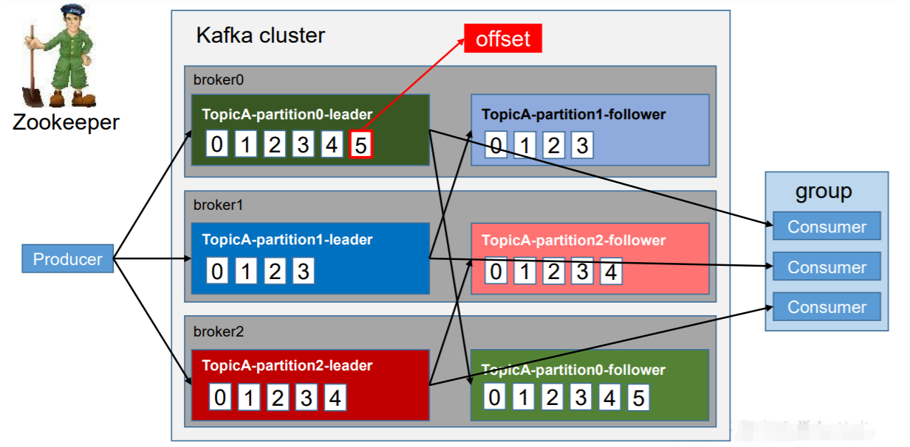

Kafka 中消息是以 topic 进行分类的，生产者生产消息，消费者消费消息，都是面向 topic 的。

topic 是逻辑上的概念，而 partition 是物理上的概念，每个 partition 对应于一个 log 文 件，该 log 文件中存储的就是 producer 生产的数据。

Producer 生产的数据会被不断追加到该 log 文件末端，且每条数据都有自己的 offset。消费者组中的每个消费者，都会实时记录自己 消费到了哪个 offset，以便出错恢复时，从上次的位置继续消费。


##### 2.文件存储

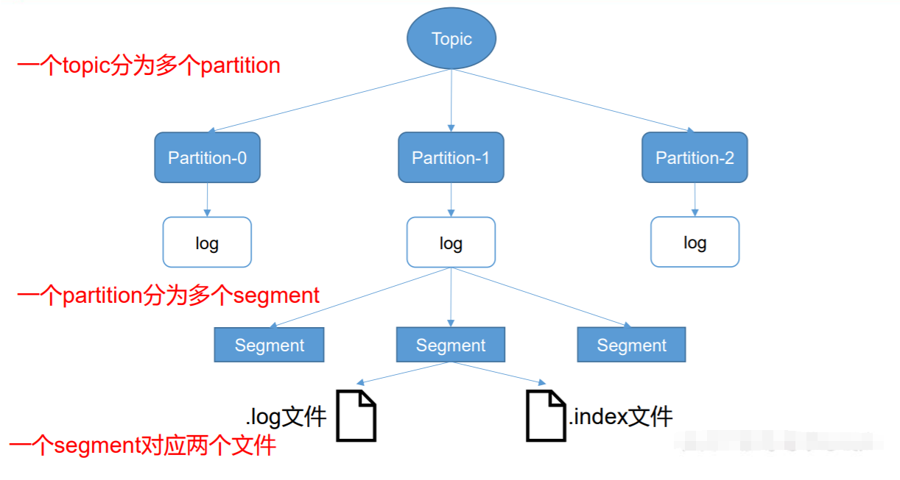

由于生产者生产的消息会不断追加到 log 文件末尾，为防止 log 文件过大导致数据定位 效率低下，Kafka 采取了分片和索引机制，将每个 partition 分为多个 segment。每个 segment 对应两个文件——“.index”文件和“.log”文件。这些文件位于一个文件夹下，该文件夹的命名 规则为：topic 名称+分区序号。例如，first 这个 topic 有三个分区，则其对应的文件夹为 first0,first-1,first-2。

```
00000000000000000000.index
00000000000000000000.log
00000000000000170410.index
00000000000000170410.log
00000000000000239430.index
00000000000000239430.log
```

> index 和 log 文件以当前 segment 的第一条消息的 offset 命名。下图为 index 文件和 log 文件的结构示意图。

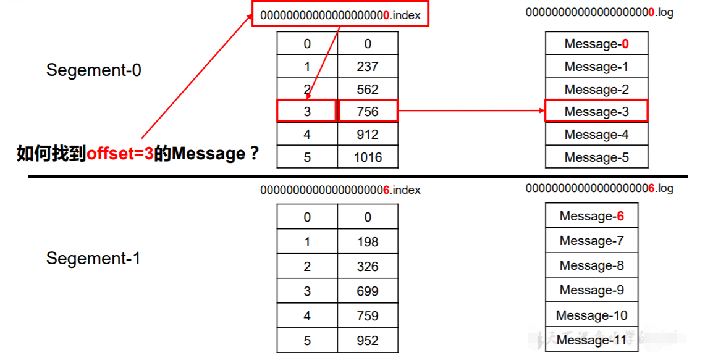

> “.index”文件存储大量的索引信息，“.log”文件存储大量的数据，索引文件中的元 数据指向对应数据文件中 message 的物理偏移地址。


### 2.4 Kafka 中生产者( producer )

#### 2.4.1  生产者发送消息的基本流程 

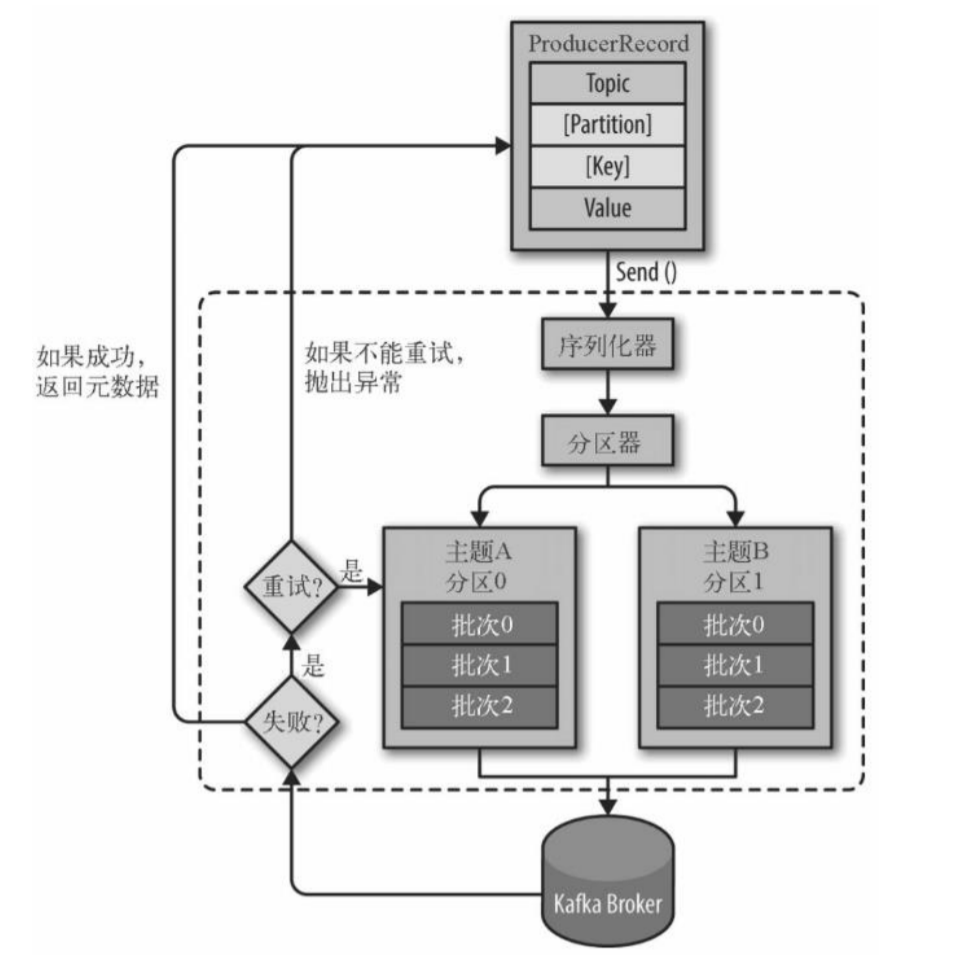


>  	从创建一个 ProducerRecord 对象开始， Producer Record 对象需要包含目标主题和要 发送的内容。我们还可以指定键或分区。在发送 ProducerReco rd 对象时，生产者要先把键 和值对象序列化成字节数组，这样它们才能够在网络上传输。
>
> ​	 接下来，数据被传给分区器。如果之前在 Producer Record 对象里指定了分区，那么分 区器就不会再做任何事情，直接把指定的分区返回。如果没有指定分区，那么分区器会根据 Producer Record 对象的键来选择一个分区。选好分区以后，生产者就知道该往哪个主题和 分区发送这条记录了。紧接着，这条记录被添加到一个记录批次里，这个批次里的所有消息 会被发送到相同的主题和分区上。有一个独立的线程负责把这些记录批次发送到相应的 broker 上。 
>
>  	服务器在收到这些消息时会返回一个响应。如果消息成功写入 Kafka ，就返回一个 RecordMetaData 对象，它包含了主题和分区信息，以及记录在分区里的偏移量。如果写入 失败， 则会返回一个错误。生产者在收到错误之后会尝试重新发送消息，几次之后如果还 是失败，就返回错误信息。 


#### 2.4.2  使用 Kafka 生产者  

#####   三种发送方式  

**1、 发送并忘记** 

>  	忽略 send 方法的返回值，不做任何处理。大多数情况下，消息会正常到达，而且生产 者会自动重试，但有时会丢失消息。 

**2、 同步非阻塞发送** 

>  	获得 send 方法返回的 Future 对象，在合适的时候调用 Future 的 get 方法。参见代码， 模块 kafka-no-spring 下包 sendtype 中。 

**3、 异步发送** 

>  	实现接口 org.apache.kafka.clients.producer.Callback，然后将实现类的实例作为参数传递 给 send 方法。参见代码，模块 kafka-no-spring 下包 sendtype 中。  

#### 2.4.3 生产者常用配置

 	**生产者有很多属性可以设置，大部分都有合理的默认值，无需调整。有些参数可能对内 存使用，性能和可靠性方面有较大影响。可以参考 org.apache.kafka.clients.producer 包下的 ProducerConfig 类。**  

1.  **acks：** 

   >  	指定了必须要有多少个分区副本收到消息，生产者才会认为写入消息是成功的，这个参 数对消息丢失的可能性有重大影响。 
   >
   > ​	 acks=0：生产者在写入消息之前不会等待任何来自服务器的响应，容易丢消息，但是吞 吐量高。  
   >
   > ​	 acks=1：只要集群的首领节点收到消息，生产者会收到来自服务器的成功响应。如果消 息无法到达首领节点（比如首领节点崩溃，新首领没有选举出来），生产者会收到一个错误 响应，为了避免数据丢失，生产者会重发消息。不过，如果一个没有收到消息的节点成为新 首领，消息还是会丢失。默认使用这个配置。 
   >
   > ​	 acks=all：只有当所有参与复制的节点都收到消息，生产者才会收到一个来自服务器的 成功响应。延迟高。 

2.  buffer.memory  

   > ​	 设置生产者内存缓冲区的大小，生产者用它缓冲要发送到服务器的消息。如果数据产生 速度大于向 broker 发送的速度，导致生产者空间不足，producer 会阻塞或者抛出异常。缺 省 33554432 (32M) 

3. max.block.ms  

   > ​	指定了在调用 send()方法或者使用 partitionsFor()方法获取元数据时生产者的阻塞时间。 当生产者的发送缓冲区已满，或者没有可用的元数据时，这些方法就会阻塞。在阻塞时间达 到 max.block.ms 时，生产者会抛出超时异常。缺省 60000ms 

4. retries 

   > ​	 发送失败时，指定生产者可以重发消息的次数。默认情况下，生产者在每次重试之间等 待 100ms，可以通过参数 retry.backoff.ms 参数来改变这个时间间隔。缺省 0 

5.  receive.buffer.bytes 和 send.buffer.bytes  

   > ​	 指定 TCP socket 接受和发送数据包的缓存区大小。如果它们被设置为-1，则使用操作系 统的默认值。如果生产者或消费者处在不同的数据中心，那么可以适当增大这些值，因为跨 数据中心的网络一般都有比较高的延迟和比较低的带宽。缺省 102400  

6.  batch.size  

   > ​	 当多个消息被发送同一个分区时，生产者会把它们放在同一个批次里。该参数指定了一 个批次可以使用的内存大小，按照字节数计算。当批次内存被填满后，批次里的所有消息会 被发送出去。但是生产者不一定都会等到批次被填满才发送，半满甚至只包含一个消息的批 次也有可能被发送。缺省 16384(16k) 

7.  linger.ms  

   > ​	 指定了生产者在发送批次前等待更多消息加入批次的时间。它和 batch.size 以先到者为 先。也就是说，一旦我们获得消息的数量够 batch.size 的数量了，他将会立即发送而不顾这 项设置，然而如果我们获得消息字节数比 batch.size 设置要小的多，我们需要“linger”特定的 时间以获取更多的消息。这个设置默认为 0，即没有延迟。设定 linger.ms=5，例如，将会减 少请求数目，但是同时会增加 5ms 的延迟，但也会提升消息的吞吐量。 

8.  compression.type  

   > ​	 producer 用于压缩数据的压缩类型。默认是无压缩。正确的选项值是 none、gzip、snappy。 压缩最好用于批量处理，批量处理消息越多，压缩性能越好。snappy 占用 cpu 少，提供较 好的性能和可观的压缩比，如果比较关注性能和网络带宽，用这个。如果带宽紧张，用 gzip， 会占用较多的 cpu，但提供更高的压缩比。 

9.  client.id  

   > ​	 当向 server 发出请求时，这个字符串会发送给 server。目的是能够追踪请求源头，以此 来允许 ip/port 许可列表之外的一些应用可以发送信息。这项应用可以设置任意字符串，因 为没有任何功能性的目的，除了记录和跟踪。 

10.  max.in.flight.requests.per.connection  

    > ​	 指定了生产者在接收到服务器响应之前可以发送多个消息，值越高，占用的内存越大， 当然也可以提升吞吐量。发生错误时，可能会造成数据的发送顺序改变,默认是 5 (修改）。
    >
    > ​	 如果需要保证消息在一个分区上的严格顺序，这个值应该设为 1。不过这样会严重影响 生产者的吞吐量。  

11.  request.timeout.ms  

    > ​	 客户端将等待请求的响应的最大时间,如果在这个时间内没有收到响应，客户端将重发 请求;超过重试次数将抛异常  

12.  metadata.fetch.timeout.ms  

    > ​	 是指我们所获取的一些元数据的第一个时间数据。元数据包含：topic，host，partitions。 此项配置是指当等待元数据 fetch 成功完成所需要的时间，否则会跑出异常给客户端 

13.  timeout.ms  

    >  	此配置选项控制 broker 等待副本确认的最大时间。如果确认的请求数目在此时间内没 有实现，则会返回一个错误。这个超时限制是以 server 端度量的，没有包含请求的网络延迟。 这个参数和 acks 的配置相匹配。  

14.  max.request.size  

    > ​	控制生产者发送请求最大大小。假设这个值为 1M，如果一个请求里只有一个消息，那 这个消息不能大于 1M，如果一次请求是一个批次，该批次包含了 1000 条消息，那么每个 消息不能大于 1KB。注意：broker 具有自己对消息记录尺寸的覆盖，如果这个尺寸小于生产 者的这个设置，会导致消息被拒绝。    


#### 2.4.4  消息顺序发送

>  	Kafka 可以保证同一个分区里的消息是有序的。也就是说，如果生产者一定的顺序发送 消息， broker 就会按照这个顺序把它们写入分区，消费者也会按照同样的顺序读取它们。 在某些情况下， 顺序是非常重要的。例如，往一个账户存入 100 元再取出来，这个与先取 钱再存钱是截然不同的！不过，有些场景对顺序不是很敏感。 
>
> ​	如果把 retires 设为非零整数，同时把 max.in.flight.request.per.connection 设为比 1 大的 数，那么，如果第一个批次消息写入失败，而第二个批次写入成功， broker 会重试写入第 一个批次。如果此时第一个批次也写入成功，那么两个批次的顺序就反过来了。
>
> ​	 一般来说，如果某些场景要求消息是有序的，那么消息是否写入成功也是很关键的，所 以不建议把 retires 设为 0 。可以把 max.in.flight.request.per.connection 设为 1，这样在生产 者尝试发送第一批消息时，就不会有其他的消息发送给 broker 。不过这样会严重影响生产 者的吞吐量，所以只有在对消息的顺序有严格要求的情况下才能这么做。  


#### 2.4.5  序列化 和反序列化

**Kafka为我们提供了不同类型的序列化器和反序列化器**

​															   **内置序列化器**


​																**内置反序列化器**	

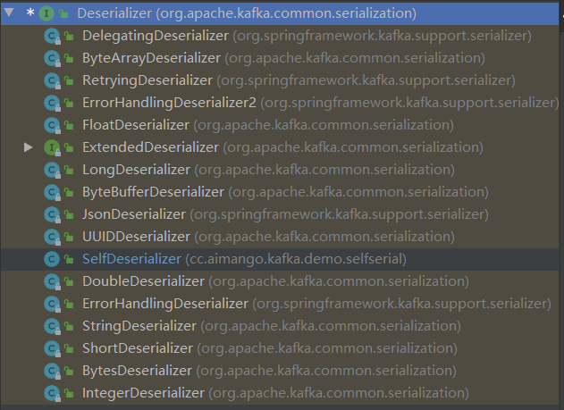


> ​	 创建生产者对象必须指定序列化器，默认的序列化器并不能满足我们所有的场景。我们 完全可以自定义序列化器。只要实现 org.apache.kafka.common.serialization.Serializer 接口即 可。  示例代码如下：

```java
/**
 * @Author: 张钰博
 * @Date: 2020/4/7 14:07
 * @Description: 自定义序列化器,序列化JavaBean
 */
//实现Kafka中的Serializer
public class SelfSerializer  implements Serializer<DemoUser> {
    //一般做相关配置
    @Override
    public void configure(Map configs, boolean isKey) {

    }

    @Override
    public byte[] serialize(String topic, DemoUser data) {
        try {
            byte[] name;
            int nameSize;
            if(data==null){
                return null;
            }
            if(data.getName()!=null){
                name = data.getName().getBytes("UTF-8");
                //字符串的长度
                nameSize = data.getName().length();
            }else{
                name = new byte[0];
                nameSize = 0;
            }
            /*id的长度4个字节，字符串的长度描述4个字节，
            字符串本身的长度nameSize个字节*/
            ByteBuffer buffer = ByteBuffer.allocate(4+4+nameSize);
            buffer.putInt(data.getId());//4
            buffer.putInt(nameSize);//4
            buffer.put(name);//nameSize
            return buffer.array();
        } catch (Exception e) {
            throw new SerializationException("Error serialize DemoUser:"+e);
        }
    }

    //一般用于释放资源
    @Override
    public void close() {

    }
}

```

**反序列化**

```
/**
 * @Author: 张钰博
 * @Date: 2020/4/7 14:21
 * @Description: 自定义反序列化器,反序列化JavaBean
 */
public class SelfDeserializer implements Deserializer<DemoUser> {


    @Override
    public void configure(Map<String, ?> configs, boolean isKey) {
        //do nothing
    }

    @Override
    public DemoUser deserialize(String topic, byte[] data) {
        try {
            if(data==null){
                return null;
            }
            if(data.length<8){
                throw new SerializationException("Error data size.");
            }
            ByteBuffer buffer = ByteBuffer.wrap(data);
            int id;
            String name;
            int nameSize;
            id = buffer.getInt();
            nameSize = buffer.getInt();
            byte[] nameByte = new byte[nameSize];
            buffer.get(nameByte);
            name = new String(nameByte,"UTF-8");
            return new DemoUser(id,name);
        } catch (Exception e) {
            throw new SerializationException("Error Deserializer DemoUser."+e);
        }

    }

    @Override
    public void close() {
        //do nothing
    }
}

```

##### 提示

有很多成熟的序列化框架，可以帮我们把自定义JavaBean序列化为数组，例如messagePack，Avro，Protobuf等。首先推荐Apache的Avro和Google的Protobuf。


#### 2.4.6  分区

>  	我们在新增ProducerRecord对象中可以看到，ProducerRecord包含了目标主题，键和值， Kafka 的消息都是一个个的键值对。键可以设置为默认的 null。
>
> ​	 键的主要用途有两个：一，用来决定消息被写往主题的哪个分区，拥有相同键的消息将 被写往同一个分区，二，还可以作为消息的附加消息。
>
> ​	 如果键值为 null，并且使用默认的分区器，分区器使用轮询算法将消息均衡地分布到各 个分区上。 
>
> ​	如果键不为空，并且使用默认的分区器，Kafka 对键进行散列（Kafka 自定义的散列算法， 具体算法原理不知），然后根据散列值把消息映射到特定的分区上。很明显，同一个键总是 被映射到同一个分区。但是只有不改变主题分区数量的情况下，键和分区之间的映射才能保 持不变，一旦增加了新的分区，就无法保证了，所以如果要使用键来映射分区，那就要在创 建主题的时候把分区规划好，而且永远不要增加新分区。 

##### 1. 分区原因和策略

（1）**方便在集群中扩展**，每个 Partition 可以通过调整以适应它所在的机器，而一个 topic 又可以有多个 Partition 组成，因此整个集群就可以适应任意大小的数据了； 

（2）**可以提高并发**，因为可以以 Partition 为单位读写。

##### 2. 分区的原则

 我们需要将 producer 发送的数据封装成一个 ProducerRecord 对象。  

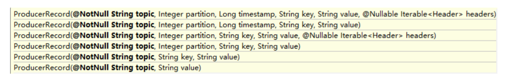

 （1）指明 partition 的情况下，直接将指明的值直接作为 partiton 值；

 （2）没有指明 partition 值但有 key 的情况下，将 key 的 hash 值与 topic 的 partition 数进行取余得到 partition 值；

 （3）既没有 partition 值又没有 key 值的情况下，第一次调用时随机生成一个整数（后 面每次调用在这个整数上自增），将这个值与 topic 可用的 partition 总数取余得到 partition 值，也就是常说的 round-robin 算法。  


##### 3. 自定义分区器 

>  	某些情况下，数据特性决定了需要进行特殊分区，比如电商业务，北京的业务量明显比 较大，占据了总业务量的 20%，我们需要对北京的订单进行单独分区处理，默认的散列分区 算法不合适了， 我们就可以自定义分区算法，对北京的订单单独处理，其他地区沿用散列 分区算法。或者某些情况下，我们用 value 来进行分区。 示例代码如下：

```java
/**
 * @Author: 张钰博
 * @Date: 2020/4/7 14:34
 * @Description: 自定义分区器，以value作为分区
 */
public class SelfPartitioner implements Partitioner {
    @Override
    public int partition(String topic, Object key, byte[] keyBytes, Object value, byte[] valueBytes, Cluster cluster) {
        //获取某一个主题下的所有分区
        List<PartitionInfo> partitionInfos = cluster.partitionsForTopic(topic);
        //获取该主题下的所有分区数目
        int num = partitionInfos.size();
        //对num进行取模运算
        int parId = value.hashCode() % num;
        //将消息发送到该分区Id下
        return parId;
    }

    @Override
    public void close() {
        //do nothing
    }

    @Override
    public void configure(Map<String,?> configs) {
        //do nothing
    }

}

```


#### 2.4.7  保障生产者数据高可用

>  为保证 producer 发送的数据，能可靠的发送到指定的 topic，topic 的每个 partition 收到 producer 发送的数据后，都需要向 producer 发送 ack（acknowledgement 确认收到），如果 producer 收到 ack，就会进行下一轮的发送，否则重新发送数据。 


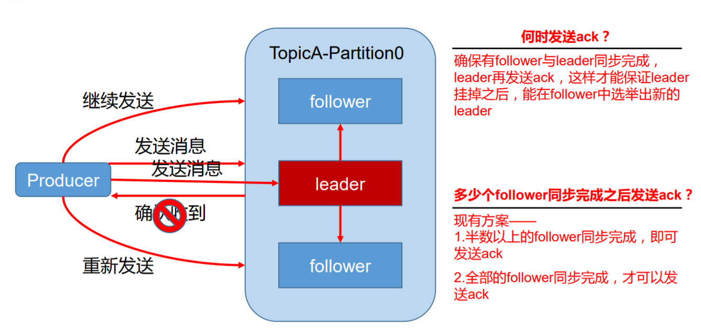


##### 1.副本数据同步策略

| 方案                        | 优点                                                       | 缺点                                                        |
| :-------------------------- | ---------------------------------------------------------- | ----------------------------------------------------------- |
| 半数以上完成同步，就发送ack | 延迟低                                                     | 选举新的 leader 时，容忍 n 台 节点的故障，需要 2n+1 个副 本 |
| 全部完成同步，才发送 ack    | 选举新的 leader 时，容忍 n 台 节点的故障，需要 n+1 个副 本 | 延迟高                                                      |

>  Kafka 选择了第二种方案，原因如下：
>
>  1.同样为了容忍 n 台节点的故障，第一种方案需要 2n+1 个副本，而第二种方案只需要 n+1 个副本，而 Kafka 的每个分区都有大量的数据，第一种方案会造成大量数据的冗余。
>
>  2.虽然第二种方案的网络延迟会比较高，但网络延迟对 Kafka 的影响较小。 


##### 2.ISR策略

>  采用第二种方案之后，设想以下情景：leader 收到数据，所有 follower 都开始同步数据， 但有一个 follower，因为某种故障，迟迟不能与 leader 进行同步，那 leader 就要一直等下去， 直到它完成同步，才能发送 ack。这个问题怎么解决呢？ 
>
> 答： Leader 维护了一个动态的 in-sync replica set (ISR)，意为和 leader 保持同步的 follower 集 合。当 ISR 中的 follower 完成数据的同步之后，leader 就会给 follower 发送 ack。如果 follower 长时间 未 向 leader 同 步 数 据 ， 则 该 follower 将 被 踢 出 ISR ， 该 时 间 阈 值 由 


##### 3.ACK应答机制

>  对于某些不太重要的数据，对数据的可靠性要求不是很高，能够容忍数据的少量丢失， 所以没必要等 ISR 中的 follower 全部接收成功。 所以 Kafka 为用户提供了三种可靠性级别，用户根据对可靠性和延迟的要求进行权衡， 选择以下的配置。  


######   acks 参数配置 

>  	0: producer 不等待 broker 的 ack，这一操作提供了一个最低的延迟，broker 一接收到还 没有写入磁盘就已经返回，当 broker 故障时有可能丢失数据；  
>  


>  ```
>  1：producer 等待 broker 的 ack，partition 的 leader 落盘成功后返回 ack，如果在 follower 同步成功之前 leader 故障，那么将会丢失数据； 
>  ```

​																	 **acks = 1 数据丢失案例** 


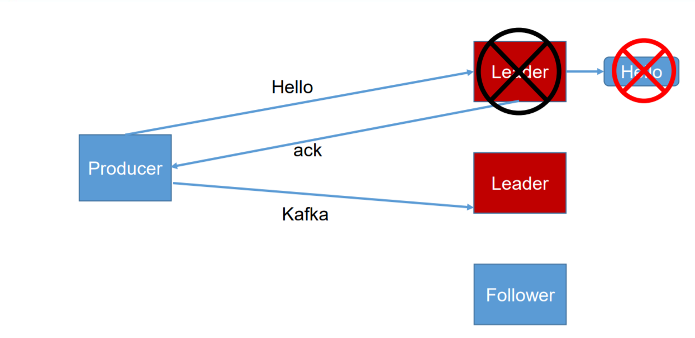


>  ```
>  -1（all）：producer 等待 broker 的 ack，partition 的 leader 和 follower 全部落盘成功后才 返回 ack。但是如果在 follower 同步完成后，broker 发送 ack 之前，leader 发生故障，那么会 造成数据重复。 
>  ```

 													**acks = -1 数据重复案例** 


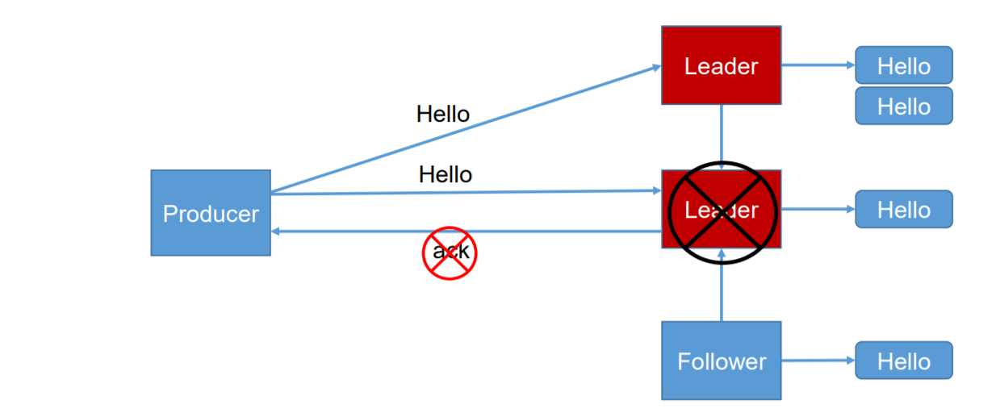

#####  4.故障处理细节  

>  **Log文件中的HW和LEO** 

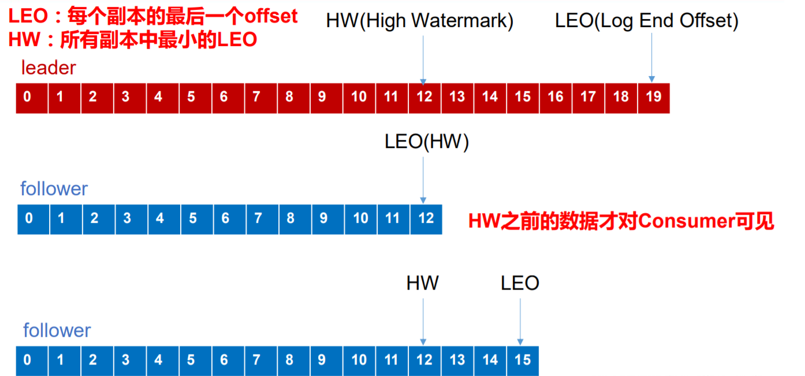


>  LEO：指的是每个副本最大的 offset；  

>  HW：指的是消费者能见到的最大的 offset，ISR 队列中最小的 LEO。 

 （1）follower 故障 follower 发生故障后会被临时踢出 ISR，待该 follower 恢复后，follower 会读取本地磁盘 记录的上次的 HW，并将 log 文件高于 HW 的部分截取掉，从 HW 开始向 leader 进行同步。 等该 follower 的 LEO 大于等于该 Partition 的 HW，即 follower 追上 leader 之后，就可以重 新加入 ISR 了。  

 （2）leader 故障 leader 发生故障之后，会从 ISR 中选出一个新的 leader，之后，为保证多个副本之间的 数据一致性，其余的 follower 会先将各自的 log 文件高于 HW 的部分截掉，然后从新的 leader 同步数据。 

* **注意：这只能保证副本之间的数据一致性，并不能保证数据不丢失或者不重复。**


#### 2.4.8  Exactly Once 语义 

>  将服务器的 ACK 级别设置为-1，可以保证 Producer 到 Server 之间不会丢失数据，即 **At Least Once 语义**。相对的，将服务器 ACK 级别设置为 0，可以保证生产者每条消息只会被 发送一次，即 **At Most Once 语义。**
>
>  At Least Once 可以保证数据不丢失，但是不能保证数据不重复；相对的，At Least Once 可以保证数据不重复，**但是不能保证数据不丢失。但是，对于一些非常重要的信息，比如说 交易数据，下游数据消费者要求数据既不重复也不丢失，即 Exactly Once 语义。**在 0.11 版 本以前的 Kafka，对此是无能为力的，只能保证数据不丢失，再在下游消费者对数据做全局 去重。对于多个下游应用的情况，每个都需要单独做全局去重，这就对性能造成了很大影响。 0.11 版本的 Kafka，引入了一项重大特性：幂等性。所谓的幂等性就是指 Producer 不论 向 Server 发送多少次重复数据，Server 端都只会持久化一条。幂等性结合 At Least Once 语 义，就构成了 Kafka 的 Exactly Once 语义。即：
>
>  **At Least Once + 幂等性 = Exactly Once** 
>
> 要启用幂等性，只需要将 Producer 的参数中 enable.idompotence 设置为 true 即可。Kafka 的幂等性实现其实就是将原来下游需要做的去重放在了数据上游。开启幂等性的 Producer 在 初始化的时候会被分配一个 PID，发往同一 Partition 的消息会附带 Sequence Number。而 Broker 端会对做缓存，当具有相同主键的消息提交时，Broker 只 会持久化一条。
>
>  但是 PID 重启就会变化，同时不同的 Partition 也具有不同主键，所以幂等性无法保证跨 分区跨会话的 Exactly Once。  


### 2.5  Kafka 消费者 (consumer)

#### 2.5.1消费者和消费者群组、分区再均衡

> ​         消费者的含义，同一般消息中间件中消费者的概念。在高并发的情况下，生产者产生消 息的速度是远大于消费者消费的速度，单个消费者很可能会负担不起，此时有必要对消费者 进行横向伸缩，于是我们可以使用多个消费者从同一个主题读取消息，对消息进行分流。

##### 1.消费者群组

> ​         Kafka 里消费者从属于消费者群组，一个群组里的消费者订阅的都是同一个主题，每个 消费者接收主题一部分分区的消息。

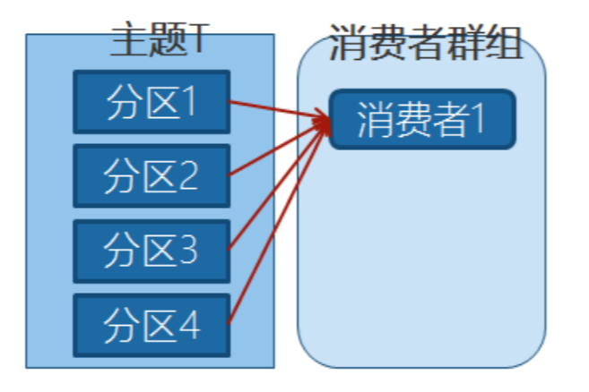

**如上图，主题 T 有 4 个分区，群组中只有一个消费者，则该消费者将收到主题 T1 全部 4 个分区的消息。**


**如上图，在群组中增加一个消费者 2，那么每个消费者将分别从两个分区接收消息，上 图中就表现为消费者 1 接收分区 1 和分区 3 的消息，消费者 2 接收分区 2 和分区 4 的消息。**

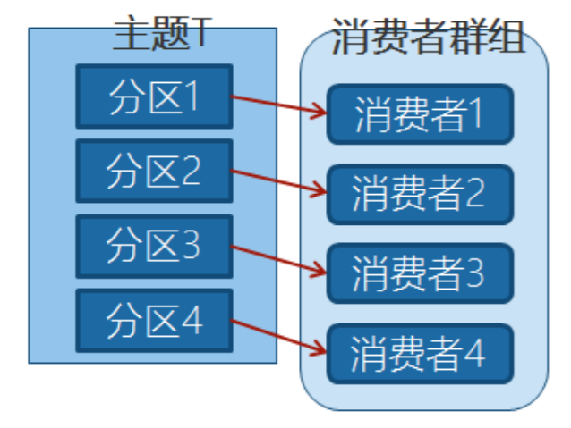

**如上图，在群组中有 4 个消费者，那么每个消费者将分别从 1 个分区接收消息。**


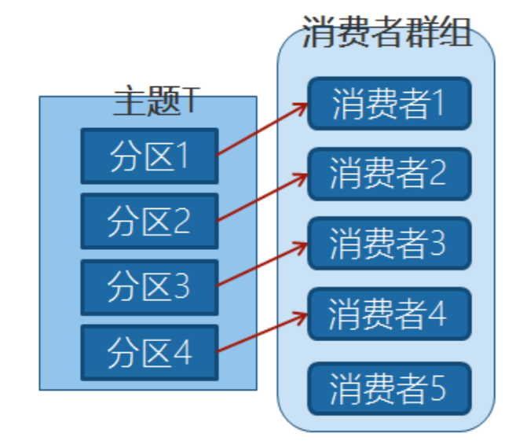


​         但是，当我们增加更多的消费者，超过了主题的分区数量，就会有一部分的消费者被闲 置，不会接收到任何消息。 往消费者群组里增加消费者是进行横向伸缩能力的主要方式。

​         所以我们有必要为主题设 定合适规模的分区，在负载均衡的时候可以加入更多的消费者。但是要记住，一个群组里消 费者数量超过了主题的分区数量，多出来的消费者是没有用处的。


**Kafka一个很重要的特性就是，只需写入一次消息，可以支持任意多的应用读取这个消息。**换句话说，每个应用都可以读到全量的消息。为了使得每个应用都能读到全量消息，应用需要有不同的消费组。对于上面的例子，假如我们新增了一个新的消费组G2，而这个消费组有两个消费者，那么会是这样的：


​	在这个场景中，消费组G1和消费组G2都能收到T1主题的全量消息，在逻辑意义上来说它们属于不同的应用。

​	最后，总结起来就是：如果应用需要读取全量消息，那么请为该应用设置一个消费组；如果该应用消费能力不足，那么可以考虑在这个消费组里增加消费者。

##### 2.分区再均衡

> ​         当消费者群组里的消费者发生变化，或者主题里的分区发生了变化，都会导致再均衡现 象的发生。从前面的知识中，我们知道，Kafka 中，存在着消费者对分区所有权的关系， 这样无论是消费者变化，比如增加了消费者，新消费者会读取原本由其他消费者读取的 分区，消费者减少，原本由它负责的分区要由其他消费者来读取，增加了分区，哪个消费者 来读取这个新增的分区，这些行为，都会导致分区所有权的变化，这种变化就被称为再均衡。 
>
> ​         再均衡对 Kafka 很重要，这是消费者群组带来高可用性和伸缩性的关键所在。不过一般 情况下，尽量减少再均衡，因为再均衡期间，消费者是无法读取消息的，会造成整个群组一 小段时间的不可用。 消费者通过向称为群组协调器的 broker（不同的群组有不同的协调器）发送心跳来维持 它和群组的从属关系以及对分区的所有权关系。如果消费者长时间不发送心跳，群组协调器 认为它已经死亡，就会触发一次再均衡。 在 0.10.1 及以后的版本中，心跳由单独的线程负责，相关的控制参数为 max.poll.interval.ms。

##### 3.消费者分区分配的过程

> ​          消费者要加入群组时，会向群组协调器发送一个 JoinGroup 请求，第一个加入群主的消 费者成为群主，群主会获得群组的成员列表，并负责给每一个消费者分配分区。分配完毕后， 群组把分配情况发送给群组协调器，协调器再把这些信息发送给所有的消费者，每个消费者 只能看到自己的分配信息，只有群主知道群组里所有消费者的分配信息。这个过程在每次再 均衡时都会发生。


##### 4.小结

消费者订阅某个主题，读取消息。消费者读取消息的时候按照消息生成的顺序依次进行读取。

> Q1:消费者如何判断这条消息是否被读取过呢？
>
> 答：偏移量，消费者通过检查偏移量来判断消息是否进行读取过。偏移量保存到zookeeper上或者Kafka上
>
> 当服务器宕机或者kafka重启后，可以根据上一次的偏移量来继续进行读取
>
> Q2:多个消费者可以消费同一个消息么？
>
> 答：不可以，同一个群组是不能消费同一个消息。在不同群组内可以消费同一个消息

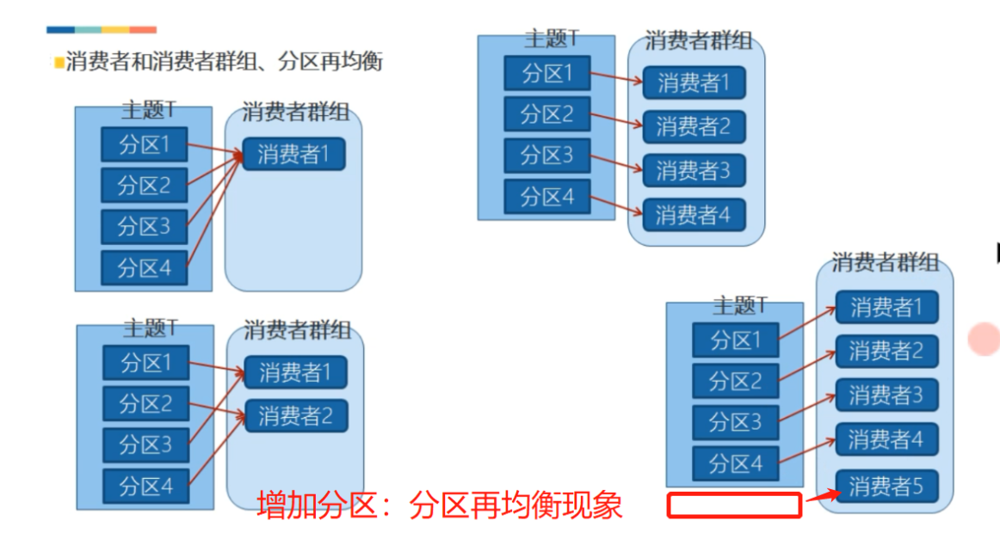

**注意:**

1. 分区数量决定了消费者的数量，消费者的数量一旦大于分区数量，则有一部分消费者是无法消费消息的
2. 多个消费者会平均消费分区里面内容，假设有4个分区3个消费者，则其中有一个消费者就会多消费一个分区消息
3. 分区再均衡由kafka内部实现，一般情况下， 要禁止分区在均衡。在kafka的集群发现要分区再均衡的时候，消费者是不能够读取消息，会在一小段时间内处于不可用状态。
4. 消费者会定期向Kafka控制器发送心跳，证明还处于活动期。一旦某个消费者挂了以后，则kafka会进行分区再均衡，将原本属于他消费的分区交给别人进行消费


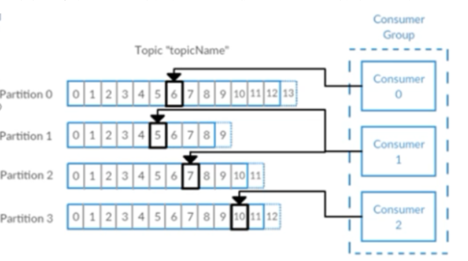


#### 2.5.2  消费方式 

>  consumer 采用 pull（拉）模式从 broker 中读取数据。
>
>  push（推）模式很难适应消费速率不同的消费者，因为消息发送速率是由 broker 决定的。 它的目标是尽可能以最快速度传递消息，但是这样很容易造成 consumer 来不及处理消息，  典型的表现就是拒绝服务以及网络拥塞。而 pull 模式则可以根据 consumer 的消费能力以适 当的速率消费消息。  
>
>  pull 模式不足之处是，如果 kafka 没有数据，消费者可能会陷入循环中，一直返回空数 据。针对这一点，Kafka 的消费者在消费数据时会传入一个时长参数 timeout，如果当前没有 数据可供消费，consumer 会等待一段时间之后再返回，这段时长即为 timeout。  


#### 2.5.3使用 Kafka 消费者

##### 1.订阅

> ​          创建消费者后，使用 subscribe()方法订阅主题，这个方法接受一个主题列表为参数，也 可以接受一个正则表达式为参数；正则表达式同样也匹配多个主题。如果新创建了新主题， 并且主题名字和正则表达式匹配，那么会立即触发一次再均衡，消费者就可以读取新添加的 主题。比如，要订阅所有和 test 相关的主题，可以 subscribe(“tets.*”)


##### 2.轮询

> ​          为了不断的获取消息，我们要在循环中不断的进行轮询，也就是不停调用 poll 方法。
>
> ​           poll 方法的参数为超时时间，控制 poll 方法的阻塞时间，它会让消费者在指定的毫秒数 内一直等待 broker 返回数据。poll 方法将会返回一个记录（消息）列表，每一条记录都包含 了记录所属的主题信息，记录所在分区信息，记录在分区里的偏移量，以及记录的键值对。
>
> ​           poll 方法不仅仅只是获取数据，在新消费者第一次调用时，它会负责查找群组，加入群 组，接受分配的分区。如果发生了再均衡，整个过程也是在轮询期间进行的。

##### 3.多线程下的消费者

> ​          KafkaConsumer 的实现不是线程安全的，所以我们在多线程的环境下，使用 KafkaConsumer 的实例要小心，应该每个消费数据的线程拥有自己的 KafkaConsumer 实例，KafkaConsumer 的实现不是线程安全的，所以我们在多线程的环境下，使用 KafkaConsumer 的实例要小心，应该每个消费数据的线程拥有自己的 KafkaConsumer 实例。代码如下

```java
public class KafkaConConsumer {
    //创建两个定长线程
    private static ExecutorService executorService = Executors.newFixedThreadPool(2);
    private static class ConsumerWorker implements Runnable{
        //创建Kafka生产者
        private KafkaConsumer<String,String> consumer;
        //封装Kafka需要传入的配置参数
        public ConsumerWorker(Map<String, Object> config, String topic) {
            Properties properties = new Properties();
            properties.putAll(config);
            this.consumer = new KafkaConsumer<String, String>(properties);
            //consumer可以订阅多个Topic主题，此时我们只订阅1个主题
            consumer.subscribe(Collections.singletonList(topic));
        }
        @Override
        public void run() {
            //获取线程的Id和producer在内存中的地址所算出来的哈希值
            final String id = Thread.currentThread().getId() +"-"+System.identityHashCode(consumer);
            try {
                while(true){
                    //拉取间隔时间 单位(毫秒)
                    ConsumerRecords<String, String> records = consumer.poll(500);
                    //遍历集合中的消息
                    for(ConsumerRecord<String, String> record:records){
                        System.out.println("线程Id:"+id+","+"主题Topic:"+record.topic()+","+"分区："+record.partition()+","+"" + "偏移量："+record.offset()+","+"键："+record.key()+"值："+record.value());
                    }
                }
            } finally {
                consumer.close();
            }
        }
    }

    public static void main(String[] args) {
        //消费配置的实例
        Map<String, Object> config = KafkaConst.consumerConfigMap("concurrent", StringDeserializer.class, StringDeserializer.class);
        for(int i = 0; i< BusiConst.CONCURRENT_PARTITIONS_COUNT; i++){
            executorService.submit(new ConsumerWorker(config, BusiConst.CONCURRENT_USER_INFO_TOPIC));
        }
    }


```


#### 2.5.4消费者配置

​          消费者有很多属性可以设置，大部分都有合理的默认值，无需调整。有些参数可能对内 存使用，性能和可靠性方面有较大影响。可以参考 org.apache.kafka.clients.consumer 包下 ConsumerConfig 类。

- **1.fetch.min.bytes**

  > ​          每次 fetch 请求时，server 应该返回的最小字节数。如果没有足够的数据返回，请求会 等待，直到足够的数据才会返回。缺省为 1 个字节。多消费者下，可以设大这个值，以降低 broker 的工作负载

- **fetch.wait.max.ms**

  > ​          如果没有足够的数据能够满足 fetch.min.bytes，则此项配置是指在应答 fetch 请求之前， server 会阻塞的最大时间。缺省为 500 个毫秒。和上面的 fetch.min.bytes 结合起来，要么满 足数据的大小，要么满足时间，就看哪个条件先满足

- **max.partition.fetch.bytes**

  > ​         指定了服务器从每个分区里返回给消费者的最大字节数，默认 1MB。假设一个主题有 20 个分区和 5 个消费者，那么每个消费者至少要有 4MB 的可用内存来接收记录，而且一旦 有消费者崩溃，这个内存还需更大。注意，这个参数要比服务器的 message.max.bytes 更大， 否则消费者可能无法读取消息。

- **session.timeout.ms**

  > ​         如果 consumer 在这段时间内没有发送心跳信息，则它会被认为挂掉了。默认 3 秒。

- **auto.offset.reset**

  > ​          消费者在读取一个没有偏移量的分区或者偏移量无效的情况下，如何处理。默认值是 latest，从最新的记录开始读取，另一个值是 earliest，表示消费者从起始位置读取分区的记 录。

  > ​          注意：默认值是 latest，意思是说，在偏移量无效的情况下，消费者将从最新的记录开 始读取数据（在消费者启动之后生成的记录），可以先启动生产者，再启动消费者，观察到 这种情况。

- **enable .auto.commit**

  > ​          默认值 true，表明消费者是否自动提交偏移。为了尽量避免重复数据和数据丢失，可以 改为 false，自行控制何时提交。

- **partition.assignment.strategy**

  > ​          分区分配给消费者的策略。系统提供两种策略。默认为 Range。允许自定义策略。
  >
  > **Range：**
  >
  > ​		 把主题的连续分区分配给消费者
  >
  > **RoundRobin：**
  >
  > ​		把主题的分区循环分配给消费者。
  >
  > **自定义分区策略：**
  >
  > ```java
  > /**
  >  *自定义分区器，以value作为分区
  >  */
  > public class SelfPartitioner implements Partitioner {
  >     @Override
  >     public int partition(String topic, Object key, byte[] keyBytes, Object value, byte[] valueBytes, Cluster cluster) {
  >         //获取某一个主题下的所有分区
  >         List<PartitionInfo> partitionInfos = cluster.partitionsForTopic(topic);
  >         //获取该主题下的所有分区数目
  >         int num = partitionInfos.size();
  >         //对num进行取模运算
  >         int parId = value.hashCode()%num;
  >         //将消息发送到该分区Id下
  >         return parId;
  >     }
  > 
  >     @Override
  >     public void close() {
  >         //do nothing
  >     }
  > 
  >     @Override
  >     public void configure(Map<String, ?> configs) {
  >         //do nothing
  >     }
  > 
  > }
  > ```

  

- **client.id**

  > ​          当向 server 发出请求时，这个字符串会发送给 server。目的是能够追踪请求源头，以此 来允许 ip/port 许可列表之外的一些应用可以发送信息。这项应用可以设置任意字符串，因 为没有任何功能性的目的，除了记录和跟踪。

- **max.poll.records**

  > ​         控制每次 poll 方法返回的的记录数量。

- **receive.buffer.bytes 和 send.buffer.bytes**

  > ​          指定 TCP socket 接受和发送数据包的缓存区大小。如果它们被设置为-1，则使用操作系 统的默认值。如果生产者或消费者处在不同的数据中心，那么可以适当增大这些值，因为跨 数据中心的网络一般都有比较高的延迟和比较低的带宽。


#### 2.5.5  分区分配策略 

>  一个 consumer group 中有多个 consumer，一个 topic 有多个 partition，所以必然会涉及 到 partition 的分配问题，即确定那个 partition 由哪个 consumer 来消费。 
>
> Kafka 有两种分配策略，一是 RoundRobin，一是 Range。 

##### 1.  Round-Robin  轮训策略

**Kafka默认分区策略**

> 也称 Round-robin 策略，即顺序分配。比如一个主题下有 3 个分区，那么第一条消息被发送到分区 0，第二条被发送到分区 1，第三条被发送到分区 2，以此类推。当生产第 4 条消息时又会重新开始，即将其分配到分区 0，就像下面这张图展示的那样。


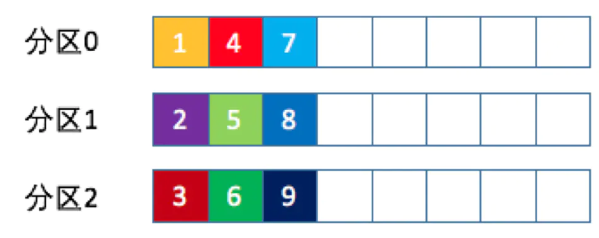

> 这就是所谓的轮询策略。轮询策略是 Kafka Java 生产者 API 默认提供的分区策略。如果你未指定partitioner.class参数，那么你的生产者程序会按照轮询的方式在主题的所有分区间均匀地“码放”消息


 **轮询策略有非常优秀的负载均衡表现，它总是能保证消息最大限度地被平均分配到所有分区上，故默认情况下它是最合理的分区策略，也是我们最常用的分区策略之一。** 


##### 2.  Randomness 随机策略

> 所谓随机就是我们随意地将消息放置到任意一个分区上，如下面这张图所示


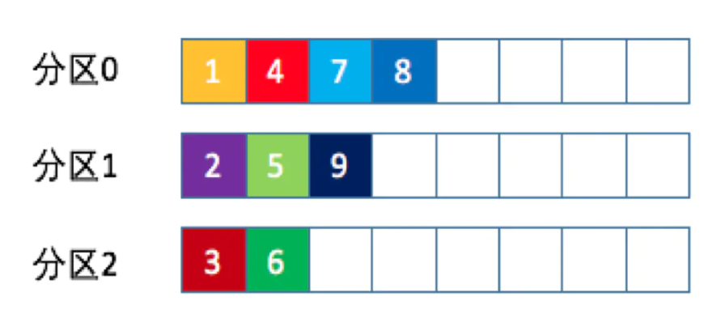


> 先计算出该主题总的分区数，然后随机地返回一个小于它的正整数。  本质上看随机策略也是力求将数据均匀地打散到各个分区，但从实际表现来看，它要逊于轮询策略，所以如果追求数据的均匀分布，还是使用轮询策略比较好。事实上，随机策略是老版本生产者使用的分区策略，在新版本中已经改为轮询了。


##### 3. Key-ordering  按消息键保序策略


> Kafka 允许为每条消息定义消息键，简称为 Key。这个 Key 的作用非常大，它可以是一个有着明确业务含义的字符串，比如客户代码、部门编号或是业务 ID 等；也可以用来表征消息元数据。特别是在 Kafka 不支持时间戳的年代，在一些场景中，工程师们都是直接将消息创建时间封装进 Key 里面的。一旦消息被定义了 Key，那么你就可以保证同一个 Key 的所有消息都进入到相同的分区里面，由于每个分区下的消息处理都是有顺序的，故这个策略被称为按消息键保序策略，如下图所示。
>


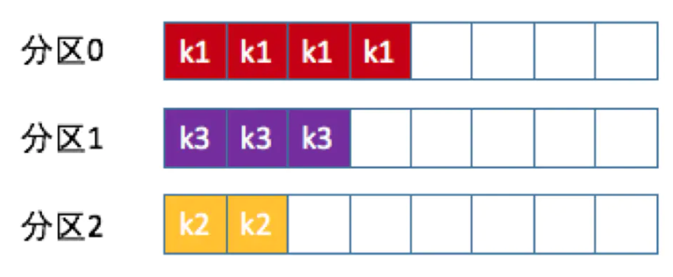


#### 2.5.6  保障消费者高可用

> ​		当消息变成已提交状态（也就是写入到所有in-sync副本）后，它才能被消费端读取。这保证了消费者读取到的数据始终是一致的，为了达到高可靠，消费者需要保证在消费消息时不丢失数据。
>
> ​		在处理分区消息时，消费者一般的处理流程为：拉取批量消息，处理完成后提交位移，然后再拉取下一批消息。提交位移保证了当前消费者发生故障或重启时，其他消费者可以接着上一次的消息位移来进行处理。需要提醒的是，消费端丢失消息的一个主要原因为：消费者拉取消息后还没处理完就提交位移，一旦在消息处理过程中发生故障，新的消费者会从已提交的位移接着处理，导致发生故障时的消息丢失。

**下面来看下消费端处理流程中的一些需要注意的细节。**

##### 1. 重要的可靠性配置

如果希望设计一个高可靠的消费者，那么消费者中有4个重要的属性需要慎重考虑。

- **group.id**

  > ​		如果有多个消费者拥有相同的group.id并且订阅相同的主题，那么每个消费者会负责消费一部分的消息。如果消费组内存在多个消费者，那么一个消费者发生故障那么其他消费者可以接替其工作，保证高可用。

- **auto.offset.reset**

  > ​		当消费者读取消息，Kafka中没有提交的位移（比如消费者所属的消费组第一次启动）或者希望读取的位移不合法（比如消费组曾经长时间下线导致位移落后）时，消费者如何处理？当设置为earliest，消费者会从分区的起始端开始读取，这可能会导致消费者重复处理消息，但也将消息丢失可能性降低到最小；当设置为latest，消费者会从分区末端开始读取，这会导致消息丢失可能性加大，但会降低消息重复处理的概率。

- **enable.auto.commit**

  > ​		你希望消费者定期自动提交位移，还是应用手动提交位移？自动提交位移可以让应用在处理消息时不用实现提交位移的逻辑，并且如果我们是在poll循环中使用相同的线程处理消息，那么自动提交位移可以保证在消息处理完成后才提交位移。如果我们在poll循环中使用另外的线程处理消息，那么自动提交位移可能会导致提交还没完成处理的消息位移。

- **auto.commit.interval.ms**

  > ​		它与第三个属性有关。如果选择了自动提交位移，那么这个属性控制提交位移的时间间隔。默认值是5秒，通常来说降低间隔可以降低消息重复处理的可能性。

##### 2.  需要注意的细节

- 手动提交位移

  > ​		如果我们选择手动提交位移，下面来根据不同场景来讨论如何实现更可靠的消费者。

- **处理完消息后立即提交**

  > ​		如果在poll循环中进行消息处理，并且处理完后提交位移，那么提交位移的实现方式非常简单。对于这种场景，可以考虑使用自动提交而不是手动提交。

-  **在处理消息过程中多次提交**

  > ​		消费者拉取批量消息后处理消息时，在处理过程中可以使用手动提交位移方式来多次更新位移。这种方式可以使得消息重复处理可能性降低。不过在这个场景中，如果不加以注意，那么可能会提交上一次拉取的最大位移而不是当前已经处理的消息位移。

-  **消费者的重试**

  > ​		在某些场景下，消费者拉取消息后进行处理时会遇到一些问题，可能希望这些消息可以延迟处理。比如，对于从Kafka拉取消息然后持久化到数据库的应用来说，如果某个时刻数据库不可用，我们可能希望延后重试。延后重试的策略可以分成如下两大类：
  >
  > 第一种处理方式是，我们提交已经处理成功的位移，然后将处理失败的消息存储到一个缓冲区，并不断进行重试处理这些消息。另外，在处理这些消息时可能poll循环仍然在继续，我们可以使用pause()方法来使得poll不会返回新的数据，这样使得重试更容易。
  >
  > 第二种处理方式是，我们把处理失败的消息写入到另外的主题，然后继续处理当前的消息。对于失败消息的主题，我们既可以使用同一个消费组进行处理，也可以使用不同的消费组进行处理。这种主题类似于其他消息系统使用的死信队列（dead-letter-queue）。

-  **持久化状态**

  > ​		在某些场景下，我们可能需要在拉取消息时维护状态。比如，对于计算滑动平均数（moving average），我们每次拉取新消息时需要更新相应的平均数。当消费者重启时，我们不但需要从上一次提交的位移开始消费，同时还需要从相应的滑动平均数中恢复。一种处理方式是，我们提交位移时将滑动平均数写入到一个用于保存结果的主题，这样应用重启时可以获取上一次的处理结果。但由于Kafka不支持多操作的事务性，因此这种方式并不严谨。我们当然可以自己加以处理，但这个问题解决起来比较复杂，建议可以使用Kafka Streams这样的开源库。

-  **消息处理时间长**

  > ​		某些应用拉取消息回来后处理消息时间比较长（比如依赖于一个阻塞服务或者进行复杂的计算），而某些版本的消费者如果长时间不poll消息会导致会话超时，因此使用这些版本的应用需要不断的拉取消息来发送心跳包到broker。一种常见的处理方式是，我们使用多线程来处理消息，然后当前线程调用pause()来使得既可以调用poll()而且消费者不会拉取新的消息；当消息处理完成后，再调用resume()来使得消费者恢复正常拉取逻辑。

-  **有且仅有一次的语义**

  > ​		Kafka不支持有且仅有一次的语义，但可以支持至少一次的语义。因此对于需要实现有且仅有一次语义的应用来说，我们需要自己额外处理。
  >
  > ​		一种常见的处理方式为，我们使用支持唯一键的外部系统（比如关系型数据库、Elasticsearch等）来进行结果去重。我们可以自己实现唯一键并且在消息中加入此属性，也可以根据消息的主题、分区以及位移信息来生成唯一键。另外，如果该外部系统支持事务，那么我们可以在一个事务中同时保存消息处理结果和位移。消费者重启时可以从该系统中获取位移，并且使用seek()方法来开始从相应的位移开始消费。


###  2.6 Kafka 事务  

>  Kafka 从 0.11 版本开始引入了事务支持。事务可以保证 Kafka 在 Exactly Once 语义的基 础上，生产和消费可以跨分区和会话，要么全部成功，要么全部失败 

#### 1. Producer 事务 

>  为了实现跨分区跨会话的事务，需要引入一个全局唯一的 Transaction ID，并将 Producer 获得的PID 和Transaction ID 绑定。这样当Producer 重启后就可以通过正在进行的 Transaction ID 获得原来的 PID。 为了管理 Transaction，Kafka 引入了一个新的组件 Transaction Coordinator。Producer 就 是通过和 Transaction Coordinator 交互获得 Transaction ID 对应的任务状态。Transaction Coordinator 还负责将事务所有写入 Kafka 的一个内部 Topic，这样即使整个服务重启，由于 事务状态得到保存，进行中的事务状态可以得到恢复，从而继续进行。 

#### 2. Consumer 事务 

>  上述事务机制主要是从 Producer 方面考虑，对于 Consumer 而言，事务的保证就会相对 较弱，尤其时无法保证 Commit 的信息被精确消费。这是由于 Consumer 可以通过 offset 访 问任意信息，而且不同的 Segment File 生命周期不同，同一事务的消息可能会出现重启后被 删除的情况。  


### 2.7 Kafka线上集群部署

**参考：人人贷计算平台部总监-胡夕 分享的博文**

> 生产环境中的 Kafka 集群方案该怎么做。既然是集群，那必然就要有多个 Kafka 节点机器，因为只有单台机器构成的 Kafka 伪集群只能用于日常测试之用，根本无法满足实际的线上生产需求。而真正的线上环境需要仔细地考量各种因素，结合自身的业务需求而制定。下面我就分别从操作系统、磁盘、磁盘容量和带宽等方面来讨论一下。

#### 1.操作系统

> 首先我们先看看要把 Kafka 安装到什么操作系统上。说起操作系统，可能你会问 Kafka 不是 JVM 系的大数据框架吗？Java 又是跨平台的语言，把 Kafka 安装到不同的操作系统上会有什么区别吗？其实区别相当大！
>
> 的确，如你所知，Kafka 由 Scala 语言和 Java 语言编写而成，编译之后的源代码就是普通的“.class”文件。本来部署到哪个操作系统应该都是一样的，但是不同操作系统的差异还是给 Kafka 集群带来了相当大的影响。目前常见的操作系统有 3 种：Linux、Windows 和 macOS。应该说部署在 Linux 上的生产环境是最多的，也有一些 Kafka 集群部署在 Windows 服务器上。Mac 虽然也有 macOS Server，但是我怀疑是否有人（特别是国内用户）真的把生产环境部署在 Mac 服务器上。
>
> 如果考虑操作系统与 Kafka 的适配性，Linux 系统显然要比其他两个特别是 Windows 系统更加适合部署 Kafka。虽然这个结论可能你不感到意外，但其中具体的原因你也一定要了解。主要是在下面这三个方面上，Linux 的表现更胜一筹。

- **I/O 模型的使用**
- **数据网络传输效率**
- **社区支持度**

> 我分别来解释一下，首先来看 I/O 模型。什么是 I/O 模型呢？你可以近似地认为 I/O 模型就是操作系统执行 I/O 指令的方法。
>
> 主流的 I/O 模型通常有 5 种类型：阻塞式 I/O、非阻塞式 I/O、I/O 多路复用、信号驱动 I/O 和异步 I/O。每种 I/O 模型都有各自典型的使用场景，比如 Java 中 Socket 对象的阻塞模式和非阻塞模式就对应于前两种模型；而 Linux 中的系统调用 select 函数就属于 I/O 多路复用模型；大名鼎鼎的 epoll 系统调用则介于第三种和第四种模型之间；至于第五种模型，其实很少有 Linux 系统支持，反而是 Windows 系统提供了一个叫 IOCP 线程模型属于这一种。
>
> 你不必详细了解每一种模型的实现细节，通常情况下我们认为后一种模型会比前一种模型要高级，比如 epoll 就比 select 要好，了解到这一程度应该足以应付我们下面的内容了。
>
> 说了这么多，I/O 模型与 Kafka 的关系又是什么呢？实际上 Kafka 客户端底层使用了 Java 的 selector，selector 在 Linux 上的实现机制是 epoll，而在 Windows 平台上的实现机制是 select。**因此在这一点上将 Kafka 部署在 Linux 上是有优势的，因为能够获得更高效的 I/O 性能。**
>
> 其次是网络传输效率的差别。你知道的，Kafka 生产和消费的消息都是通过网络传输的，而消息保存在哪里呢？肯定是磁盘。故 Kafka 需要在磁盘和网络间进行大量数据传输。如果你熟悉 Linux，你肯定听过零拷贝（Zero Copy）技术，就是当数据在磁盘和网络进行传输时避免昂贵的内核态数据拷贝从而实现快速地数据传输。Linux 平台实现了这样的零拷贝机制，但有些令人遗憾的是在 Windows 平台上必须要等到 Java 8 的 60 更新版本才能“享受”到这个福利。**一句话总结一下，在 Linux 部署 Kafka 能够享受到零拷贝技术所带来的快速数据传输特性。**
>
> 最后是社区的支持度。这一点虽然不是什么明显的差别，但如果不了解的话可能比前两个因素对你的影响更大。简单来说就是，社区目前对 Windows 平台上发现的 Kafka Bug 不做任何承诺。虽然口头上依然保证尽力去解决，但根据我的经验，Windows 上的 Bug 一般是不会修复的。**因此，Windows 平台上部署 Kafka 只适合于个人测试或用于功能验证，千万不要应用于生产环境。**


#### 2.磁盘

> 如果问哪种资源对 Kafka 性能最重要，磁盘无疑是要排名靠前的。在对 Kafka 集群进行磁盘规划时经常面对的问题是，我应该选择普通的机械磁盘还是固态硬盘？前者成本低且容量大，但易损坏；后者性能优势大，不过单价高。我给出的建议是使用普通机械硬盘即可。
>
> Kafka 大量使用磁盘不假，可它使用的方式多是顺序读写操作，一定程度上规避了机械磁盘最大的劣势，即随机读写操作慢。从这一点上来说，使用 SSD 似乎并没有太大的性能优势，毕竟从性价比上来说，机械磁盘物美价廉，而它因易损坏而造成的可靠性差等缺陷，又由 Kafka 在软件层面提供机制来保证，故使用普通机械磁盘是很划算的。
>
> 关于磁盘选择另一个经常讨论的话题就是到底是否应该使用磁盘阵列（RAID）。使用 RAID 的两个主要优势在于：
>
> - 提供冗余的磁盘存储空间
> - 提供负载均衡


> 以上两个优势对于任何一个分布式系统都很有吸引力。不过就 Kafka 而言，一方面 Kafka 自己实现了冗余机制来提供高可靠性；另一方面通过分区的概念，Kafka 也能在软件层面自行实现负载均衡。如此说来 RAID 的优势就没有那么明显了。当然，我并不是说 RAID 不好，实际上依然有很多大厂确实是把 Kafka 底层的存储交由 RAID 的，只是目前 Kafka 在存储这方面提供了越来越便捷的高可靠性方案，因此在线上环境使用 RAID 似乎变得不是那么重要了。综合以上的考量，我给出的建议是：
>
> - 追求性价比的公司可以不搭建 RAID，使用普通磁盘组成存储空间即可。
> - 使用机械磁盘完全能够胜任 Kafka 线上环境。


#### 3.磁盘容量


> Kafka 集群到底需要多大的存储空间？这是一个非常经典的规划问题。Kafka 需要将消息保存在底层的磁盘上，这些消息默认会被保存一段时间然后自动被删除。虽然这段时间是可以配置的，但你应该如何结合自身业务场景和存储需求来规划 Kafka 集群的存储容量呢？

> 我举一个简单的例子来说明该如何思考这个问题。假设你所在公司有个业务每天需要向 Kafka 集群发送 1 亿条消息，每条消息保存两份以防止数据丢失，另外消息默认保存两周时间。现在假设消息的平均大小是 1KB，那么你能说出你的 Kafka 集群需要为这个业务预留多少磁盘空间吗？

> 我们来计算一下：每天 1 亿条 1KB 大小的消息，保存两份且留存两周的时间，那么总的空间大小就等于 1 亿 * 1KB * 2 / 1000 / 1000 = 200GB。一般情况下 Kafka 集群除了消息数据还有其他类型的数据，比如索引数据等，故我们再为这些数据预留出 10% 的磁盘空间，因此总的存储容量就是 220GB。既然要保存两周，那么整体容量即为 220GB * 14，大约 3TB 左右。Kafka 支持数据的压缩，假设压缩比是 0.75，那么最后你需要规划的存储空间就是 0.75 * 3 = 2.25TB。

> 总之在规划磁盘容量时你需要考虑下面这几个元素：
>
> - 新增消息数
> - 消息留存时间
> - 平均消息大小
> - 备份数
> - 是否启用压缩

 

#### 4.带宽

> 对于 Kafka 这种通过网络大量进行数据传输的框架而言，带宽特别容易成为瓶颈。事实上，在我接触的真实案例当中，带宽资源不足导致 Kafka 出现性能问题的比例至少占 60% 以上。如果你的环境中还涉及跨机房传输，那么情况可能就更糟了。
>
> 如果你不是超级土豪的话，我会认为你和我平时使用的都是普通的以太网络，带宽也主要有两种：1Gbps 的千兆网络和 10Gbps 的万兆网络，特别是千兆网络应该是一般公司网络的标准配置了。下面我就以千兆网络举一个实际的例子，来说明一下如何进行带宽资源的规划。
>
> 与其说是带宽资源的规划，其实真正要规划的是所需的 Kafka 服务器的数量。假设你公司的机房环境是千兆网络，即 1Gbps，现在你有个业务，其业务目标或 SLA 是在 1 小时内处理 1TB 的业务数据。那么问题来了，你到底需要多少台 Kafka 服务器来完成这个业务呢？
>
> 让我们来计算一下，由于带宽是 1Gbps，即每秒处理 1Gb 的数据，假设每台 Kafka 服务器都是安装在专属的机器上，也就是说每台 Kafka 机器上没有混布其他服务，毕竟真实环境中不建议这么做。通常情况下你只能假设 Kafka 会用到 70% 的带宽资源，因为总要为其他应用或进程留一些资源。
>
> 根据实际使用经验，超过 70% 的阈值就有网络丢包的可能性了，故 70% 的设定是一个比较合理的值，也就是说单台 Kafka 服务器最多也就能使用大约 700Mb 的带宽资源。
>
> 稍等，这只是它能使用的最大带宽资源，你不能让 Kafka 服务器常规性使用这么多资源，故通常要再额外预留出 2/3 的资源，即单台服务器使用带宽 700Mb / 3 ≈ 240Mbps。需要提示的是，这里的 2/3 其实是相当保守的，你可以结合你自己机器的使用情况酌情减少此值。
>
> 好了，有了 240Mbps，我们就可以计算 1 小时内处理 1TB 数据所需的服务器数量了。根据这个目标，我们每秒需要处理 2336Mb 的数据，除以 240，约等于 10 台服务器。如果消息还需要额外复制两份，那么总的服务器台数还要乘以 3，即 30 台。
>
> 怎么样，还是很简单的吧。用这种方法评估线上环境的服务器台数是比较合理的，而且这个方法能够随着你业务需求的变化而动态调整。

#### 5.总结

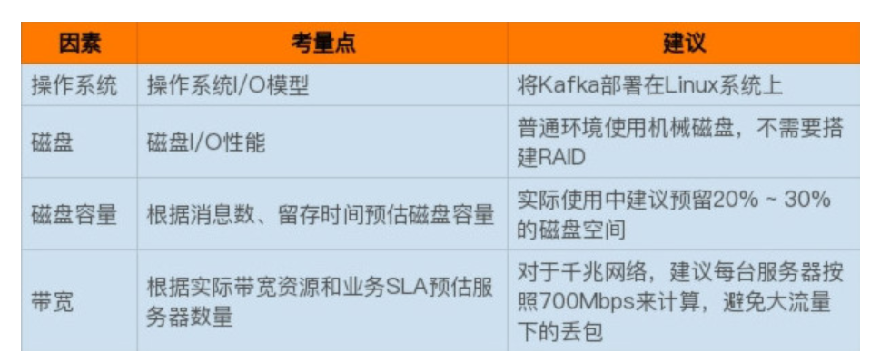


### 2.8 Kafka 监控

##### **1. 市面上主流的监控框架**

###### 1.1 JMXTool 工具

>  JMXTool 工具。严格来说，它并不是一个框架，只是社区自带的一个工具。JMXTool 工具能够实时查看 Kafka JMX 指标。

> 需要运行下面的命令，来获取它的使用方法的完整介绍。

```
bin/kafka-run-class.sh kafka.tools.JmxTool
```

> 主要参数说明：

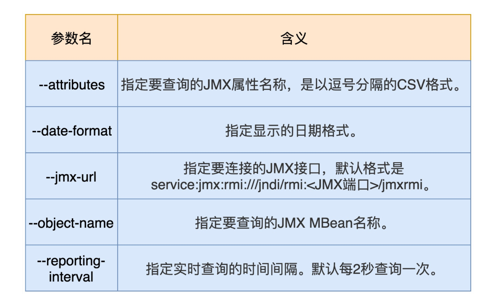

> 例如：下面这条命令，表示每 5 秒查询一次过去 1 分钟的 BytesInPerSec 均值。

```
bin/kafka-run-class.sh kafka.tools.JmxTool --object-name kafka.server:type=BrokerTopicMetrics,name=BytesInPerSec --jmx-url service:jmx:rmi:///jndi/rmi://:9997/jmxrmi --date-format "YYYY-MM-dd HH:mm:ss" --attributes OneMinuteRate --reporting-interval 1000
```

**注意事项：**

- 设置 --jmx-url 参数的值时，需要指定 JMX 端口。在这个例子中，端口是 9997，在实际操作中，你需要指定你的环境中的端口。
- 由于我是直接在 Broker 端运行的命令，因此就把主机名忽略掉了。如果你是在其他机器上运行这条命令，你要记得带上要连接的主机名。


###### 1.2 Kafka Manager

> Kafka Manager 是Kafka监控里面最主流，也是监控工具最好用的一个框架。是雅虎公司于 2015 年开源的一个 Kafka 监控框架。这个框架用 **Scala** 语言开发而成，主要用于管理和监控 Kafka 集群。


> 当前，Kafka Manager 最新版是 3.0.0.4。在其 [Github](https://github.com/yahoo/CMAK/releases)官网上下载 tar.gz 包之后，我们执行解压缩，可以得到 kafka-manager-3.0.0.4 目录。之后，我们需要运行 sbt 工具来编译 Kafka Manager。sbt 是专门用于构建 Scala 项目的编译构建工具，类似于我们熟知的 Maven 和 Gradle。Kafka Manager 自带了 sbt 命令，我们直接运行它构建项目就可以了

**结果如图：**


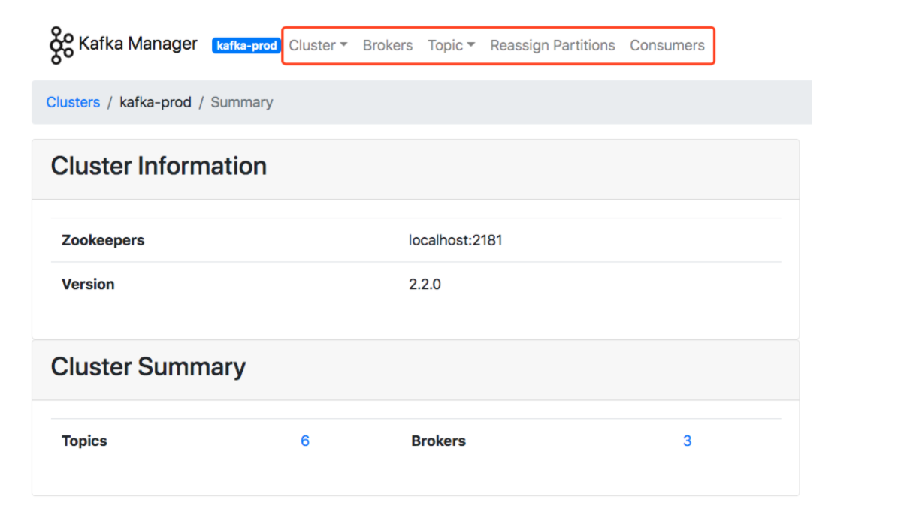

###### 1.3 Burrow

> Burrow 是 LinkedIn 开源的一个专门监控消费者进度的框架，但发展缓慢，社区活跃度低。框架是用 Go 写的，安装时要求必须有 Go 运行环境，所以，Burrow 在普及率上不如其他框架。另外，Burrow 没有 UI 界面，只是开放了一些 HTTP Endpoint。


###### 1.4 JMXTrans + InfluxDB + Grafana

> 在更流行的做法是，**在一套通用的监控框架中监控 Kafka**，比如使用**JMXTrans + InfluxDB + Grafana 的组合**。由于 Grafana 支持对**JMX 指标**的监控，因此很容易将 Kafka 各种 JMX 指标集成进来。（付费产品）

如图所示：

> 

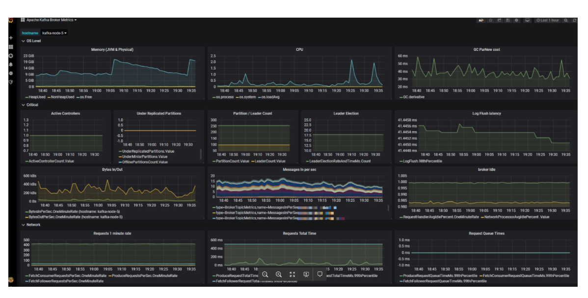


> 图中集中了很多监控指标，比如 CPU 使用率、GC 收集数据、内存使用情况等。除此之外，这个仪表盘面板还囊括了很多关键的 Kafka JMX 指标，比如 BytesIn、BytesOut 和每秒消息数等。将这么多数据统一集成进一个面板上直观地呈现出来，是这套框架非常鲜明的特点。

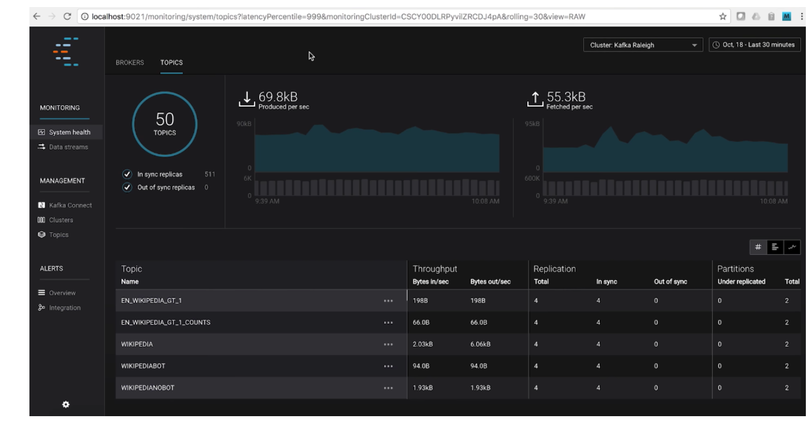

> 从这张图中，我们可以直观地观测到整个 Kafka 集群的主题数量、ISR 副本数量、各个主题对应的 TPS 等数据。当然，Control Center 提供的功能远不止这些，你能想到的所有 Kafka 运维管理和监控功能，Control Center 几乎都能提供。

###### 1.5 kafka Eagle 

> [Kafka Eagle](https://github.com/smartloli/kafka-eagle) 是由国人开发和维护，框架使用的语言为java。而且目前还在积极地演进着。根据 Kafka Eagle 官网的描述，它支持最新的 Kafka 2.x 版本，除了提供常规的监控功能之外，还开放了告警功能（Alert）

###### 1.6 小结

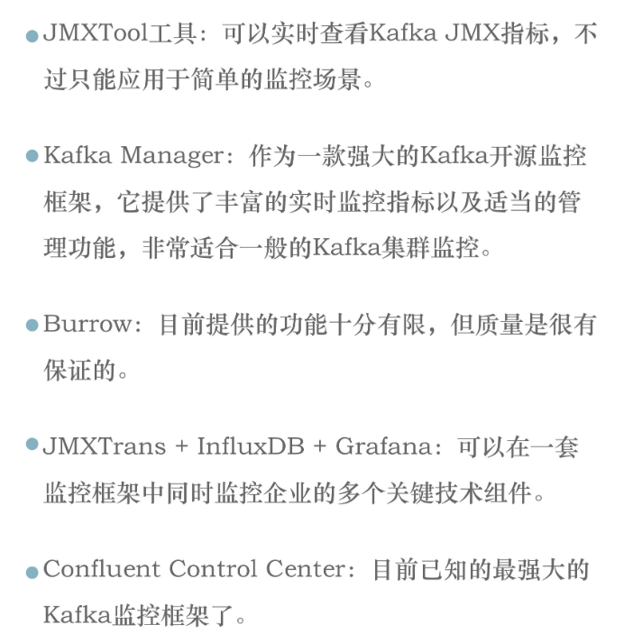


##### 2. 安装Kafka Eagle

1、下载[kafka-eagle-bin](https://github.com/smartloli/kafka-eagle-bin)包


2、上传到服务器

3、解压文件到本地

> tar -zxvf  kafka-eagle-bin-1.4.4.tar.gz 

4、进入kafka-eagle-bin-1.4.4再次解压

> tar -zxvf  kafka-eagle-web-1.4.4-bin.tar.gz

5、使用root权限编辑环境变量，设置JDK和Kafka-eagle地址

/dev/ap/kafka-eagle-bin-1.4.6/kafka-eagle-web-1.4.6

> sudo vi /etc/profile
>
> #Kafka_Web
> export JAVA_HOME=/developer/jdk1.8.0_231
> export KE_HOME=/developer/kafka-eagle-bin-1.4.4/kafka-eagle-web-1.4.4
> export PATH=$PATH:$JAVA_HOME/bin:$KE_HOME/bin

6、刷新配置

> source /etc/profile

7、给启动文件执行权限

> cd  kafka-eagle-web-1.4.4/bin
>
> chmod 777 ke.sh

8、修改conf中的system-config.properties配置文件

```
######################################
#配置多个Kafka集群所对应的Zookeeper
######################################
kafka.eagle.zk.cluster.alias=cluster1,cluster2
cluster1.zk.list=dn1:2181,dn2:2181,dn3:2181
cluster2.zk.list=tdn1:2181,tdn2:2181,tdn3:2181

######################################
# 设置Zookeeper线程数
######################################
kafka.zk.limit.size=25

######################################
# 设置Kafka Eagle浏览器访问端口
######################################
kafka.eagle.webui.port=8048

######################################
# 如果你的offsets存储在Kafka中，这里就配置
# 属性值为kafka，如果是在Zookeeper中，可以
# 注释该属性。一般情况下，Offsets的也和你消
# 费者API有关系，如果你使用的Kafka版本为0.10.x
# 以后的版本，但是，你的消费API使用的是0.8.2.x
# 时的API，此时消费者依然是在Zookeeper中
######################################
cluster1.kafka.eagle.offset.storage=kafka
######################################
# 如果你的集群一个是新版本（0.10.x以上），
# 一个是老版本（0.8或0.9），可以这样设置，
# 如果都是新版本，那么可以将值都设置成kafka
######################################
cluster2.kafka.eagle.offset.storage=zookeeper

######################################
# 是否启动监控图表，默认是不启动的
######################################
kafka.eagle.metrics.charts=false

######################################
# 在使用Kafka SQL查询主题时，如果遇到错误，
# 可以尝试开启这个属性，默认情况下，不开启
######################################
kafka.eagle.sql.fix.error=false

######################################
# 邮件服务器设置，用来告警
######################################
kafka.eagle.mail.enable=false
kafka.eagle.mail.sa=
kafka.eagle.mail.username=
kafka.eagle.mail.password=
kafka.eagle.mail.server.host=
kafka.eagle.mail.server.port=

######################################
# 设置告警用户，多个用户以英文逗号分隔
######################################
kafka.eagle.alert.users=smartloli.org@gmail.com


######################################
# 超级管理员删除主题的Token
######################################
kafka.eagle.topic.token=keadmin

######################################
# 如果启动Kafka SASL协议，开启该属性
######################################
kafka.eagle.sasl.enable=false
kafka.eagle.sasl.protocol=SASL_PLAINTEXT
kafka.eagle.sasl.mechanism=PLAIN

######################################
# Kafka Eagle默认存储在Sqlite中，如果要使用
# MySQL可以替换驱动、用户名、密码、连接地址
######################################
kafka.eagle.driver=com.mysql.jdbc.Driver
kafka.eagle.url=jdbc:mysql://127.0.0.1:3306/ke?useUnicode=true&characterEncoding=UTF-8&zeroDateTimeBehavior=convertToNull
kafka.eagle.username=root
kafka.eagle.password=123456

#kafka.eagle.driver=org.sqlite.JDBC
#kafka.eagle.url=jdbc:sqlitE:/Users/albert/workspace/kafka-egale/db/ke.db
#kafka.eagle.username=root
#kafka.eagle.password=root
```

9、进入bin目录启动监控界面

>  ./ke.sh start


图中包含了登录地址、访问账号和密码

10、登录页面查看监控数据

http://127.0.0.1:8048/ke

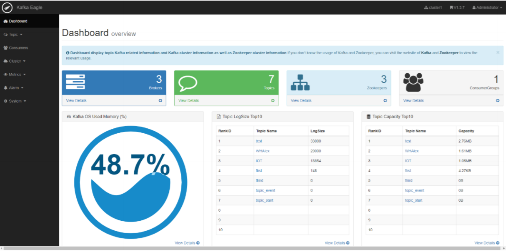

**常用命令**

```
# 查看Kafka Eagle运行状态
ke.sh status

# 停止Kafka Eagle
ke.sh stop

# 查看Kafka Eagle GC情况
ke.sh gc

# 查看Kafka Eagle服务器资源占用情况，例如TCP、句柄等
ke.sh stats

# 查看Kafka Eagle版本号
ke.sh version

# 查看Kafka Eagle服务器上JDK的编码情况（如果JDK编码不是UTF-8，可能会有异常出现，执行如下命令，根据提示来修复JDK编码问题）
ke.sh jdk

# 查看Kafka Eagle中是否存在某个类（如果需要精确，类名前面可以加上包名）
ke.sh find [ClassName]
```

**小结**

> ​		总的来说，Kafka Eagle提供了简单、易用的页面，部署方便。同时，提供非常详细的[操作手册](https://docs.kafka-eagle.org/)，根据官网提供的操作手册来安装Kafka Eagle，一般都可以正常使用。另外，有时候可能会在日志中发现一些连接超时或是空指针异常，对于这类问题，首先需要检测Kafka集群的各个Broker节点JMX_PORT是否开启（这个Kafka默认是不开启），然后就是空指针异常问题，这类问题通常发生在Kafka集群配置了ACL，这就需要认真检测Kafka Eagle配置文件中ACL信息是否正确（比如设置的用户名和密码是否正确，以及用户是否拥有访问Topic的权限等）

```
vi bin/kafka-server-start.sh
if [ "x$KAFKA_HEAP_OPTS" = "x" ]; then
    export KAFKA_HEAP_OPTS="-server -Xms2G -Xmx2G -XX:PermSize=128m -XX:+UseG1GC -XX:MaxGCPauseMillis=200 -XX:ParallelGCThreads=8 -XX:ConcGCThreads=5 -XX:InitiatingHeapOccupancyPercent=70"
    # 开启JMX_PORT端口，端口开启后，Kafka Eagle系统会自动感知获取
    export JMX_PORT="9999"
    # 注释脚本中默认的信息
    # export KAFKA_HEAP_OPTS="-Xmx1G -Xms1G"
fi
```

**常见错误**

> 一、FATAL Fatal error during KafkaServerStartable startup. Prepare to shutdown (kafka.server.KafkaServerStartable)
>
> kafka.common.InconsistentBrokerIdException: Configured broker.id 2 doesn't match stored broker.id 0 in meta.properties. If you moved your data, make sure your configured broker.id matches. If you intend to create a new broker, you should remove all data in your data directories (log.dirs).
> 解决方案：
>
> 1、找到配置文件查看log.dirs
>
> cat server.properties
>
> 2、修改该目录下的meta.properties配置
>
> brokerid
>
> 二、页面无法打开
>
> 解决方案：
>
> 1、请查看防火墙是否开启
>
> *firewall*-*cmd* --*state*
>
> 2、关闭防火墙
>
> systemctl stop firewalld.service
>
> ./ke.sh start能够启动，但是无法访问web ui页面的问题
>
> 1.需要注意添加配置项（system-config.properties ）：
>
> ```
>     ######################################
>     # kafka jdbc driver address
>     ######################################
>     kafka.eagle.driver=org.sqlite.JDBC
>     #此处需要指定sqlite使用的数据库文件路径，kafka-eagle-web安装的路径
>     kafka.eagle.url=jdbc:sqlite:/home/kafka-eagle-web-1.2.4/db/ke.db 
>     kafka.eagle.username=root
>     kafka.eagle.password=123456
> 
> ```


## 3.Kafka API

#### 1.生产者向消费者发送消息

模拟生产者向消费者发送消息

```java
/**
 * @Author: 张钰博
 * @Date: 2020/4/7 15:10
 * @Description: 生产者示例代码
 */
public class ProducerDemo {
    public static void main(String[] args) {
        //给生产者配置参数，将参数写在Properties中
        Properties properties = new Properties();
        //配置服务器地址,Kafka可以通过一个Broker去寻找其他的服务器地址，Kafka官方推荐至少写两到三个，防止因为宕机无法连接到其他服务器
        properties.put(ProducerConfig.BOOTSTRAP_SERVERS_CONFIG,  "192.168.0.1:9092,192.168.0.2:9092");
        //发送给Kafka的消息键必须是字节数组，发送不同的数据类型键所序列化的工具也有所不同，Kafka提供了10中不同的数据序列化工具。也可以自定义
        properties.put(ProducerConfig.KEY_SERIALIZER_CLASS_CONFIG, StringDeserializer.class);
        //发送给Kafka的消息值必须是字节数组，发送不同的数据类型值所序列化的工具也有所不同，Kafka提供了10中不同的数据序列化工具。也可以自定义
        properties.put(ProducerConfig.VALUE_SERIALIZER_CLASS_CONFIG, StringDeserializer.class );

        //创建生产者，因为我们发送的键和值都是String，所以泛型也必须为String类型。将参数配置properties传入其中
        KafkaProducer<String, String> producer = new KafkaProducer<>(properties);

        //Topic 主题
        String topic = "test";
        //Key 用来决定消息发送到该主题的那个分区
        String key = "hi";
        //value  发送的内容
        String value = "Hello World";
        /**
         * 发送消息到Kafka中。泛型也为String类型。
         * 传入的参数：
         * Topic：主题
         * Key：用来告诉Kafka如何分区
         * Value：发送的消息内容
         */
        try {
            ProducerRecord<String, String> producerRecord = new ProducerRecord<>(topic,key,value);
      /*      //同步发发送消息
            Future<RecordMetadata> future = producer.send(producerRecord);
            //获取发送后的结果，判断是否发送成功
            RecordMetadata recordMetadata = future.get();
            //如果不为null表示发送成功
            if (null!=recordMetadata) {
                System.out.println("消息发送成功：-----------------------   主题Topic:"+recordMetadata.topic()+","+"分区："+recordMetadata.partition()+","+"" +
                        "偏移量："+recordMetadata.offset());

            }*/

        //异步发送消息
            producer.send(producerRecord, new Callback() {
                @Override
                public void onCompletion(RecordMetadata metadata, Exception exception) {
                    if (null!=exception) {
                        //出现异常了
                        exception.printStackTrace();
                        System.out.println("发送失败，出现异常");
                    }
                    if (null!=metadata) {
                        System.out.println("消息发送成功：-------------------主题Topic:"+metadata.topic()+","+"分区："+metadata.partition()+","+"" + "偏移量："+metadata.offset());
                    }
                }
            });
        } catch (Exception e) {
            e.printStackTrace();
            System.out.println("消息发送失败");
        }finally {
            //关闭生产者
            producer.close();
        }
    }
}
```

模拟消费者消费消息

```java
/**
 * @Author: 张钰博
 * @Date: 2020/4/7 15:17
 * @Description: 消费者示例代码
 */
public class ConsumerDemo {
    public static void main(String[] args) {
        //给消费者配置参数，将参数写在Properties中
        Properties properties = new Properties();
        //配置服务器地址,Kafka可以通过一个Broker去寻找其他的服务器地址，Kafka官方推荐至少写两到三个，防止因为宕机无法连接到其他服务器
        properties.put(ConsumerConfig.BOOTSTRAP_SERVERS_CONFIG, "192.168.0.1:9092,192.168.0.2:9092");
        //键：接受生产者发送的数据，必须要反序列化
        properties.put(ConsumerConfig.KEY_DESERIALIZER_CLASS_CONFIG, StringDeserializer.class);
        //值：接受生产者发送的数据，必须要反序列化
        properties.put(ConsumerConfig.VALUE_DESERIALIZER_CLASS_CONFIG, StringDeserializer.class );
        //指定消费者所在的群组Id
        properties.put(ConsumerConfig.GROUP_ID_CONFIG, "group1");
        //创建消费者，将配置对象传入其中
        KafkaConsumer<String, String> consumer = new KafkaConsumer<>(properties);
        try {
            //订阅主题，消费者允许订阅多个主题
            consumer.subscribe(Collections.singletonList("test"));
            //consumer.subscribe(Arrays.asList("test"));
            //Kafka中只有拉取，没有推送。必须反复不断的拉取
            while (true) {
                //拉取间隔时间 单位(毫秒)
                ConsumerRecords<String, String> records = consumer.poll(500);
                //消息可能不止一条，进行for循环
                for (ConsumerRecord<String, String> record : records) {
                    System.out.println("主题Topic:"+record.topic()+","+"分区："+record.partition()+","+"" +
                            "偏移量："+record.offset()+","+"键："+record.key()+"值："+record.value());
                }
            }
        } catch (Exception e) {
            e.printStackTrace();
        } finally {
            consumer.close();
        }
    }
    }
```


#### 2.模拟多线程，生产者向消费者发送消息

**生产者**

```java
/**
 * @Author: 张钰博
 * @Date: 2020/4/7 16:33
 * @Description: 模拟多线程生产者
 */
public class KafkaConProducer {

    private static DemoUser makeUser(int id){
        DemoUser user = new DemoUser();
        user.setId(id);
        user.setName("芒果好好吃："+id);
        return user;
    }


    //发送消息的个数
    private static final int MSG_SIZE = 1000;
    /**
     * 创建负责发送消息的定长线程池
     * Runtime.getRuntime().availableProcessors() 获取本机CPU核心数
     */
    private static ExecutorService executorService = Executors.newFixedThreadPool(Runtime.getRuntime().availableProcessors());
    //让所有线程同时进行运行，防止主线程过早退出。等待消息同时发送完毕才可以退出
    private static CountDownLatch countDownLatch = new CountDownLatch(MSG_SIZE);

    /*发送消息的任务*/
    private static class ProduceWorker implements Runnable{
        //创建生产者
        private KafkaProducer<String,String> producer;

        private ProducerRecord<String,String> record;

        //封装生产者和消息记录，每次发送消息就不用重新创建对象
        public ProduceWorker(ProducerRecord<String, String> record,KafkaProducer<String, String> producer) {
            this.record = record;
            this.producer = producer;
        }

        @Override
        public void run() {
            //获取线程的Id和producer在内存中的地址所算出来的哈希值。多个线程发送的消息，producer哈希值都一样。结论：不管有多少个线程只需要创建一个Kafka的生产者
            final String id = Thread.currentThread().getId()+"-"+System.identityHashCode(producer);
            try {
                //使用异步发送
                producer.send(record, (metadata, exception) -> {
                    //判断如果exception不为null表示发送失败
                    if(null!=exception){
                        exception.printStackTrace();
                        System.out.println("发送失败");
                    }
                    //判断metadata不为null表示发送成功
                    if(null!=metadata){
                        System.out.println("消息发送成功：-------------------主题Topic:"+metadata.topic()+","+"分区："+metadata.partition()+","+"" + "偏移量："+metadata.offset());
                    }
                    //每发送一次消息，countDownLatch就会递减一次。countDownLatch如果递减为0表示消息已经全部发送完了
                    countDownLatch.countDown();
                });
                System.out.println(id+":数据["+record+"]已发送。");
            } catch (Exception e) {
                e.printStackTrace();
            }
        }
    }

    public static void main(String[] args) {
        //创建Kafka生产者，不管有多少个线程只需要创建一个Kafka的生产者
        KafkaProducer<String,String> producer = new KafkaProducer<String, String>(KafkaConst.producerConfig(StringSerializer.class,StringSerializer.class));
        try {
            //发送1000条数据到kafka
            for(int i=0;i<MSG_SIZE;i++){
                DemoUser user = makeUser(i);
                //发送消息到Kafka中
                ProducerRecord<String, String> record = new ProducerRecord<>(
                        BusiConst.CONCURRENT_USER_INFO_TOPIC
                        , null
                        , System.currentTimeMillis()
                        , user.getName()
                        , user.toString());
                executorService.submit(new ProduceWorker(record,producer));
            }
            countDownLatch.await();
        } catch (Exception e) {
            e.printStackTrace();
        } finally {
            producer.close();
            executorService.shutdown();
        }
    }


}

```


**消费者代码**

```java
/**
 * @Author: 张钰博
 * @Date: 2020/4/7 17:02
 * @Description:   KafkaConsumer<String,String> consumer; 是线程不安全的
 * 模拟多线程情况下，线程安全的消费数据
 */
public class KafkaConConsumer {
    //创建两个定长线程
    private static ExecutorService executorService = Executors.newFixedThreadPool(2);
    private static class ConsumerWorker implements Runnable{
        //创建Kafka生产者
        private KafkaConsumer<String,String> consumer;
        //封装Kafka需要传入的配置参数
        public ConsumerWorker(Map<String, Object> config, String topic) {
            Properties properties = new Properties();
            properties.putAll(config);
            this.consumer = new KafkaConsumer<>(properties);
            //consumer可以订阅多个Topic主题，此时我们只订阅1个主题
            consumer.subscribe(Collections.singletonList(topic));
        }
        @Override
        public void run() {
            //获取线程的Id和producer在内存中的地址所算出来的哈希值
            final String id = Thread.currentThread().getId() +"-"+System.identityHashCode(consumer);
            try {
                while(true){
                    //拉取间隔时间 单位(毫秒)
                    ConsumerRecords<String, String> records = consumer.poll(500);
                    //遍历集合中的消息
                    for(ConsumerRecord<String, String> record:records){
                        System.out.println("线程Id:"+id+","+"主题Topic:"+record.topic()+","+"分区："+record.partition()+","+"" + "偏移量："+record.offset()+","+"键："+record.key()+"值："+record.value());
                    }
                }
            } finally {
                consumer.close();
            }
        }
    }

    public static void main(String[] args) {
        //消费配置的实例
        Map<String, Object> config = KafkaConst.consumerConfigMap("concurrent", StringDeserializer.class, StringDeserializer.class);
        for(int i = 0; i< BusiConst.CONCURRENT_PARTITIONS_COUNT; i++){
            executorService.submit(new ConsumerWorker(config, BusiConst.CONCURRENT_USER_INFO_TOPIC));
        }
    }

```


**封装BusiConst的代码**

```java
public class BusiConst {
    public static final String HELLO_TOPIC  = "hello-topic-12";

    public static final int CONCURRENT_PARTITIONS_COUNT = 2;
    public static final String CONCURRENT_USER_INFO_TOPIC = "concurrent-test";

    public static final String SELF_SERIAL_TOPIC = "self-serial";

    public static final String SELF_PARTITION_TOPIC = "self-partition";

    public static final String CONSUMER_GROUP_TOPIC  = "consumer-group-test";
    public static final String CONSUMER_GROUP_A  = "groupA";
    public static final String CONSUMER_GROUP_B  = "groupB";

    public static final String CONSUMER_COMMIT_TOPIC  = "simple";

    public static final String REBALANCE_TOPIC = "rebalance-topic-three-part";
}
```

