# 1、测试Kafka生产吞吐量

**测压环境**

| 序号 | IP            | CPU核数 | 内存 | 服务               | 版本号                         |
| ---- | ------------- | ------- | ---- | ------------------ | ------------------------------ |
| 1    | 172.18.40.105 | 4核     | 8G   | Kafka              | 2.2.0                          |
| 2    | 172.18.40.106 | 4核     | 8G   | kafka              | 2.2.0                          |
| 3    | 172.18.40.107 | 4核     | 8G   | Zookeeper          | 3.6.0                          |
| 4    | 172.18.40.108 | 4核     | 8G   | Kafka-eagle、Kafka | Kafka-eagle-1.4.6，Kafka-2.2.0 |

**测压目的**

测试向3个Brokers集群，1个Topic，**1个Partitions**  发送1亿条消息,每条消息100字节，测试kafka集群吞吐量

------

截图如下：

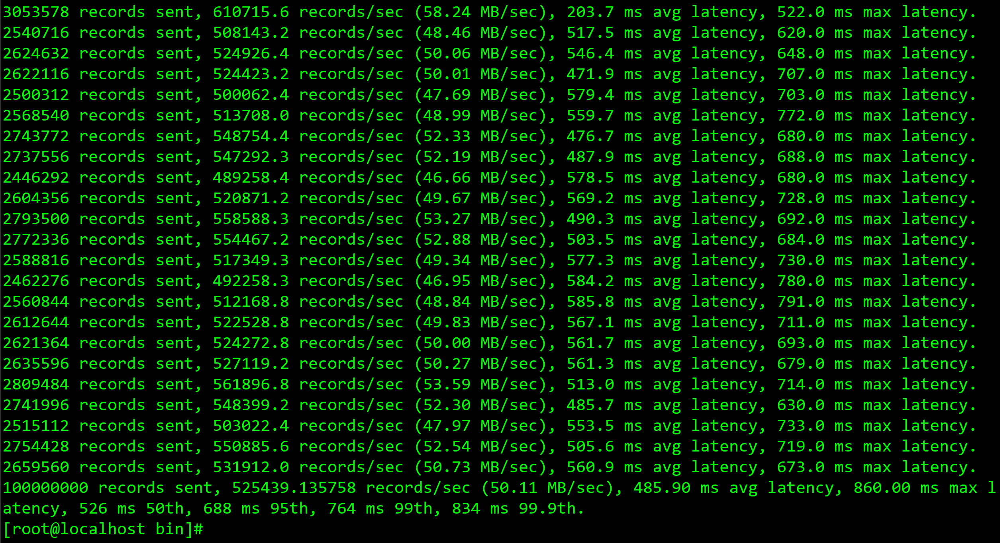

**结果：**

 1. 每秒平均向kafka写入了50.11 MB的数据(大概是：52544.14336条消息，计算方式：
3.18X1024X1024/1000)
2. 每次写入的平均延迟为485.90毫秒
3. 最大延迟为860.00毫秒
 4. 526毫秒内占50%
 5. 688毫秒内占95%
 6. 764毫秒内占99%
 7. 834毫秒内占99.9%

------

测试向3个Brokers集群，1个Topic，**3个Partitions**   发送1亿条消息,每条消息100字节，测试kafka集群吞吐量

截图如下：

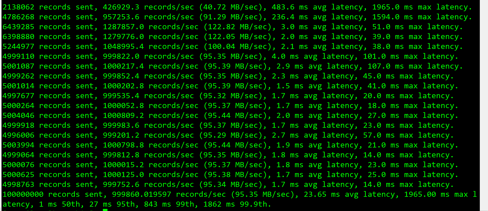

**结果：**

  1. 每秒平均向kafka写入了95.35 MB的数据(大概是：99981.7216条消息，计算方式：
     95.35X1024X1024/1000)
 2. 每次写入的平均延迟为23.65毫秒
 3. 最大延迟为1965.00毫秒
 4. 1毫秒内占50%
 5. 27毫秒内占95%
 6. 843毫秒内占99%
 7. 1862毫秒内占99.9%

**小结**

​	从以上结果看出，适当增加分区数量可以提高Kafka集群性能。后期我们测试Topic数量对单机性能的影响

# 2、测试Kafka消费吞吐量

**测压环境**

| 序号 | IP            | CPU核数 | 内存 | 服务               | 版本号                         |
| ---- | ------------- | ------- | ---- | ------------------ | ------------------------------ |
| 1    | 172.18.40.105 | 4核     | 8G   | Kafka              | 2.2.0                          |
| 2    | 172.18.40.106 | 4核     | 8G   | kafka              | 2.2.0                          |
| 3    | 172.18.40.107 | 4核     | 8G   | Zookeeper          | 3.6.0                          |
| 4    | 172.18.40.108 | 4核     | 8G   | Kafka-eagle、Kafka | Kafka-eagle-1.4.6，Kafka-2.2.0 |

**测压目的**

模拟10个用户消费Kafka集群1个Topic下的消息，一共消费1亿条消息，每次消费100字节

------

截图如下：

**结果**：

1. 一共消费了9536.7432MB
2. 消费速度为 52.5571M/S
3. 总共消费1亿条消息
4. 每秒消费55.1W条消息

# 3. 测试Topic数量对Kafka性能的影响

**Topic数量：16**

生产者

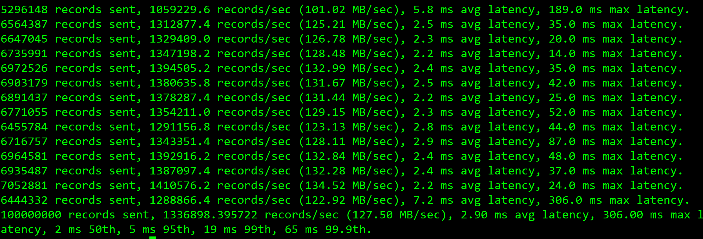

消费者

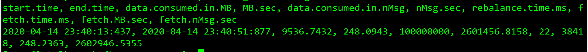

------

**Topic数量：32**

生产者：

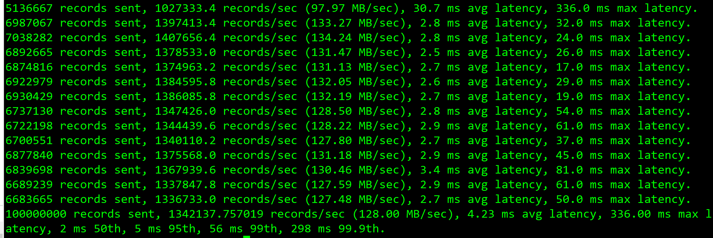

消费者：

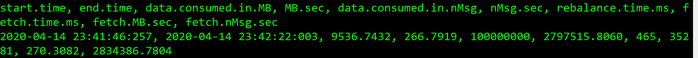

------

**Topic数量：64**

生产者：

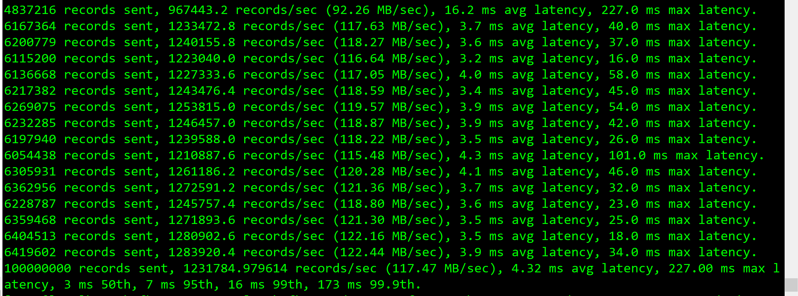

消费者：

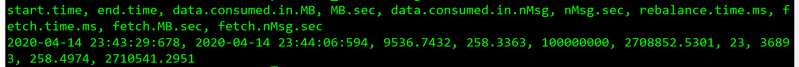

------

**Topic数量：128**

生产者：

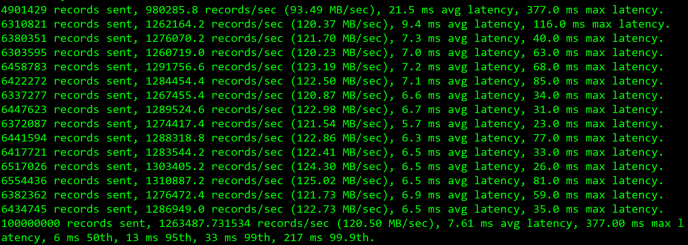

消费者：

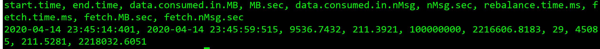

------

**Topic数量：256**

生产者：

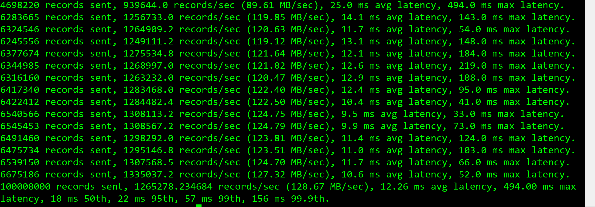

消费端：

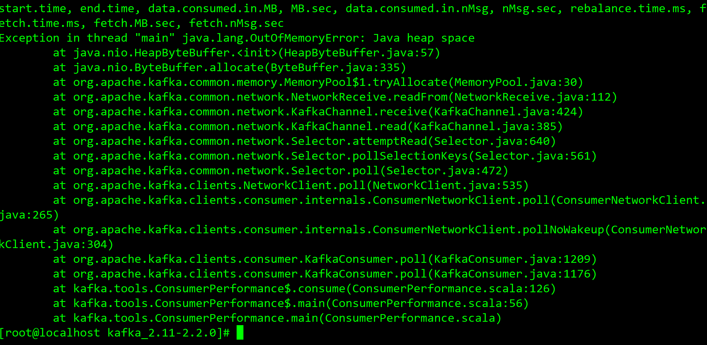

****

| Topic数量 |    消息数量    | 消息大小 | 发送端RT（ms） | 发送端TPS |         消费端TPS          |
| :-------: | :------------: | -------- | :------------: | :-------: | :------------------------: |
|    16     | 100000000(1亿) | 100字节  |    2.90/ms     | 133.68w/s |         260.14w/s          |
|    32     | 100000000(1亿) | 100字节  |    4.23/ms     | 134.21w/s |         279.75w/s          |
|    64     | 100000000(1亿) | 100字节  |    4.32/ms     | 123.17w/s |         270.88w/s          |
|    128    | 100000000(1亿) | 100字节  |    7.61/ms     | 126.34w/s |         221.66w/s          |
|    256    | 100000000(1亿) | 100字节  |    12.26/ms    | 126.54w/s | java.lang.OutOfMemoryError |

**小结：**

​			**随着Topic的增加，Kafka的性能会随之降低。这是因为Kafka的每个Topic、每个分区都会对应一个物理文件。当Topic数量增加时，消息分散的落盘策略会导致磁盘IO竞争激烈成为瓶颈。** 

